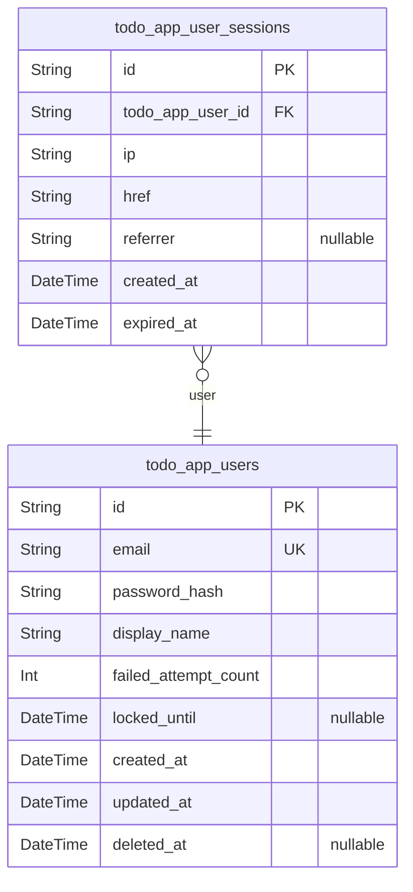
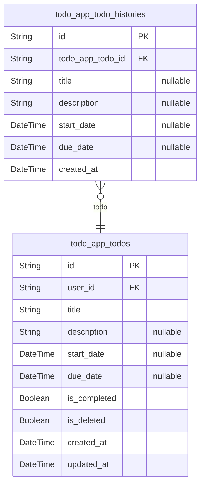

# Prisma Markdown

> Generated by [`prisma-markdown`](https://github.com/samchon/prisma-markdown)

- [Actors](#actors)
- [Todos](#todos)

## Actors

### `todo_app_users`

Authenticated user accounts with email/password credentials and profile
information.

This table serves as the primary identity store for the Todo application.
Each user has a unique email address for login, a securely hashed
password, and a display name for personalization. The table tracks
authentication security through failed login attempt counting and account
lockout timestamps.

Key features:
- Email-based authentication with unique constraint
- Bcrypt-hashed passwords (cost factor 12+)
- Account lockout after 5 consecutive failed attempts (15-minute lockout)
- Soft delete capability for account recovery
- Profile display name (defaults to email on registration)

Relationships:
- Has many [todo_app_user_sessions](#todo_app_user_sessions) for JWT session management
- Owns all todos in the Todos domain component

Properties as follows:

- `id`: Primary Key. Unique identifier for the user account.
- `email`
  > User's email address used for authentication. Must be unique across all
  > users. Stored in lowercase for case-insensitive comparison. Maximum
  > length is 254 characters per RFC standards.
- `password_hash`
  > Bcrypt-hashed password with cost factor 12 or higher. The original
  > password must meet complexity requirements: 8-128 characters with at
  > least one uppercase letter, one lowercase letter, one digit, and one
  > special character.
- `display_name`
  > User's chosen display name for personalization within the application.
  > Initialized to the email address upon registration. Must be between 1 and
  > 50 characters and cannot be blank. Not required to be unique across
  > users.
- `failed_attempt_count`
  > Counter tracking consecutive failed login attempts. Account is locked
  > after 5 failed attempts. Reset to 0 upon successful authentication.
- `locked_until`
  > Timestamp indicating when the account lockout expires. Account is locked
  > for 15 minutes after 5 consecutive failed login attempts. Null when
  > account is not locked.
- `created_at`
  > Timestamp when the user account was created. Set automatically upon
  > registration.
- `updated_at`
  > Timestamp when the user account was last updated. Updated automatically
  > on any profile or credential changes.
- `deleted_at`
  > Timestamp when the user account was soft-deleted. Null for active
  > accounts. Used for account recovery scenarios.

### `todo_app_user_sessions`

User session tracking table for authentication and login auditing.

Each session record captures a single login event for a {@link
todo_app_users} actor, storing connection metadata including IP address,
requested URL, and HTTP referrer header. Sessions have a defined
expiration time for security purposes.

Sessions are created during user authentication and referenced for audit
trails and session management. Multiple active sessions may exist per
user (e.g., logged in on multiple devices).

Properties as follows:

- `id`: Primary Key.
- `todo_app_user_id`: The user who owns this session. [todo_app_users.id](#todo_app_users)
- `ip`
  > IP address from which the session was created, captured at authentication
  > time.
- `href`
  > Full URL path including query parameters from the authentication request,
  > used for tracking the login origin.
- `referrer`
  > HTTP Referer header value from the login request, indicating the source
  > page that led to authentication. May be null if not provided by the
  > client.
- `created_at`
  > Timestamp when the session was created, marking the moment of successful
  > authentication.
- `expired_at`
  > Timestamp when the session expires and is no longer valid. Always set to
  > enforce session lifetime limits for security.

## Todos

### `todo_app_todos`

Main todo entity storing user task information including title,
description, dates, completion status, and soft delete flag.

Each todo is owned by exactly one user through the [todo_app_users](#todo_app_users)
relationship, ensuring complete data isolation between users. Users can
create, view, edit, complete, and delete their todos through dedicated
API endpoints.

The soft delete pattern (is_deleted flag) allows users to move todos to
trash and restore them, with permanent deletion removing both the todo
and its associated edit history entries from {@link
todo_app_todo_histories}.

Properties as follows:

- `id`: Primary Key.
- `user_id`
  > Reference to the user who owns this todo. Each todo belongs to exactly
  > one user, and users can only access their own todos. {@link
  > todo_app_users.id}
- `title`
  > The title of the todo. Required field with maximum length of 200
  > characters. Leading and trailing whitespace is trimmed before storage.
- `description`
  > Optional detailed description of the todo. Maximum length of 5000
  > characters. Can be null if not provided. Formatting including line breaks
  > and whitespace is preserved exactly as provided.
- `start_date`
  > Optional start date for the todo. Stored as date only without time
  > component. Can be null if not specified.
- `due_date`
  > Optional due date for the todo. Stored as date only without time
  > component. Can be null if not specified. No validation constraint with
  > start_date - start_date can be after due_date.
- `is_completed`
  > Completion status of the todo. Binary state: true for complete, false for
  > incomplete. New todos default to incomplete (false). Toggling completion
  > status does not create edit history entries.
- `is_deleted`
  > Soft delete flag for trash functionality. When true, the todo is in the
  > trash and excluded from normal todo list queries. When false, the todo is
  > active and visible in the normal list. Deleting a todo sets this to true
  > without removing data.
- `created_at`
  > Timestamp when the todo was created. Set automatically on creation and
  > immutable thereafter.
- `updated_at`
  > Timestamp when the todo was last modified. Updated automatically on any
  > edit to title, description, start_date, due_date, is_completed, or
  > is_deleted.

### `todo_app_todo_histories`

Edit history entries tracking all modifications to todos.

Each history entry captures the state changes made during a todo edit
operation. Records the timestamp of the edit and the new values for any
changed fields (title, description, start_date, due_date). Fields that
were not modified during an edit are stored as null to clearly
distinguish between "not changed" and "changed to empty".

History entries are automatically created whenever a user edits their
todo. Entries are sorted from most recent to oldest for display. When a
todo is permanently deleted, all associated history entries are cascade
deleted to maintain referential integrity.

This table supports the audit trail functionality, allowing users to
review the complete modification history of their todos.

Properties as follows:

- `id`: Primary Key.
- `todo_app_todo_id`
  > The todo that this history entry belongs to. References {@link
  > todo_app_todos.id}. When the parent todo is permanently deleted, this
  > history entry is cascade deleted.
- `title`
  > The new title value after the edit. Null indicates the title was not
  > modified during this edit operation.
- `description`
  > The new description value after the edit. Null indicates the description
  > was not modified during this edit operation.
- `start_date`
  > The new start date value after the edit. Null indicates the start date
  > was not modified during this edit operation.
- `due_date`
  > The new due date value after the edit. Null indicates the due date was
  > not modified during this edit operation.
- `created_at`
  > Timestamp when this history entry was created, representing when the edit
  > operation occurred. Used for sorting history entries from most recent to
  > oldest.
