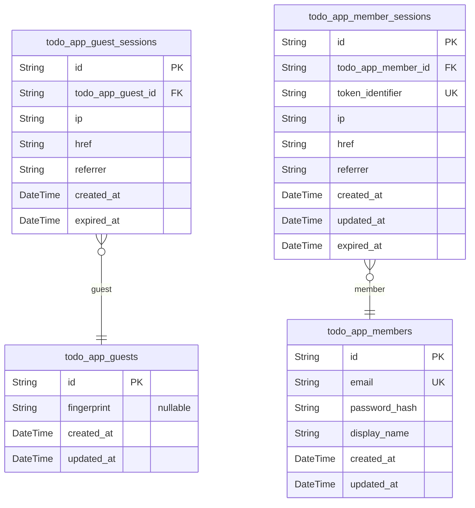
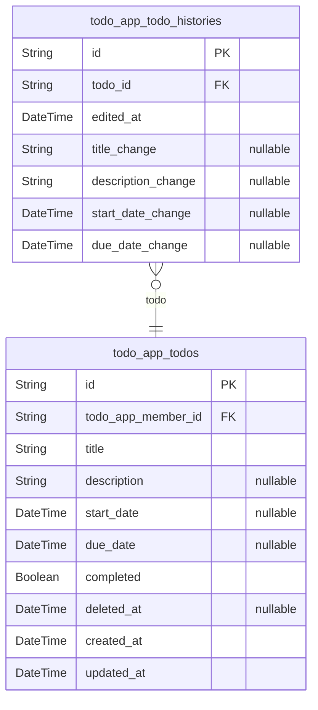

# Prisma Markdown

> Generated by [`prisma-markdown`](https://github.com/samchon/prisma-markdown)

- [Actors](#actors)
- [Todos](#todos)

## Actors

### `todo_app_guests`

Guest actor entity representing unauthenticated visitors before they
register or log in. Each guest record serves as an identity anchor for
tracking sessions and collecting analytics. Guests have limited
capabilities restricted to registration and login functions - they cannot
access any todo management features or user profiles.

The guest identity is established via device fingerprint when available,
enabling detection of returning visitors across sessions. Once a guest
completes registration, they transition to a member identity and their
guest record becomes inactive.

Related entities: [todo_app_guest_sessions](#todo_app_guest_sessions) tracks session tokens
and connection metadata for guest visits.

Privacy: Guest data is used internally for analytics and rate limiting
only. No guest data is exposed to other users.

Properties as follows:

- `id`: Primary Key.
- `fingerprint`
  > Device fingerprint for visitor identification. Used to detect returning
  > visitors across sessions. May be null if fingerprint cannot be determined
  > or is blocked by the user.
- `created_at`: Timestamp when the guest record was created.
- `updated_at`: Timestamp when the guest record was last updated.

### `todo_app_guest_sessions`

Temporary session tokens for guest access prior to authentication.

This table tracks sessions for unauthenticated visitors (guests) before
they register or login. Each session captures connection metadata
including IP address, current URL, and referrer for audit and rate
limiting purposes.

Sessions have a defined lifecycle with expiration to ensure security.
When a guest registers or logs in, their guest session transitions to a
member session, and this temporary record may be cleaned up.

Relationship: Each session belongs to exactly one [todo_app_guests](#todo_app_guests)
actor.

Properties as follows:

- `id`: Primary Key.
- `todo_app_guest_id`: The guest actor who owns this session. [todo_app_guests.id](#todo_app_guests)
- `ip`: IP address of the client connection for this guest session.
- `href`: Current URL path the guest is accessing during this session.
- `referrer`: Referrer URL indicating where the guest came from before this session.
- `created_at`: Timestamp when this guest session was created.
- `expired_at`: Timestamp when this guest session expires for security purposes.

### `todo_app_members`

Registered user accounts with email/password credentials and display name.

This is the primary actor table for authenticated members of the todo
application. Each member can create, manage, and track their private
todos. The email serves as the unique authentication identifier, and the
password_hash stores the securely hashed password.

Members have complete ownership of their todos and associated edit
histories. When a member account is deleted, all their todos (including
those in trash) and edit histories are permanently removed.

Related entities:
- [todo_app_member_sessions](#todo_app_member_sessions) - Session tokens for authenticated access
- [todo_app_todos](#todo_app_todos) - Private todos owned by the member

Properties as follows:

- `id`: Primary Key.
- `email`
  > Email address used as the unique authentication identifier for the member
  > account. Must be unique across all members.
- `password_hash`
  > Securely hashed password for authentication. The password is hashed using
  > a secure algorithm and never stored in plain text.
- `display_name`
  > Display name shown in the member's profile. This is a private todo app so
  > display names are not shared with other users.
- `created_at`: Timestamp when the member account was created.
- `updated_at`
  > Timestamp when the member account was last updated (e.g., display name
  > change, password change).

### `todo_app_member_sessions`

JWT session tokens tracking authenticated member sessions with connection
context and temporal lifecycle management.

Each session represents a single authentication event for a
todo_app_members actor, storing the JWT token identifier, client
connection metadata (IP, href, referrer), and timestamps for creation,
last refresh, and expiration. Sessions enforce the
single-active-session-per-user policy and are invalidated on logout,
password change, or account deletion.

Sessions are created upon successful authentication and provide the
foundation for JWT-based access control. The token_identifier stores the
JWT 'jti' claim for token validation and revocation support. The
updated_at field tracks token refresh events, while expired_at defines
the session's maximum validity period.

Properties as follows:

- `id`: Primary Key.
- `todo_app_member_id`: The member who owns this session. [todo_app_members.id](#todo_app_members)
- `token_identifier`
  > Unique JWT token identifier (jti claim) for session validation and
  > revocation support.
- `ip`: Client IP address from which the session was initiated.
- `href`: The URL endpoint accessed when creating the session.
- `referrer`: HTTP referrer header from the authentication request.
- `created_at`: Timestamp when the session was created upon successful authentication.
- `updated_at`
  > Timestamp when the session was last refreshed, tracking token refresh
  > events.
- `expired_at`: Timestamp when the session expires and must be re-authenticated.

## Todos

### `todo_app_todos`

Main todo task entity for personal task management.

Each todo represents a task owned exclusively by a single member,
ensuring complete privacy and isolation between users. Todos support a
full lifecycle including active state, completion tracking, soft deletion
to trash, and permanent removal.

Key features:
- Title and optional description for task details
- Optional start and due dates for scheduling
- Completion status for progress tracking
- Soft delete via deleted_at for trash and restore functionality
- Edit history tracked through [todo_app_todo_histories](#todo_app_todo_histories)

Users can only access their own todos. The deleted_at field enables trash
functionality where deleted todos can be viewed separately and restored.

Properties as follows:

- `id`: Primary Key.
- `todo_app_member_id`
  > Owner of the todo. References [todo_app_members.id](#todo_app_members). Each todo
  > belongs exclusively to one member, ensuring complete privacy.
- `title`
  > Title of the todo task. Required field that cannot be empty or contain
  > only whitespace. Maximum length enforced by validation rules.
- `description`
  > Detailed description of the todo task. Optional field that can be left
  > empty or cleared. Supports free-form text content.
- `start_date`
  > Scheduled start date for the todo. Optional field indicating when work
  > should begin. Must be equal to or earlier than due_date when both are
  > set.
- `due_date`
  > Deadline date for the todo. Optional field for tracking task deadlines.
  > Must be equal to or later than start_date when both are set.
- `completed`
  > Completion status of the todo. Defaults to false (incomplete) on
  > creation. Users can toggle between complete and incomplete states at any
  > time.
- `deleted_at`
  > Soft delete timestamp. When set, the todo is considered deleted and moved
  > to trash. Null for active todos. Enables trash and restore functionality.
- `created_at`
  > Timestamp when the todo was created. Recorded automatically on creation
  > and used for sorting and pagination.
- `updated_at`
  > Timestamp when the todo was last updated (e.g., title change, description
  > change, completion toggle). Recorded automatically on modification.

### `todo_app_todo_histories`

Immutable edit history entries tracking field-level changes to todos for
audit trail purposes.

Each history entry records a single edit operation on a todo, capturing
the timestamp of the edit and what each field was changed to. Only fields
that were actually modified during an edit are populated; unchanged
fields remain null. History entries are automatically created when a user
edits a todo's title, description, start date, or due date.

History entries are permanently associated with their parent {@link
todo_app_todos} and follow its lifecycle: preserved during
soft-delete/restore operations, and permanently deleted only when the
parent todo is permanently deleted from trash. History entries cannot be
modified or individually deleted by users, maintaining a complete and
trustworthy audit trail.

The one-to-many relationship ensures each todo can have zero or more
history entries, providing a complete timeline of how the todo has
evolved over time. Entries are typically viewed in reverse chronological
order (most recent first) based on the edited_at timestamp.

Properties as follows:

- `id`: Primary Key.
- `todo_id`: The parent todo that was edited. [todo_app_todos.id](#todo_app_todos).
- `edited_at`
  > The exact timestamp when the edit operation occurred. Used for
  > chronological ordering of edit history with most recent entries displayed
  > first.
- `title_change`
  > The new title value after the edit, if the title field was modified
  > during this edit operation. Null if the title was not changed.
- `description_change`
  > The new description value after the edit, if the description field was
  > modified during this edit operation. Null if the description was not
  > changed.
- `start_date_change`
  > The new start date value after the edit, if the start date field was
  > modified during this edit operation. Null if the start date was not
  > changed.
- `due_date_change`
  > The new due date value after the edit, if the due date field was modified
  > during this edit operation. Null if the due date was not changed.
