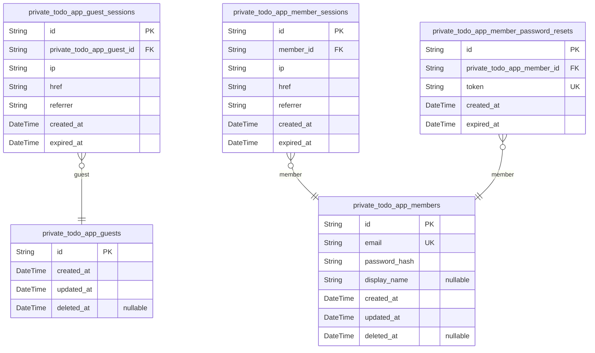
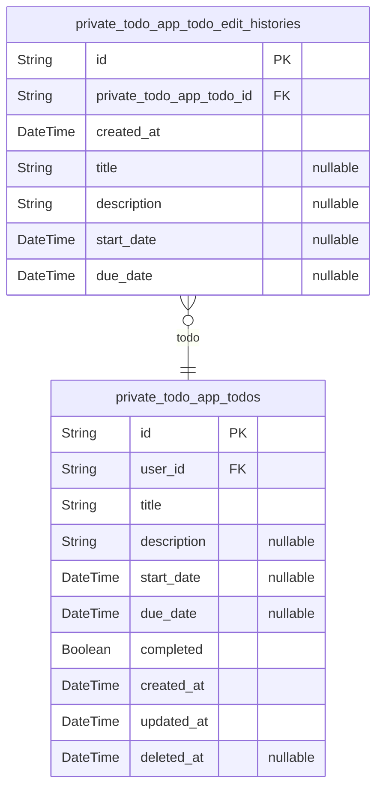

# Prisma Markdown

> Generated by [`prisma-markdown`](https://github.com/samchon/prisma-markdown)

- [Actors](#actors)
- [Todos](#todos)

## Actors

### `private_todo_app_guests`

Temporary guest identifiers for unauthenticated visitors before they sign
up or log in.

Guests represent pre-authentication visitors who have not yet provided
valid credentials to the system. The guest state is temporary and serves
as the entry point for new users joining the private todo application.

A visitor remains a guest until they successfully complete the sign up
process to create an account or successfully log in with existing
credentials. Once authentication is successful, the guest transitions to
a member with full access to their personal todo features.

This actor table works in conjunction with {@link
private_todo_app_guest_sessions} for session tracking.

Properties as follows:

- `id`: Primary Key.
- `created_at`: Timestamp when the guest identifier was created.
- `updated_at`: Timestamp when the guest record was last updated.
- `deleted_at`
  > Timestamp when the guest was soft-deleted. Null if the guest record is
  > still active.

### `private_todo_app_guest_sessions`

Temporary session tokens for tracking guest access before authentication.

This table records session information for unauthenticated visitors
(guests) as they browse the application before signing up or logging in.
Each session captures connection metadata including IP address, current
URL, and referrer for analytics and security purposes.

Guest sessions are created when a visitor first accesses the application
and remain active until expiration. When a guest successfully
authenticates (signs up or logs in), their guest session ends and a
member session begins.

Properties as follows:

- `id`: Primary Key.
- `private_todo_app_guest_id`: The guest this session belongs to. [private_todo_app_guests.id](#private_todo_app_guests)
- `ip`: IP address of the guest client connection.
- `href`: Current URL path the guest is accessing.
- `referrer`: Referrer URL from which the guest navigated to the application.
- `created_at`: Timestamp when the guest session was created.
- `expired_at`
  > Timestamp when the guest session expires. Sessions have a finite lifetime
  > for security purposes.

### `private_todo_app_members`

Member actor accounts for authenticated users of the private todo
application.

This table stores member identity and authentication credentials. Each
member can create and manage their own private todos, which are
completely isolated from other members. The member actor has its own
authentication flow with email/password credentials.

Key relationships:
- Has many [private_todo_app_member_sessions](#private_todo_app_member_sessions) for JWT session
management
- Has many [private_todo_app_member_password_resets](#private_todo_app_member_password_resets) for password
recovery
- Has many [private_todo_app_todos](#private_todo_app_todos) in the Todos domain (via
user_id FK)

Account deletion is irreversible and permanently removes all associated
data including todos and edit history.

Properties as follows:

- `id`: Primary Key.
- `email`
  > Unique email address used for member identification and login
  > authentication. Must be unique across all registered members.
- `password_hash`
  > Hashed password for member authentication. Stored securely using one-way
  > hashing algorithm. Required for account creation and login verification.
- `display_name`
  > Optional display name shown in the member's profile. Can be left empty or
  > unset at any time. Only visible to the profile owner.
- `created_at`: Timestamp when the member account was created.
- `updated_at`: Timestamp when the member account was last updated.
- `deleted_at`
  > Timestamp when the member account was soft-deleted (moved to trash). Null
  > if the account is active. Used for trash functionality before permanent
  > deletion.

### `private_todo_app_member_sessions`

JWT session tokens tracking member authentication state with connection
metadata.

Each session represents a single login event for a member, storing the
connection context
(IP address, href, referrer) for security auditing. Sessions expire based
on the expired_at
timestamp and are used to validate JWT access and refresh tokens.

Sessions belong to exactly one member and provide the foundation for
authentication state
management and login history tracking.

Properties as follows:

- `id`: Primary Key.
- `member_id`: The authenticated member's [private_todo_app_members.id](#private_todo_app_members).
- `ip`: IP address from which the member initiated the login session.
- `href`: The URL the member was accessing when they logged in.
- `referrer`
  > The HTTP referrer header value from the login request, indicating the
  > previous page the member came from.
- `created_at`: Timestamp when the session was created (login time).
- `expired_at`
  > Timestamp when the session will expire. Used to validate JWT token
  > validity and enforce session timeout policies.

### `private_todo_app_member_password_resets`

Password reset tokens issued to members for secure password recovery and
change operations.

Each token is uniquely generated and associated with a specific member
account, enabling the member to reset their password through a secure
verification process. Tokens have a limited validity period defined by
the expiration timestamp.

The table supports the "Users can change their password" requirement by
providing a secure mechanism for password recovery when members forget
their credentials or wish to update their password for security reasons.

Related entity: [private_todo_app_members](#private_todo_app_members).

Properties as follows:

- `id`: Primary Key.
- `private_todo_app_member_id`
  > The member who requested this password reset token. {@link
  > private_todo_app_members.id}.
- `token`
  > Unique password reset token string used for secure password reset
  > verification. Must be cryptographically random and single-use.
- `created_at`: Timestamp when the password reset token was created.
- `expired_at`
  > Expiration timestamp after which the token is no longer valid. Tokens
  > should have a limited validity period for security.

## Todos

### `private_todo_app_todos`

User's private todo items with title, description, dates, completion
status, and soft-delete support for trash functionality.

Each todo belongs to a single member and contains the task details
including a required title, optional description, optional start and due
dates, and completion status. Todos support soft deletion through the
deleted_at field, enabling trash functionality where users can view
deleted todos, restore them, or permanently delete them.

When a todo is permanently deleted (removed from trash), its associated
edit history entries are cascade deleted. Todos are completely private -
each member can only access their own todos.

Key relationships:
- Belongs to [private_todo_app_members](#private_todo_app_members) via user_id
- Has many [private_todo_app_todo_edit_histories](#private_todo_app_todo_edit_histories) tracking all
modifications

Properties as follows:

- `id`: Primary Key.
- `user_id`: Owner of this todo. References [private_todo_app_members.id](#private_todo_app_members).
- `title`
  > Title of the todo item. Required field that provides a brief summary of
  > the task.
- `description`
  > Detailed description of the todo item. Optional field for additional
  > context or notes about the task.
- `start_date`
  > Optional start date for the todo item. When sorting by start date, todos
  > without a start date appear at the end.
- `due_date`
  > Optional due date for the todo item. When sorting by due date, todos
  > without a due date appear at the end.
- `completed`
  > Completion status of the todo. Newly created todos are incomplete (false)
  > by default. Users can toggle between complete and incomplete states.
- `created_at`
  > Timestamp when the todo was created. Used for sorting todos by creation
  > date.
- `updated_at`
  > Timestamp when the todo was last modified. Updated on every edit
  > operation.
- `deleted_at`
  > Soft delete timestamp. When set, the todo is in the trash and excluded
  > from normal todo lists. Null for active todos.

### `private_todo_app_todo_edit_histories`

Edit history entries that track field-level changes made to todos over time.

Each history entry captures a single edit event, recording the timestamp
when the modification occurred and documenting which specific fields were
altered during that change. Only fields that were actually modified
during the edit are recorded; unchanged fields remain null in that entry.

This table serves as an audit trail for todo modifications, allowing
users to review the complete evolution of their todo items. History
entries are automatically created whenever a todo's title, description,
start date, or due date is modified, and are permanently deleted when the
parent todo is permanently removed from the trash.

Relationships:
- Belongs to [private_todo_app_todos](#private_todo_app_todos) via private_todo_app_todo_id
- Cascade deleted when parent todo is permanently deleted

Properties as follows:

- `id`: Primary Key.
- `private_todo_app_todo_id`: Reference to the todo that was edited. [private_todo_app_todos.id](#private_todo_app_todos).
- `created_at`
  > Timestamp when this edit was made. Used for sorting history entries from
  > most recent to oldest.
- `title`
  > The new title value after the edit, if the todo's title was modified
  > during this change. Null if the title was not changed.
- `description`
  > The new description value after the edit, if the todo's description was
  > modified during this change. Null if the description was not changed.
- `start_date`
  > The new start date value after the edit, if the todo's start date was
  > modified during this change. Null if the start date was not changed.
- `due_date`
  > The new due date value after the edit, if the todo's due date was
  > modified during this change. Null if the due date was not changed.
