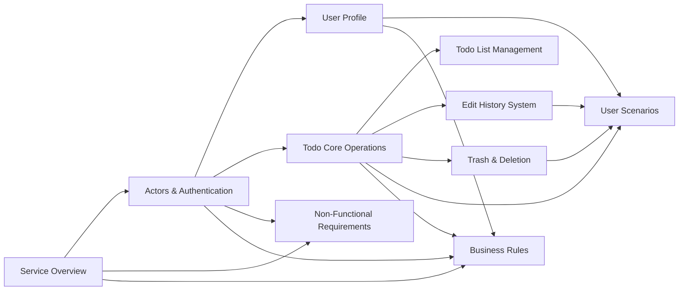

# Todo Application - Planning Documentation

## Document Overview

This planning documentation defines the complete business requirements for a **private multi-user Todo application**. The system enables users to create, manage, and track their personal todo items with full privacy - each user's data is completely isolated and inaccessible to other users.

### Project Scope

The Todo application provides:
- **User Account Management**: Registration, authentication, password management, and account deletion
- **Profile Management**: Display name configuration with complete privacy
- **Todo Operations**: Create, view, edit, complete, and delete todos
- **Edit History**: Comprehensive audit trail for all todo modifications
- **Trash System**: Soft delete with restore and permanent deletion capabilities
- **List Management**: Pagination, filtering by completion status, and multiple sorting options

### Core Design Principles

1. **Privacy-First**: Complete data isolation between users
2. **Full Audit Trail**: Every edit is tracked and viewable
3. **Soft Delete**: Deleted items can be recovered from trash
4. **Flexible Organization**: Multiple filtering and sorting options

---

## Document Structure

The planning documentation is organized into the following categories:

### Foundation Documents
| Document | Purpose |
|----------|--------|
| [Service Overview](./01-service-overview.md) | Business vision, goals, and value proposition |
| [Actors and Authentication](./02-actors-and-authentication.md) | User actor definitions and authentication system |

### Core Feature Requirements
| Document | Purpose |
|----------|--------|
| [User Profile Requirements](./03-user-profile-requirements.md) | Profile structure and privacy model |
| [Todo Core Operations](./04-todo-core-operations.md) | Todo CRUD operations and completion management |
| [Todo List Management](./05-todo-list-management.md) | Pagination, filtering, and sorting requirements |
| [Edit History System](./06-edit-history-system.md) | History tracking and audit trail |
| [Trash and Deletion](./07-trash-and-deletion.md) | Soft delete, restore, and permanent deletion |

### Supporting Documentation
| Document | Purpose |
|----------|--------|
| [User Scenarios](./08-user-scenarios.md) | Complete user journeys and workflows |
| [Non-Functional Requirements](./09-non-functional-requirements.md) | Performance, security, and privacy standards |
| [Business Rules](./10-business-rules.md) | Validation rules and business constraints |

---

## Navigation Guide

### Getting Started

1. Begin with the [Service Overview](./01-service-overview.md) to understand the business context
2. Review [Actors and Authentication](./02-actors-and-authentication.md) for the user model
3. Explore core feature documents in sequence:
   - [User Profile Requirements](./03-user-profile-requirements.md)
   - [Todo Core Operations](./04-todo-core-operations.md)
   - [Todo List Management](./05-todo-list-management.md)

### Feature Deep-Dive

For specific feature implementation:
- **Todo editing and history**: See [Edit History System](./06-edit-history-system.md)
- **Delete and recovery**: See [Trash and Deletion](./07-trash-and-deletion.md)
- **User workflows**: See [User Scenarios](./08-user-scenarios.md)

### Quality and Standards

- **Performance targets**: See [Non-Functional Requirements](./09-non-functional-requirements.md)
- **Validation rules**: See [Business Rules](./10-business-rules.md)

---

## Document Dependencies

---

## Quick Reference

### User Actor
- **Name**: `user`
- **Type**: Authenticated member
- **Scope**: Complete data privacy - can only access own data

### Key Features
| Feature | Description |
|---------|------------|
| Todo Management | Create, edit, complete, delete todos |
| Edit History | Full audit trail of all modifications |
| Trash System | Soft delete with restore capability |
| Filtering | By completion status (all/complete/incomplete) |
| Sorting | By creation date, start date, or due date |

---

> *Developer Note: This document defines **business requirements only**. All technical implementations (architecture, APIs, database design, etc.) are at the discretion of the development team.*