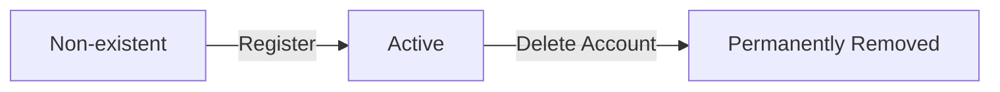

**todoApp — Actor definitions, permission matrix, authentication, session, account lifecycle**

Actor definitions, permission matrix, authentication, session, account lifecycle

# Actor Definitions

Define all user actor types with their roles and what they can do.

## guest Actor

A guest is an unauthenticated visitor who has not yet signed in to the application. Guests have limited capabilities focused on account creation and authentication. They can register a new account by providing an email address and password. Email addresses must be unique among all registered users to prevent duplicate accounts. During registration, guests must provide a password that meets security requirements. Once registered, guests become members and gain full access to their todo management features. Guests can also log in with their existing email and password credentials to access their account. They cannot view any todos, profiles, or other user-specific content until they authenticate. The application does not provide any public content or shared resources for guests to browse. Guests cannot view other users' profiles or todos as the application enforces strict privacy. All todo data is completely private and only accessible to authenticated members.

### Guest Actor Definition

### Unauthenticated Visitor Status

A guest is an unauthenticated visitor who has not yet signed in to the application.

THE system SHALL identify any user without valid authentication credentials as a guest.

THE system SHALL treat all guests uniformly regardless of their intended purpose.

WHEN a user session lacks valid authentication, THE system SHALL classify the user as a guest.

### Limited Capabilities

Guests have restricted capabilities limited to account creation and authentication functions.

THE system SHALL restrict guest access to registration and login functions only.

THE system SHALL NOT allow guests to access any todo management features.

THE system SHALL NOT allow guests to view any user profile information.

THE system SHALL NOT allow guests to access any user-specific content or data.

### Authentication Required

All todo-related and profile-related functions require authentication.

WHEN a guest attempts to access protected resources, THE system SHALL require authentication.

WHEN a guest attempts to view todos, THE system SHALL deny access and prompt for login.

WHEN a guest attempts to view profiles, THE system SHALL deny access and prompt for login.

THE system SHALL NOT provide any public todo listings or shared resources for guests to browse.

### Registration Access

### Account Creation Capability

Guests can create new accounts to become authenticated members.

THE system SHALL allow guests to register a new account by providing an email address and password.

THE system SHALL provide a registration interface accessible to all guests.

THE system SHALL NOT require any authentication to access the registration function.

### Account Creation Flow

WHEN a guest submits a registration request, THE system SHALL validate the provided email and password.

WHEN the registration validation succeeds, THE system SHALL create a new user account.

WHEN a new account is created, THE system SHALL assign the user the member role.

### Guest to Member Transition

WHEN a guest successfully completes registration, THE system SHALL transition the guest to member status.

WHEN a guest becomes a member, THE system SHALL grant access to all member capabilities including todo management.

WHEN registration completes, THE system SHALL authenticate the new member automatically.

THE system SHALL NOT retain any guest-specific restrictions after successful registration.

### Login Credentials

### Login Capability

Guests can authenticate using existing account credentials.

THE system SHALL allow guests to log in by providing their registered email address and password.

THE system SHALL provide a login interface accessible to all guests.

THE system SHALL NOT require any prior authentication to access the login function.

### Authentication Process

WHEN a guest submits login credentials, THE system SHALL validate the email and password combination.

WHEN login credentials are valid, THE system SHALL authenticate the user and establish a session.

WHEN login succeeds, THE system SHALL transition the guest to member status with full member capabilities.

### Login Failure Handling

IF the provided email does not match any registered account, THE system SHALL reject the login attempt.

IF the provided password does not match the stored credentials for the email, THE system SHALL reject the login attempt.

WHEN login fails, THE system SHALL NOT reveal whether the email or password was incorrect.

### Account Creation Requirements

### Email Uniqueness Requirement

Each registered email address must be unique across all users.

THE system SHALL require a unique email address for account registration.

WHEN a guest attempts to register with an email already in use, THE system SHALL reject the registration request.

THE system SHALL NOT allow multiple accounts to share the same email address.

THE system SHALL treat email addresses as case-insensitive for uniqueness validation.

### Password Security Requirements

Passwords must meet security requirements to protect user accounts.

THE system SHALL require a password for account registration.

THE system SHALL enforce a minimum password length for security.

THE system SHALL store passwords in a hashed format, not plain text.

THE system SHALL NOT allow passwords that are too short or too weak.

WHEN a guest submits a password that does not meet security requirements, THE system SHALL reject the registration request.

THE system SHALL provide feedback about password requirements when validation fails.

### Guest Data Access Restrictions

### No Data Access Before Login

Guests cannot access any user-specific data until they authenticate.

THE system SHALL NOT allow guests to view any todo lists or individual todos.

THE system SHALL NOT allow guests to view their own todos (guests have no todos).

THE system SHALL NOT allow guests to view other users' profiles or todos.

THE system SHALL NOT expose any user data through public APIs or interfaces accessible to guests.

### Privacy Enforcement

THE system SHALL enforce strict privacy by preventing all data access for unauthenticated users.

WHEN a guest requests any protected resource, THE system SHALL return an authentication required response.

THE system SHALL NOT leak any information about the existence of user data to guests.

THE system SHALL NOT provide any way for guests to enumerate registered users or their data.

THE system SHALL treat all todo and profile data as completely private and accessible only to authenticated members.

## member Actor

A member is an authenticated user who has successfully logged into the application. Members can create todos with a title and optional description, start date, and due date. They can view a paginated list of their own todos showing title, completion status, dates, and creation date. Members can view full details of any individual todo including the complete description. They can mark todos as complete or incomplete using a simple toggle. Members can edit their todos' title, description, start date, and due date, with every edit recorded in history. They can soft-delete their todos, which moves them to trash without permanent removal. Members can view their trash containing deleted todos in a paginated list. They can restore deleted todos from trash back to their active list. Members can permanently delete todos from trash, which also removes the edit history. They can filter their todo list by completion status. Members can sort todos by creation date, start date, or due date. They can view the full edit history of any todo showing all changes made. Members can edit their profile display name. They can change their password. Members can delete their account, which permanently removes all their todos including those in trash and all edit history. Each member's todos are completely private and cannot be accessed by other users.

### Member Actor Definition

### Member Identity

THE system SHALL recognize a member as any user who has successfully authenticated.

THE system SHALL maintain a unique identifier for each member.

THE system SHALL associate all todos with exactly one member who owns them.

### Member Session

WHILE a member is authenticated, THE system SHALL grant access to all member-specific operations.

WHEN a member's session expires, THE system SHALL require re-authentication before allowing further operations.

### Member Capabilities Overview

THE system SHALL allow a member to create, view, edit, complete, and delete their own todos.

THE system SHALL allow a member to manage their trash including restoring and permanently deleting todos.

THE system SHALL allow a member to view edit history for their todos.

THE system SHALL allow a member to edit their profile display name.

THE system SHALL allow a member to change their password.

THE system SHALL allow a member to delete their account permanently.

### Todo Ownership and Privacy

### Ownership Model

THE system SHALL associate every todo with exactly one member who created it.

THE system SHALL prevent any member from accessing todos owned by another member.

THE system SHALL ensure that todo ownership cannot be transferred between members.

### Privacy Enforcement

THE system SHALL enforce complete privacy of each member's todos.

WHEN a member performs any todo operation, THE system SHALL verify that the todo belongs to that member.

IF a member attempts to access a todo they do not own, THE system SHALL reject the request.

THE system SHALL NOT provide any mechanism for members to view, access, or share another member's todos.

THE system SHALL NOT display any information about other members' todos in any list, search, or view.

### Todo Creation

### Creation Requirements

WHEN a member creates a todo, THE system SHALL require a title.

WHEN a member creates a todo, THE system SHALL allow an optional description.

WHEN a member creates a todo, THE system SHALL allow an optional start date.

WHEN a member creates a todo, THE system SHALL allow an optional due date.

### Initial State

WHEN a member creates a todo, THE system SHALL set the completion status to incomplete by default.

WHEN a member creates a todo, THE system SHALL record the creation date and time.

WHEN a member creates a todo, THE system SHALL associate the todo with the creating member as its owner.

### Validation

IF the title is not provided during creation, THE system SHALL reject the request.

IF the title exceeds the maximum allowed length, THE system SHALL reject the request.

### Todo Viewing

### Todo List Display

WHEN a member requests their todo list, THE system SHALL display only todos owned by that member.

WHEN a member views their todo list, THE system SHALL show for each todo: the title, completion status, start date (if set), due date (if set), and creation date.

THE system SHALL NOT display deleted todos in the normal todo list.

### Paginated Lists

WHEN a member requests their todo list, THE system SHALL provide the results in paginated form.

THE system SHALL allow members to navigate between pages of their todo list.

### Individual Todo Details

WHEN a member views a single todo, THE system SHALL display all details including the full description.

IF a member attempts to view a todo they do not own, THE system SHALL reject the request.

### Completion Toggle

### Marking Complete

WHEN a member marks a todo as complete, THE system SHALL update the completion status to complete.

IF a member attempts to complete a todo they do not own, THE system SHALL reject the request.

### Marking Incomplete

WHEN a member marks a todo as incomplete, THE system SHALL update the completion status to incomplete.

IF a member attempts to mark incomplete a todo they do not own, THE system SHALL reject the request.

### Toggle Behavior

THE system SHALL allow members to toggle between complete and incomplete states unlimited times.

THE system SHALL maintain the completion status until explicitly changed by the owning member.

WHEN a todo completion status is toggled, THE system SHALL NOT create an edit history entry.

### Todo Editing and History

### Editable Fields

WHEN a member edits a todo, THE system SHALL allow modification of the title.

WHEN a member edits a todo, THE system SHALL allow modification of the description.

WHEN a member edits a todo, THE system SHALL allow modification of the start date.

WHEN a member edits a todo, THE system SHALL allow modification of the due date.

IF a member attempts to edit a todo they do not own, THE system SHALL reject the request.

### Edit History Tracking

WHEN a member edits a todo, THE system SHALL create a history entry recording the edit.

THE system SHALL record in each history entry: the date and time of the edit.

THE system SHALL record in each history entry: what the title was changed to (if changed).

THE system SHALL record in each history entry: what the description was changed to (if changed).

THE system SHALL record in each history entry: what the start date was changed to (if changed).

THE system SHALL record in each history entry: what the due date was changed to (if changed).

### Viewing Edit History

WHEN a member requests the edit history of a todo, THE system SHALL return all history entries for that todo.

THE system SHALL sort history entries from most recent to oldest.

IF a member attempts to view history of a todo they do not own, THE system SHALL reject the request.

### Filtering and Sorting

### Filtering by Completion Status

WHEN a member filters their todo list, THE system SHALL provide an option to view all todos.

WHEN a member filters their todo list, THE system SHALL provide an option to view only complete todos.

WHEN a member filters their todo list, THE system SHALL provide an option to view only incomplete todos.

THE system SHALL apply filtering only to todos owned by the requesting member.

### Sorting by Creation Date

WHEN a member sorts by creation date, THE system SHALL provide an option to sort newest first.

WHEN a member sorts by creation date, THE system SHALL provide an option to sort oldest first.

### Sorting by Start Date

WHEN a member sorts by start date, THE system SHALL provide an option to sort earliest first.

WHEN a member sorts by start date, THE system SHALL provide an option to sort latest first.

WHEN sorting by start date, THE system SHALL place todos without a start date at the end of the list.

### Sorting by Due Date

WHEN a member sorts by due date, THE system SHALL provide an option to sort earliest first.

WHEN a member sorts by due date, THE system SHALL provide an option to sort latest first.

WHEN sorting by due date, THE system SHALL place todos without a due date at the end of the list.

### Soft Delete and Trash

### Soft Delete Operation

WHEN a member deletes a todo, THE system SHALL move the todo to trash without permanently removing it.

THE system SHALL remove soft-deleted todos from the normal todo list view.

IF a member attempts to delete a todo they do not own, THE system SHALL reject the request.

### Trash List Display

WHEN a member views their trash, THE system SHALL display only deleted todos owned by that member.

THE system SHALL provide the trash list in paginated form.

WHEN a member views their trash, THE system SHALL show for each deleted todo: the title, completion status, and dates previously stored.

### Trash Privacy

THE system SHALL NOT allow any member to view another member's trash.

IF a member attempts to access a deleted todo they do not own, THE system SHALL reject the request.

### Restore and Permanent Deletion

### Restore from Trash

WHEN a member restores a deleted todo, THE system SHALL return the todo to the normal todo list.

WHEN a member restores a deleted todo, THE system SHALL preserve all previously recorded data including edit history.

IF a member attempts to restore a todo they do not own, THE system SHALL reject the request.

### Permanent Deletion

WHEN a member permanently deletes a todo from trash, THE system SHALL remove the todo and all its data permanently.

WHEN a member permanently deletes a todo, THE system SHALL delete all edit history entries associated with that todo.

IF a member attempts to permanently delete a todo they do not own, THE system SHALL reject the request.

THE system SHALL NOT provide any mechanism to recover a permanently deleted todo.

### Profile and Account Management

### Display Name Management

WHEN a member edits their profile, THE system SHALL allow modification of the display name.

IF a member attempts to view another member's profile, THE system SHALL reject the request.

THE system SHALL ensure that profile information remains private and visible only to the owning member.

### Password Change

WHEN a member changes their password, THE system SHALL require authentication with the current password.

WHEN a member changes their password, THE system SHALL update the stored password.

### Account Deletion

WHEN a member deletes their account, THE system SHALL permanently delete the member's profile.

WHEN a member deletes their account, THE system SHALL permanently delete all todos owned by that member.

WHEN a member deletes their account, THE system SHALL permanently delete all todos in the member's trash.

WHEN a member deletes their account, THE system SHALL permanently delete all edit history for all of the member's todos.

THE system SHALL NOT provide any mechanism to recover a deleted account or its associated data.

# Authentication Flows

Registration, login, session management, and token policies.

## Registration and Login

Define user registration and login flows including validation and error handling.

### User Registration

WHEN a guest submits registration with an email and password, THE system SHALL validate that the email is in a valid email format.

WHEN a guest submits registration with an email and password, THE system SHALL verify that the email is not already registered.

IF the submitted email is already registered to an existing user, THE system SHALL reject the registration request.

IF the submitted email format is invalid, THE system SHALL reject the registration request.

WHEN registration validation passes, THE system SHALL create a new user account with the provided email and hashed password.

WHEN a new user account is created, THE system SHALL initialize the user's profile with the required display name field.

WHEN registration succeeds, THE system SHALL authenticate the user and establish a session automatically.

IF registration fails for any reason, THE system SHALL NOT create any user account or store any credentials.

The system SHALL allow guests to attempt registration multiple times, subject to rate limiting.

WHEN a registered user attempts to register again with the same email, THE system SHALL reject the request without revealing whether the email exists.

### User Login

WHEN a user submits login credentials with an email and password, THE system SHALL validate that the email format is valid.

WHEN a user submits login credentials, THE system SHALL look up the account by email address.

IF no account exists for the submitted email, THE system SHALL reject the login request.

IF the submitted password does not match the stored password hash, THE system SHALL reject the login request.

WHEN login credentials are verified successfully, THE system SHALL authenticate the user and establish a session.

WHEN login succeeds, THE system SHALL grant the user member actor privileges.

IF login fails, THE system SHALL NOT reveal whether the email exists or the password is incorrect (generic error message).

The system SHALL allow users to attempt login multiple times, subject to rate limiting.

WHEN an authenticated user's session expires, THE system SHALL require re-authentication through the login process.

IF login fails due to invalid credentials, THE system SHALL allow the user to retry with correct credentials.

## Session and Token Policy

Define session duration, token refresh, and expiration policies.

### Session Lifecycle

WHEN a user successfully authenticates, THE system SHALL create a new session for that user.

THE system SHALL associate each session with exactly one user account.

THE system SHALL maintain session state for the duration of the session's validity period.

WHEN a user logs out, THE system SHALL invalidate the current session immediately.

WHEN a user's account is deleted, THE system SHALL invalidate all sessions associated with that user account.

WHEN a user changes their password, THE system SHALL invalidate all existing sessions for that user except the current session.

THE system SHALL allow only one active session per user at a time unless explicitly configured otherwise.

### JWT Token Structure

THE system SHALL issue JSON Web Tokens (JWT) for session authentication.

THE system SHALL include the user identifier in the token payload.

THE system SHALL include a token identifier in the token payload.

THE system SHALL include the token issuance timestamp in the token payload.

THE system SHALL include the token expiration timestamp in the token payload.

THE system SHALL sign all tokens using a secure cryptographic algorithm.

THE system SHALL reject any token with an invalid or missing signature.

THE system SHALL NOT include sensitive information such as passwords in the token payload.

### Token Refresh Mechanism

WHEN a user's access token is near expiration, THE system SHALL allow the user to refresh their token.

THE system SHALL issue a new access token upon successful token refresh.

THE system SHALL invalidate the previous access token when issuing a refreshed token.

IF a token refresh request is made with an expired or invalid token, THE system SHALL reject the request.

THE system SHALL require re-authentication after the maximum refresh period has elapsed.

THE system SHALL record the last refresh timestamp for each session.

WHEN a token is refreshed, THE system SHALL maintain the user's authenticated state without requiring login credentials.

### Token and Session Expiration

THE system SHALL define a maximum validity period for all access tokens.

THE system SHALL define a maximum session duration regardless of token refreshes.

WHEN a token expires, THE system SHALL reject the token and require the user to refresh or re-authenticate.

WHEN a session reaches its maximum duration, THE system SHALL terminate the session and require re-authentication.

THE system SHALL provide a grace period for token expiration to allow in-flight requests to complete.

IF a user is inactive beyond a specified threshold, THE system SHALL expire the session.

THE system SHALL communicate token expiration information in the token payload for client-side handling.

# Account Lifecycle

Account state transitions and lifecycle management.

## Account States and Transitions

Define account states (active, suspended, deleted) and valid transitions.

### Account States

THE system SHALL maintain the following account state for each user:

1. **Active** - The account is operational and the user can perform all member functions

WHEN a user successfully completes registration, THE system SHALL set the account state to Active.

WHILE an account is in Active state, THE system SHALL allow the user to:
- Log in with registered credentials
- Create, view, edit, and delete todos
- Modify their profile display name
- Change their password
- Delete their account

THE system SHALL NOT support suspended or deactivated account states.

THE system SHALL NOT support account reactivation after deletion.

Note: This system provides a simple two-state model (non-existent and active). Advanced account states such as suspended, deactivated, or locked are outside the scope of this application.

### Account Lifecycle

THE system SHALL manage the following account lifecycle phases:

WHEN a guest completes registration, THE system SHALL create a new account in Active state.

WHEN an Active account holder requests account deletion, THE system SHALL permanently remove the account and all associated data.

THE system SHALL NOT provide any intermediate lifecycle states between Active and Permanently Removed.

THE system SHALL NOT support account suspension, deactivation, or temporary disabling.

THE system SHALL NOT support account recovery after permanent deletion.

### Account Deletion

WHEN a user requests account deletion, THE system SHALL:

1. Verify the user is authenticated as the account owner
2. Permanently delete all todos owned by the user, including todos in the trash
3. Permanently delete all todo history records associated with the deleted todos
4. Permanently delete the user profile
5. Permanently delete the user account
6. Terminate the current session

THE system SHALL NOT require additional confirmation beyond authentication.

THE system SHALL NOT allow deletion of another user's account.

THE system SHALL NOT retain any user data after account deletion.

THE system SHALL NOT provide a grace period or undo mechanism for account deletion.

IF the account does not exist, THE system SHALL reject the deletion request.

Note: Account deletion is immediate and irreversible. Users who wish to use the application again must register as new users.

### State Transition Constraints

THE system SHALL enforce the following state transition rules:

| Current State | Allowed Transition | Trigger |
|---------------|-------------------|----------|
| Non-existent | → Active | Successful registration |
| Active | → Permanently Removed | Account deletion request |
| Permanently Removed | → (no transitions) | N/A |

THE system SHALL NOT allow transition from Permanently Removed to any other state.

THE system SHALL NOT allow transition from Active to any state other than Permanently Removed.

THE system SHALL NOT support suspension or deactivation transitions.

WHILE an account exists, THE system SHALL maintain it in Active state exclusively.

WHEN an account deletion is requested, THE system SHALL process the deletion immediately without state change delays.