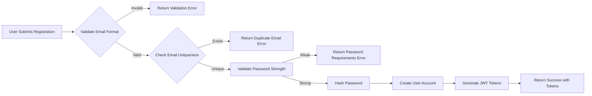
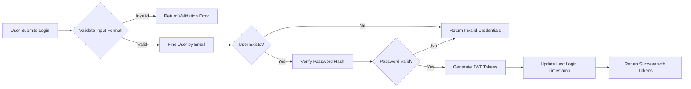
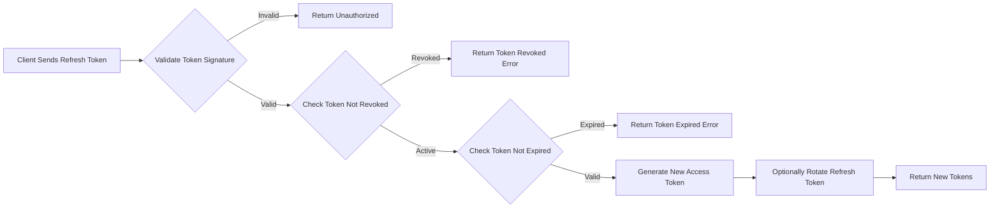
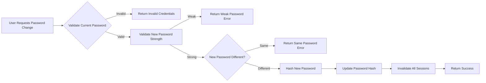
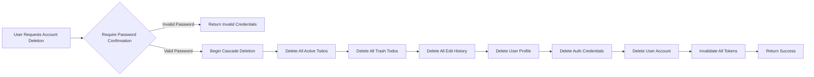
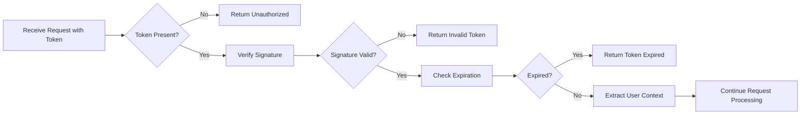

# Actors and Authentication Requirements

## Overview

This document defines the complete authentication and authorization model for the TodoApp private multi-user Todo application. The system implements a single actor type with JWT-based authentication, ensuring complete data privacy and isolation between users.

---

## 1. User Actor Definition

### 1.1 Actor Description

The TodoApp system recognizes a single actor type:

| Actor | Description |
|-------|-------------|
| **User** | An authenticated individual who manages their own todos, profile, and account. Each user operates in complete isolation - they can only access their own data and cannot view other users' profiles or todos. |

### 1.2 User Actor Characteristics

THE system SHALL recognize only one type of authenticated actor: the User.

WHEN a user is authenticated, THE system SHALL assign them the "user" role with complete access to only their own resources.

THE system SHALL enforce that users can never access, view, modify, or delete any data belonging to other users.

### 1.3 Non-Authenticated State

WHEN an individual is not authenticated, THE system SHALL consider them a "guest" with no access to any protected resources.

THE system SHALL deny all todo, profile, and account operations for non-authenticated individuals except for registration and login.

---

## 2. Authentication Flow Requirements

### 2.1 User Registration

#### 2.1.1 Registration Process

#### 2.1.2 Registration Requirements

WHEN a guest submits a registration request with email and password, THE system SHALL validate that:
- THE email address SHALL be in valid email format (containing @ symbol and domain)
- THE email address SHALL be unique across all registered users
- THE password SHALL meet minimum strength requirements (defined in Section 3)

IF the email format is invalid, THEN THE system SHALL reject the registration with error code `INVALID_EMAIL_FORMAT`.

IF the email address already exists in the system, THEN THE system SHALL reject the registration with error code `EMAIL_ALREADY_REGISTERED`.

IF the password does not meet strength requirements, THEN THE system SHALL reject the registration with error code `WEAK_PASSWORD` and provide specific requirements not met.

WHEN all validation passes, THE system SHALL:
1. Hash the password using a secure hashing algorithm
2. Create a new user account with the provided email
3. Initialize an empty profile with a default display name
4. Generate JWT access and refresh tokens
5. Return the tokens along with user identifier

THE system SHALL NOT store passwords in plain text under any circumstances.

THE system SHALL complete the registration process and return a response within 3 seconds under normal conditions.

### 2.2 User Login

#### 2.2.1 Login Process

#### 2.2.2 Login Requirements

WHEN a user submits login credentials (email and password), THE system SHALL validate both fields are present.

IF either email or password is missing from the request, THEN THE system SHALL return error code `MISSING_CREDENTIALS`.

WHEN validating login credentials, THE system SHALL use timing-safe comparison to prevent timing attacks.

IF the email does not exist or the password is incorrect, THEN THE system SHALL return the same error code `INVALID_CREDENTIALS` without revealing which field is incorrect.

WHEN authentication succeeds, THE system SHALL:
1. Generate a new JWT access token
2. Generate a new JWT refresh token
3. Record the login timestamp
4. Return both tokens to the client

THE system SHALL complete the login process and return a response within 2 seconds under normal conditions.

THE system SHALL NOT include the password or password hash in any response.

### 2.3 User Logout

#### 2.3.1 Logout Requirements

WHEN an authenticated user requests to logout, THE system SHALL invalidate the current refresh token.

THE system SHALL NOT invalidate the access token immediately (it will expire naturally based on its expiration time).

WHEN logout is complete, THE system SHALL return a success confirmation.

THE logout operation SHALL complete within 1 second.

### 2.4 Token Refresh

#### 2.4.1 Refresh Token Flow

#### 2.4.2 Refresh Requirements

WHEN a client submits a valid refresh token, THE system SHALL generate a new access token.

THE system MAY optionally rotate the refresh token for enhanced security (issuing a new refresh token and invalidating the old one).

IF the refresh token has been revoked or is invalid, THEN THE system SHALL return error code `TOKEN_REVOKED` and require the user to re-authenticate.

IF the refresh token has expired, THEN THE system SHALL return error code `TOKEN_EXPIRED` and require the user to re-authenticate.

---

## 3. Password Management

### 3.1 Password Strength Requirements

THE system SHALL enforce the following minimum password requirements:

| Requirement | Specification |
|-------------|---------------|
| Minimum Length | At least 8 characters |
| Maximum Length | At most 128 characters |
| Complexity | At least one uppercase letter (A-Z) |
| Complexity | At least one lowercase letter (a-z) |
| Complexity | At least one digit (0-9) |
| Complexity | At least one special character (!@#$%^&*()_+-=[]{};'\":,./<>?) |

WHEN a user creates or changes their password, THE system SHALL validate all strength requirements.

IF any password requirement is not met, THEN THE system SHALL reject the password and return error code `WEAK_PASSWORD` with a detailed message listing all unmet requirements.

### 3.2 Password Storage Requirements

THE system SHALL store only hashed passwords using bcrypt or Argon2id algorithm.

THE system SHALL use a minimum work factor of 12 for bcrypt or equivalent security level for Argon2id.

THE system SHALL generate a unique salt for each password hash.

THE system SHALL NEVER store passwords in plain text, reversible encryption, or legacy hash formats (MD5, SHA1, etc.).

### 3.3 Password Change

#### 3.3.1 Password Change Process

#### 3.3.2 Password Change Requirements

WHEN an authenticated user requests to change their password, THE system SHALL require:
1. The current password for verification
2. The new password

IF the current password verification fails, THEN THE system SHALL return error code `INVALID_CURRENT_PASSWORD`.

WHEN the current password is valid, THE system SHALL validate the new password against all strength requirements.

IF the new password is identical to the current password, THEN THE system SHALL return error code `SAME_PASSWORD` with a message requesting a different password.

WHEN password change succeeds, THE system SHALL:
1. Hash and store the new password
2. Invalidate all existing refresh tokens for security
3. Optionally invalidate all active sessions
4. Generate new tokens for the current session

THE password change operation SHALL complete within 3 seconds.

### 3.4 Password Security Considerations

THE system SHALL implement account lockout after 5 consecutive failed authentication attempts.

WHEN a user has 5 consecutive failed login attempts, THE system SHALL temporarily lock the account for 15 minutes.

WHEN an account is locked, THEN THE system SHALL return error code `ACCOUNT_LOCKED` with the remaining lock duration.

THE system SHALL reset the failed attempt counter upon successful authentication.

THE system SHALL NOT enforce password expiration for regular users (passwords remain valid until changed by the user).

---

## 4. Account Lifecycle

### 4.1 Account Creation

WHEN a user successfully registers, THE system SHALL create:
1. A user account record with unique identifier
2. An authentication credential record (email and password hash)
3. An empty user profile with default display name
4. Empty todo collections (active todos and trash)

THE user identifier SHALL be a unique, non-sequential identifier (UUID or similar) to prevent enumeration attacks.

### 4.2 Account Deletion

#### 4.2.1 Account Deletion Process

#### 4.2.2 Account Deletion Requirements

WHEN an authenticated user requests account deletion, THE system SHALL require password confirmation for security.

IF the password confirmation fails, THEN THE system SHALL return error code `INVALID_PASSWORD` and NOT proceed with deletion.

WHEN account deletion is confirmed, THE system SHALL permanently delete in the following order:
1. All active todos owned by the user
2. All todos in the trash owned by the user
3. All edit history records for those todos
4. The user's profile information
5. The user's authentication credentials
6. The user account record itself

THE system SHALL invalidate all JWT tokens associated with the deleted account.

THE account deletion operation SHALL be atomic - IF any step fails, THEN THE system SHALL roll back all changes and return an appropriate error.

THE system SHALL complete account deletion within 10 seconds for accounts with normal data volume.

### 4.3 Data Retention After Deletion

THE system SHALL NOT retain any user data after account deletion for privacy compliance.

THE system SHALL NOT retain backup copies of deleted user data beyond the standard backup retention period (if applicable).

---

## 5. Session Management

### 5.1 JWT Token Structure

#### 5.1.1 Access Token Structure

THE system SHALL issue JWT access tokens containing the following claims:

| Claim | Description | Value Example |
|-------|-------------|---------------|
| `sub` | Subject (User ID) | "550e8400-e29b-41d4-a716-446655440000" |
| `iat` | Issued At Timestamp | 1708396800 |
| `exp` | Expiration Timestamp | 1708397700 |
| `role` | User Role | "user" |
| `jti` | JWT ID (unique identifier) | "unique-token-id" |

#### 5.1.2 Refresh Token Structure

THE system SHALL issue JWT refresh tokens containing the following claims:

| Claim | Description | Value Example |
|-------|-------------|---------------|
| `sub` | Subject (User ID) | "550e8400-e29b-41d4-a716-446655440000" |
| `iat` | Issued At Timestamp | 1708396800 |
| `exp` | Expiration Timestamp | 1709001600 |
| `type` | Token Type | "refresh" |
| `jti` | JWT ID (unique identifier) | "unique-refresh-token-id" |

### 5.2 Token Expiration Configuration

THE system SHALL use the following token expiration times:

| Token Type | Expiration Time | Rationale |
|------------|-----------------|-----------|
| Access Token | 15 minutes | Balance between security and user experience |
| Refresh Token | 30 days | Allow reasonable session persistence |

THE system SHALL allow configuration of token expiration times through environment variables.

### 5.3 Token Security Requirements

THE system SHALL sign all JWT tokens using the HS256 (HMAC-SHA256) or RS256 (RSA-SHA256) algorithm.

THE system SHALL use a strong, randomly-generated secret key for HS256 signing (minimum 256 bits).

THE system SHALL store the signing key securely (environment variable or secure key management system).

THE system SHALL NEVER include sensitive information (passwords, personal data) in JWT payloads.

### 5.4 Token Storage Recommendations

THE system documentation SHALL recommend clients store tokens using one of these methods:
1. **httpOnly cookies** (most secure) - Prevents XSS access
2. **localStorage with XSS protection** (convenient) - Requires proper CSP headers

THE system SHALL NOT mandate a specific client-side storage mechanism.

### 5.5 Token Validation

WHEN the system receives a request to a protected endpoint, THE system SHALL:
1. Extract the JWT from the Authorization header
2. Verify the token signature
3. Check the token has not expired
4. Extract the user identifier from the token
5. Load the user context for the request

IF token validation fails for any reason, THEN THE system SHALL return HTTP 401 Unauthorized with appropriate error code.

### 5.6 Session Revocation

THE system SHALL support session revocation through refresh token invalidation.

WHEN a user changes their password, THE system SHALL revoke all existing refresh tokens.

WHEN a user deletes their account, THE system SHALL revoke all tokens for that account.

THE system MAY maintain a token blacklist for immediate revocation capability (optional feature).

---

## 6. Security Considerations

### 6.1 Authentication Security

#### 6.1.1 Brute Force Protection

THE system SHALL implement rate limiting on authentication endpoints:

| Endpoint | Rate Limit |
|----------|------------|
| Registration | 5 requests per minute per IP |
| Login | 10 requests per minute per IP |
| Password Change | 3 requests per minute per user |
| Token Refresh | 20 requests per minute per IP |

IF rate limits are exceeded, THEN THE system SHALL return HTTP 429 Too Many Requests with a `Retry-After` header.

#### 6.1.2 Timing Attack Prevention

THE system SHALL use constant-time comparison functions when validating passwords and tokens.

THE system SHALL not reveal whether an email exists in the system during login attempts.

#### 6.1.3 Input Validation

THE system SHALL sanitize all authentication inputs to prevent injection attacks.

THE system SHALL validate email format before processing.

THE system SHALL reject passwords containing control characters or null bytes.

### 6.2 Token Security

#### 6.2.1 Token Transmission

THE system SHALL require HTTPS for all authentication operations.

THE system SHALL NOT transmit tokens in URL parameters or query strings.

THE system SHALL recommend clients use secure (HTTPS) connections for all API calls.

#### 6.2.2 Token Handling

THE system SHALL generate unique token identifiers (jti claim) for each token issued.

THE system SHALL ensure tokens cannot be reused after revocation.

THE system SHALL log token generation events for audit purposes (without logging token values).

### 6.3 Privacy Requirements

THE system SHALL not expose user identifiers in error messages.

THE system SHALL not include other users' data in any response.

THE system SHALL ensure complete data isolation between users at all times.

---

## 7. Permission Matrix

### 7.1 Complete Permission Overview

| Resource/Action | Authenticated User | Non-Authenticated |
|-----------------|-------------------|-------------------|
| **Authentication** ||
| Register account | ❌ | ✅ |
| Login | ❌ | ✅ |
| Logout | ✅ | ❌ |
| Refresh token | ✅ | ❌ |
| Change password | ✅ | ❌ |
| Delete own account | ✅ | ❌ |
| **User Profile** ||
| View own profile | ✅ | ❌ |
| Edit own display name | ✅ | ❌ |
| View other users' profiles | ❌ | ❌ |
| **Todo Operations** ||
| Create todo | ✅ | ❌ |
| View own todos | ✅ | ❌ |
| View single todo | ✅ | ❌ |
| Edit own todo | ✅ | ❌ |
| Complete/Uncomplete todo | ✅ | ❌ |
| Delete own todo | ✅ | ❌ |
| View other users' todos | ❌ | ❌ |
| **Edit History** ||
| View edit history of own todos | ✅ | ❌ |
| **Trash Operations** ||
| View own trash | ✅ | ❌ |
| Restore own todo | ✅ | ❌ |
| Permanently delete own todo | ✅ | ❌ |
| **Data Privacy** ||
| Access any other user's data | ❌ | ❌ |
| Enumerate users | ❌ | ❌ |

### 7.2 Authorization Rules

#### 7.2.1 User-Scoped Access

ALL todo operations SHALL be scoped to the authenticated user.

WHEN a user performs any todo operation, THE system SHALL automatically filter by the user's identifier.

THE system SHALL reject any attempt to access resources not owned by the authenticated user with HTTP 404 Not Found (not 403 Forbidden, to prevent resource enumeration).

#### 7.2.2 Profile Privacy

THE system SHALL enforce complete profile privacy.

Users SHALL NOT have access to any profile information belonging to other users.

THE system SHALL not expose user information in any API response, error message, or system output.

#### 7.2.3 Todo Privacy

THE system SHALL enforce complete todo privacy.

WHEN accessing todos, THE system SHALL automatically apply a filter for the authenticated user's identifier.

THE system SHALL verify ownership before any todo operation (view, edit, delete).

IF a user attempts to access a todo they do not own, THEN THE system SHALL return HTTP 404 Not Found.

### 7.3 Authorization Implementation Requirements

THE system SHALL implement authorization at the middleware or service layer level.

THE system SHALL verify user ownership for EVERY protected resource access.

THE system SHALL not rely solely on client-side filtering for security.

THE system SHALL log authorization failures for security monitoring.

---

## 8. Error Codes Summary

### 8.1 Authentication Error Codes

| Error Code | HTTP Status | Description |
|------------|-------------|-------------|
| `MISSING_CREDENTIALS` | 400 | Email or password not provided |
| `INVALID_CREDENTIALS` | 401 | Email or password incorrect |
| `INVALID_EMAIL_FORMAT` | 400 | Email format is invalid |
| `EMAIL_ALREADY_REGISTERED` | 409 | Email already exists in system |
| `WEAK_PASSWORD` | 400 | Password does not meet strength requirements |
| `SAME_PASSWORD` | 400 | New password same as current |
| `INVALID_CURRENT_PASSWORD` | 401 | Current password verification failed |
| `ACCOUNT_LOCKED` | 423 | Account temporarily locked |
| `TOKEN_EXPIRED` | 401 | Token has expired |
| `TOKEN_REVOKED` | 401 | Token has been revoked |
| `INVALID_TOKEN` | 401 | Token validation failed |

### 8.2 Authorization Error Codes

| Error Code | HTTP Status | Description |
|------------|-------------|-------------|
| `UNAUTHORIZED` | 401 | Authentication required |
| `FORBIDDEN` | 403 | Action not permitted |
| `RESOURCE_NOT_FOUND` | 404 | Resource does not exist or not owned |

---

## 9. Performance Requirements

| Operation | Maximum Response Time |
|-----------|-----------------------|
| User Registration | 3 seconds |
| User Login | 2 seconds |
| User Logout | 1 second |
| Token Refresh | 1 second |
| Password Change | 3 seconds |
| Account Deletion | 10 seconds |

THE system SHALL complete authentication operations within the specified time limits under normal load conditions.

---

## 10. Summary

This document establishes the complete authentication and authorization foundation for the TodoApp private multi-user Todo application. Key points:

1. **Single Actor Model**: Only one user actor type exists, simplifying authorization
2. **JWT-Based Authentication**: Stateless authentication with access and refresh tokens
3. **Strong Password Requirements**: Minimum 8 characters with complexity requirements
4. **Complete Data Isolation**: Users can never access other users' data
5. **Cascade Deletion**: Account deletion removes all user data permanently
6. **Security-First Design**: Rate limiting, timing attack prevention, and secure token handling

These requirements form the security foundation upon which all other system features are built.