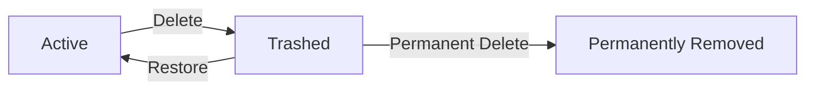
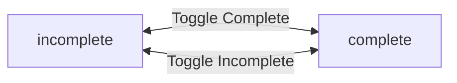
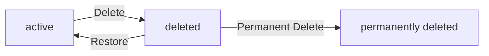

**todoApp — Business concepts, relationships, and states from user perspective**

Business concepts, relationships, and states from user perspective

# Domain Concepts

Describe what each concept means to users and why it exists.

## User Concept

A User represents an individual who has registered to use the todo application. Each user creates their account by providing an email address and a password during the sign-up process. The email address serves as a unique identifier, allowing the system to distinguish one user from another. Users authenticate themselves by logging in with their registered email and password combination. Once logged in, users have complete control over their personal information, including the ability to change their password at any time. Each user maintains a profile that includes a display name, which they can edit to personalize their identity within the application. Users have the option to permanently delete their account, which removes all of their data including todos and edit history. Privacy is fundamental to the user concept; each user's data is completely isolated and cannot be accessed by other users. There is no way for users to view or interact with another user's profile or todos. The user concept ensures a private, secure environment where individuals can manage their personal tasks without concern for data exposure.

### User Account Creation

A User account represents an individual's registration to use the todo application.

WHEN a person signs up for the application, THE system SHALL create a new user account associated with that person.

WHEN a new user account is created, THE system SHALL capture the person's email address and password.

THE system SHALL require each user account to have exactly one email address.

THE system SHALL require each user account to have exactly one password.

THE system SHALL allow any person to create a user account regardless of whether other user accounts already exist.

WHEN a user account is successfully created, THE system SHALL enable that user to authenticate and access their personal workspace.

### Email as Unique Identifier

The email address serves as the unique identifier for each user account.

THE system SHALL treat each email address as unique across all user accounts.

WHEN a person attempts to sign up with an email address that is already registered, THE system SHALL reject the account creation request.

THE system SHALL use the email address to distinguish one user from another.

THE system SHALL allow a user to reference their own identity through their registered email address.

THE system SHALL NOT allow two different user accounts to share the same email address under any circumstances.

### User Authentication

Authentication verifies a user's identity before granting access to their personal workspace.

WHEN a user provides their registered email address and correct password, THE system SHALL authenticate the user.

WHEN a user is successfully authenticated, THE system SHALL grant access to that user's personal workspace and todos.

WHEN a user provides an unregistered email address, THE system SHALL NOT authenticate that user.

WHEN a user provides a correct email address but incorrect password, THE system SHALL NOT authenticate that user.

THE system SHALL NOT grant access to any user's workspace without successful authentication.

### User Profile and Display Name

Each user maintains a profile containing their display name for personalization within the application.

THE system SHALL associate exactly one display name with each user account.

WHEN a new user account is created, THE system SHALL require an initial display name to be set.

THE system SHALL allow a user to change their display name at any time after account creation.

WHEN a user updates their display name, THE system SHALL apply the new display name immediately to that user's profile.

THE system SHALL NOT allow users to view other users' profiles or display names.

THE system SHALL NOT expose a user's display name to any other user.

### Password Management

Passwords secure user accounts and must be managed carefully.

THE system SHALL allow authenticated users to change their password.

WHEN a user changes their password, THE system SHALL require the new password to be different from the current password.

WHEN a user successfully changes their password, THE system SHALL apply the new password for all subsequent authentication attempts.

THE system SHALL continue to allow the user to authenticate with the new password after a password change.

### Account Deletion Process

Users have the right to permanently remove their account and all associated data.

THE system SHALL allow an authenticated user to delete their own account.

WHEN a user deletes their account, THE system SHALL permanently remove all of that user's todos, including those in the trash.

WHEN a user deletes their account, THE system SHALL permanently remove all edit history associated with that user's todos.

WHEN a user deletes their account, THE system SHALL permanently remove that user's profile information.

WHEN a user deletes their account, THE system SHALL release that user's email address for potential future registration.

THE system SHALL NOT allow a user to delete another user's account.

THE system SHALL NOT allow account deletion to be undone once completed.

### Data Privacy and Isolation

Privacy is fundamental to the user concept; each user's data is completely isolated from other users.

THE system SHALL ensure that each user's todos are completely private.

THE system SHALL NOT allow any user to view another user's todos.

THE system SHALL NOT allow any user to access another user's edit history.

THE system SHALL NOT provide any mechanism for sharing todos between users.

THE system SHALL NOT expose any user's data to any other user under any circumstances.

WHEN a user accesses their own data, THE system SHALL verify that the authenticated user is the owner of that data.

THE system SHALL prevent all forms of cross-user data access.

### Individual User Workspace

Each user operates within an isolated personal workspace for managing their tasks.

THE system SHALL provide each authenticated user with their own individual workspace.

THE system SHALL contain only that user's todos within a user's workspace.

THE system SHALL allow a user to create, view, edit, complete, and delete todos only within their own workspace.

THE system SHALL maintain complete separation between different users' workspaces.

THE system SHALL NOT allow any interaction between different users' workspaces.

A user's workspace SHALL remain accessible only to that user throughout the account's lifetime.

THE system SHALL ensure that secure personal task management is maintained through complete workspace isolation.

## Todo Concept

A Todo represents a task or item that a user wants to track and complete. Each todo belongs exclusively to one user and remains completely private to that user. Users create todos by providing a title, which is required and serves as the main identifier for the task. Optionally, users can add a description to provide additional context, set a start date to indicate when work should begin, and set a due date to track deadlines. Newly created todos start in an incomplete state, indicating that the task has not yet been finished. Users can toggle a todo between complete and incomplete states as they progress through their work. Todos can be edited at any time to update the title, description, start date, or due date. When no longer needed, users can delete todos, which moves them to a trash area rather than permanently removing them. Deleted todos can be restored from the trash or permanently deleted if the user confirms the action. The todo list supports filtering by completion status and sorting by creation date, start date, or due date. Each todo maintains a creation date and tracks its current completion status for display in lists.

### Task Tracking Purpose

THE system SHALL provide a task tracking capability that allows users to create, manage, and track their personal todos.

THE system SHALL ensure each todo belongs exclusively to one user.

THE system SHALL prevent users from viewing, accessing, or modifying todos belonging to other users.

THE system SHALL maintain complete privacy of each user's todos from all other users.

WHEN a user views their todo list, THE system SHALL display only todos belonging to that user.

THE system SHALL not provide any mechanism for sharing todos between users.

### Todo Creation

WHEN a user creates a todo, THE system SHALL require a title.

WHEN a user creates a todo, THE system SHALL allow an optional description.

WHEN a user creates a todo, THE system SHALL allow an optional start date.

WHEN a user creates a todo, THE system SHALL allow an optional due date.

WHEN a user creates a todo, THE system SHALL set the initial completion status to incomplete.

WHEN a user creates a todo, THE system SHALL record the creation date.

WHEN a user creates a todo, THE system SHALL associate the todo with the creating user.

IF the title is not provided during todo creation, THE system SHALL reject the creation request.

THE system SHALL allow users to create todos with only a title and no other fields.

### Todo Completion Status

THE system SHALL maintain a completion status for each todo.

THE system SHALL support two completion states: incomplete and complete.

WHEN a user marks an incomplete todo as complete, THE system SHALL update the todo's status to complete.

WHEN a user marks a complete todo as incomplete, THE system SHALL update the todo's status to incomplete.

THE system SHALL allow users to toggle between complete and incomplete states at any time.

THE system SHALL preserve the completion status until the user explicitly changes it.

WHEN a todo is displayed in a list, THE system SHALL show its current completion status.

### Start Date and Due Date

THE system SHALL allow users to set an optional start date on a todo to indicate when work should begin.

THE system SHALL allow users to set an optional due date on a todo to track deadlines.

THE system SHALL allow users to set a start date without a due date.

THE system SHALL allow users to set a due date without a start date.

THE system SHALL allow users to set both a start date and a due date on the same todo.

THE system SHALL allow users to clear a previously set start date.

THE system SHALL allow users to clear a previously set due date.

WHEN a todo has a start date set, THE system SHALL display the start date in the todo list.

WHEN a todo has a due date set, THE system SHALL display the due date in the todo list.

WHEN a todo has no start date set, THE system SHALL not display a start date in the todo list.

WHEN a todo has no due date set, THE system SHALL not display a due date in the todo list.

### Todo Lifecycle States

THE system SHALL support two lifecycle states for todos: active and deleted.

THE system SHALL consider a todo to be in the active state when it has not been deleted.

THE system SHALL consider a todo to be in the deleted state when it has been soft deleted.

Active todos SHALL appear in the normal todo list.

Deleted todos SHALL appear in the trash list and not in the normal todo list.

THE system SHALL maintain the completion status independently of the lifecycle state.

A deleted todo SHALL retain its completion status when moved to trash.

A restored todo SHALL retain its completion status when returned to the active state.

### Soft Delete to Trash

WHEN a user deletes a todo, THE system SHALL move the todo to the trash rather than permanently removing it.

WHEN a todo is moved to trash, THE system SHALL retain all todo data including title, description, dates, completion status, and edit history.

WHEN a todo is moved to trash, THE system SHALL remove it from the normal todo list.

WHEN a user views the trash list, THE system SHALL display all of that user's deleted todos.

THE system SHALL provide a separate trash view for viewing deleted todos.

WHEN a user deletes a todo, THE system SHALL not delete the todo's edit history.

### Restore from Trash

WHEN a user restores a deleted todo from trash, THE system SHALL return the todo to the active state.

WHEN a todo is restored, THE system SHALL make the todo visible in the normal todo list again.

WHEN a todo is restored, THE system SHALL preserve all todo data including title, description, dates, and completion status.

WHEN a todo is restored, THE system SHALL preserve the todo's edit history.

THE system SHALL allow users to restore any deleted todo from their trash.

### Permanent Deletion

WHEN a user permanently deletes a todo from trash, THE system SHALL remove the todo and all associated data irreversibly.

WHEN a user permanently deletes a todo, THE system SHALL delete the todo's edit history.

IF a user permanently deletes a todo, THE system SHALL not allow recovery of that todo.

WHEN a user deletes their account, THE system SHALL permanently delete all of that user's todos including those in trash.

### Filtering by Completion Status

THE system SHALL allow users to filter their todo list by completion status.

WHEN a user selects "All todos" filter, THE system SHALL display both complete and incomplete todos.

WHEN a user selects "Only complete todos" filter, THE system SHALL display only todos with complete status.

WHEN a user selects "Only incomplete todos" filter, THE system SHALL display only todos with incomplete status.

THE system SHALL apply the completion status filter only to active todos, not deleted todos.

### Sorting by Date Fields

THE system SHALL allow users to sort their todo list by creation date.

THE system SHALL allow users to sort their todo list by start date.

THE system SHALL allow users to sort their todo list by due date.

WHEN sorting by creation date, THE system SHALL support sorting newest first or oldest first.

WHEN sorting by start date, THE system SHALL support sorting earliest first or latest first.

WHEN sorting by due date, THE system SHALL support sorting earliest first or latest first.

WHEN sorting by start date, THE system SHALL place todos without a start date at the end of the list.

WHEN sorting by due date, THE system SHALL place todos without a due date at the end of the list.

THE system SHALL apply sorting only to active todos, not deleted todos.

## TodoHistory Concept

TodoHistory represents a chronological record of all changes made to a todo over its lifetime. Each time a user edits a todo, a history entry is automatically created to preserve a record of what changed. A history entry captures the timestamp of when the edit occurred, allowing users to see the exact timing of each modification. The entry records which specific fields were changed during the edit, including the title, description, start date, or due date. Only the fields that were actually modified are recorded in each history entry, keeping the record focused and relevant. Users can view the complete edit history of any of their todos to understand how the task has evolved. History entries are presented in reverse chronological order, showing the most recent changes first. This provides transparency and accountability, helping users recall why and when changes were made. The edit history remains associated with the todo until the todo is permanently deleted from the trash. When a todo is permanently deleted, all of its associated history entries are also removed. The history concept supports users in tracking the evolution of their tasks over time.

### History Entry Creation and Content

### History Entry Creation and Content

WHEN a user edits a todo, THE system SHALL automatically create a history entry to record the modifications.

WHEN a history entry is created, THE system SHALL record the exact timestamp of when the edit was made.

WHEN a user edits a todo, THE system SHALL create exactly one history entry that captures all field changes from that single edit operation.

WHEN a history entry is created, THE system SHALL record what the title was changed to IF the title was modified.

WHEN a history entry is created, THE system SHALL record what the description was changed to IF the description was modified.

WHEN a history entry is created, THE system SHALL record what the start date was changed to IF the start date was modified.

WHEN a history entry is created, THE system SHALL record what the due date was changed to IF the due date was modified.

WHEN a history entry is created, THE system SHALL only include fields that were actually changed during the edit.

IF no fields are modified during an edit, THE system SHALL NOT create a history entry.

WHEN recording date field modifications, THE system SHALL accept empty or null values as valid change records for optional fields.

### History Viewing and Ordering

### History Viewing and Ordering

WHEN a user views the edit history of a todo, THE system SHALL display all history entries associated with that todo.

WHEN displaying the edit history, THE system SHALL sort history entries in reverse chronological order with the most recent edits first.

WHEN a user views the edit history, THE system SHALL show the timestamp of when each modification was made.

WHEN a user views the edit history, THE system SHALL show which specific fields were changed in each history entry.

WHEN a user views the edit history, THE system SHALL display the values that each field was changed to.

THE system SHALL provide users with a complete timeline of how their todo has evolved over time.

THE system SHALL maintain a comprehensive audit trail for each todo that documents all modifications.

WHEN a user views the edit history, THE system SHALL provide transparency into what changes were made and when they occurred.

IF a todo has no edit history, THE system SHALL display an empty history list.

### History Retention and Deletion

### History Retention and Deletion

WHILE a todo exists in the system, THE system SHALL retain all of its history entries.

WHEN a todo is soft-deleted and moved to the trash, THE system SHALL preserve all associated history entries.

WHEN a todo is restored from the trash, THE system SHALL restore access to its complete edit history.

WHEN a todo is permanently deleted from the trash, THE system SHALL permanently delete all history entries associated with that todo.

IF a user permanently deletes a todo, THE system SHALL ensure its history entries are no longer accessible.

WHEN a user account is deleted, THE system SHALL permanently delete all history entries for all todos owned by that user.

THE system SHALL NOT allow history entries to be modified or deleted except through permanent todo deletion or account deletion.

# Domain Relationships

Describe how concepts relate to each other from a business perspective.

## Conceptual Relationships

Describe how concepts relate to each other in business terms.

### User-Todo Ownership Relationship

### Ownership Model

THE system SHALL associate every todo with exactly one user who is the owner.

THE system SHALL ensure that ownership of a todo cannot be transferred to another user.

WHEN a user creates a todo, THE system SHALL establish the user as the sole owner of that todo.

THE system SHALL maintain a one-to-many relationship between each user and their todos.

A user may have zero or more todos at any given time.

### Ownership Lifecycle

WHEN a user account is deleted, THE system SHALL permanently delete all todos owned by that user.

WHEN a todo is in the trash and the owner's account is deleted, THE system SHALL permanently delete that todo.

THE system SHALL NOT allow any user to access, view, or modify todos owned by another user.

THE system SHALL ensure complete data isolation between users through ownership constraints.

### Todo-TodoHistory Association

### History Tracking Relationship

THE system SHALL associate every todo history entry with exactly one todo.

THE system SHALL maintain a one-to-many relationship between each todo and its history entries.

A todo may have zero or more history entries at any given time.

WHEN a todo is edited, THE system SHALL create exactly one history entry associated with that todo.

### History Integrity

THE system SHALL preserve all history entries for a todo until the todo is permanently deleted.

WHEN a todo is permanently deleted from the trash, THE system SHALL delete all history entries associated with that todo.

WHEN a todo is restored from the trash, THE system SHALL restore all associated history entries.

THE system SHALL NOT allow history entries to exist independently of their associated todo.

THE system SHALL NOT allow history entries to be transferred to a different todo.

### BelongsTo Relationships

### Todo BelongsTo User

THE system SHALL ensure every todo belongs to exactly one user.

WHEN a todo is created, THE system SHALL establish a belongs-to relationship with the creating user.

THE system SHALL prevent any todo from existing without an associated user.

THE system SHALL NOT allow modification of the user a todo belongs to.

### TodoHistory BelongsTo Todo

THE system SHALL ensure every history entry belongs to exactly one todo.

WHEN a history entry is created, THE system SHALL establish a belongs-to relationship with the edited todo.

THE system SHALL prevent any history entry from existing without an associated todo.

THE system SHALL NOT allow modification of the todo a history entry belongs to.

### Cascade Effects

WHEN a user is deleted, THE system SHALL cascade the deletion to all todos belonging to that user.

WHEN a todo is permanently deleted, THE system SHALL cascade the deletion to all history entries belonging to that todo.

### Relationship Constraints

### Referential Integrity

THE system SHALL maintain referential integrity across all relationships.

THE system SHALL NOT allow orphaned todos that have no associated user.

THE system SHALL NOT allow orphaned history entries that have no associated todo.

THE system SHALL validate that the referenced user exists before creating a todo.

THE system SHALL validate that the referenced todo exists before creating a history entry.

### Privacy Through Relationships

THE system SHALL enforce user isolation through relationship constraints.

WHEN a user requests to view todos, THE system SHALL return only todos belonging to that user.

WHEN a user requests to view history entries, THE system SHALL return only history entries belonging to that user's todos.

THE system SHALL reject any request to access resources belonging to a different user.

### Relationship Cardinality

A user SHALL be associated with zero or more todos.

A todo SHALL be associated with exactly one user.

A todo SHALL be associated with zero or more history entries.

A history entry SHALL be associated with exactly one todo.

## Lifecycle and Retention

Describe business rules for concept lifecycle and data retention from a user perspective.

### Todo Lifecycle

### Lifecycle States

THE system SHALL define the following lifecycle states for a todo:
1. **Active** — The todo exists in the user's normal todo list and can be viewed, edited, or deleted
2. **Trashed** — The todo has been soft deleted and exists only in the user's trash, where it can be restored or permanently deleted

### State Transitions

WHEN a user creates a new todo, THE system SHALL assign it the Active state.

WHEN a user deletes an Active todo, THE system SHALL transition it to the Trashed state.

WHEN a user restores a Trashed todo, THE system SHALL transition it back to the Active state.

WHEN a user permanently deletes a Trashed todo, THE system SHALL remove the todo and all its associated data from the system.

### Lifecycle Constraints

THE system SHALL NOT allow direct transitions from Active to permanently deleted without first transitioning through the Trashed state.

THE system SHALL preserve the completion status of a todo through all state transitions.

### Soft Deletion and Trash

### Soft Delete Behavior

WHEN a user deletes a todo, THE system SHALL NOT permanently remove the todo from storage.

WHEN a user deletes a todo, THE system SHALL move the todo to the user's trash.

WHEN a todo is moved to trash, THE system SHALL retain all of its data including:
1. The todo's title, description, start date, and due date
2. The todo's completion status
3. The todo's entire edit history

### Trash Visibility

THE system SHALL provide a separate trash view for viewing deleted todos.

THE system SHALL NOT display trashed todos in the normal todo list.

THE system SHALL only show trashed todos to the user who originally owned them.

### Trash List Features

THE system SHALL display the following information for each todo in the trash list:
1. The todo's title
2. The todo's completion status
3. The todo's start date, if set
4. The todo's due date, if set

THE system SHALL support pagination for the trash list.

### Recovery from Trash

### Restoration Capability

THE system SHALL allow users to restore todos from the trash.

WHEN a user restores a todo from trash, THE system SHALL transition the todo back to the Active state.

WHEN a user restores a todo from trash, THE system SHALL make the todo visible in the normal todo list again.

### Restoration Data Integrity

WHEN a user restores a todo, THE system SHALL preserve all of the todo's original data:
1. The title and description
2. The start date and due date
3. The completion status
4. The entire edit history

THE system SHALL NOT modify the creation date of a restored todo.

THE system SHALL retain all history entries created before the todo was deleted.

### Restoration Limitations

THE system SHALL only allow the original owner of a todo to restore it from trash.

THE system SHALL NOT provide a time limit on how long a todo can remain in trash before restoration is no longer possible.

### Permanent Deletion Policy

### Permanent Deletion Execution

THE system SHALL allow users to permanently delete todos from the trash.

WHEN a user permanently deletes a todo, THE system SHALL remove the todo entirely from the system.

WHEN a user permanently deletes a todo, THE system SHALL delete all associated edit history entries.

### Permanent Deletion Irreversibility

THE system SHALL NOT provide any mechanism to recover a permanently deleted todo.

THE system SHALL NOT retain any data about a permanently deleted todo.

THE system SHALL warn the user that permanent deletion cannot be undone before executing the action.

### Permanent Deletion Constraints

THE system SHALL only allow permanent deletion of todos that are in the Trashed state.

THE system SHALL only allow the original owner of a todo to permanently delete it.

### Implicit Permanent Deletion

WHEN a user deletes their account, THE system SHALL permanently delete all of the user's todos, including those in the trash, along with all associated edit history entries.

### Account Deletion and Data Retention

### Account Deletion Scope

WHEN a user deletes their account, THE system SHALL permanently remove:
1. The user's profile information
2. All of the user's Active todos
3. All of the user's Trashed todos
4. All edit history entries for the user's todos

### Account Deletion Finality

THE system SHALL NOT provide any mechanism to recover a deleted account or its associated data.

THE system SHALL NOT retain any residual data after account deletion.

THE system SHALL warn the user that account deletion is permanent and all data will be lost before executing the action.

### Data Isolation in Retention

THE system SHALL ensure that a user's todos and history entries remain isolated to that user throughout the entire lifecycle.

THE system SHALL NOT allow any other user to access, view, or interact with a user's todos or history at any point in the lifecycle.

THE system SHALL enforce data isolation equally for Active todos, Trashed todos, and edit history entries.

# Enums and State Machines

Enum type definitions and state transitions.

## Enum Definitions

Define all enum types with their allowed values and descriptions.

### Completion Status Type

THE system SHALL define a completion status type with the following allowed values:

| Value | Description |
|-------|-------------|
| Incomplete | The todo has not been completed |
| Complete | The todo has been marked as completed |

WHEN a user creates a new todo, THE system SHALL assign the completion status of Incomplete.

WHEN a user marks a todo as complete, THE system SHALL change the completion status to Complete.

WHEN a user marks a todo as incomplete, THE system SHALL change the completion status to Incomplete.

THE system SHALL only allow a todo to have one of the two defined completion status values at any given time.

### Todo Lifecycle Status Type

THE system SHALL define a lifecycle status type with the following allowed values:

| Value | Description |
|-------|-------------|
| Active | The todo is in the normal todo list and visible to the user |
| Deleted | The todo has been soft-deleted and exists in the trash |

WHEN a user creates a new todo, THE system SHALL assign the lifecycle status of Active.

WHEN a user deletes a todo, THE system SHALL change the lifecycle status to Deleted.

WHEN a user restores a todo from the trash, THE system SHALL change the lifecycle status back to Active.

WHEN a user permanently deletes a todo from the trash, THE system SHALL remove the todo and its history entirely from the system.

THE system SHALL only allow a todo to have one of the two defined lifecycle status values at any given time.

THE system SHALL NOT include todos with Deleted lifecycle status in the normal todo list.

### Sort Field Type

THE system SHALL define a sort field type with the following allowed values:

| Value | Description |
|-------|-------------|
| CreationDate | Sort by when the todo was created |
| StartDate | Sort by the todo's start date |
| DueDate | Sort by the todo's due date |

THE system SHALL allow users to select one sort field at a time for viewing their todo list.

WHEN sorting by StartDate, THE system SHALL place todos without a start date at the end of the sorted list.

WHEN sorting by DueDate, THE system SHALL place todos without a due date at the end of the sorted list.

THE system SHALL only allow sorting by one of the defined sort field values.

### Sort Direction Type

THE system SHALL define a sort direction type with the following allowed values:

| Value | Description |
|-------|-------------|
| Ascending | Sort from earliest/smallest to latest/largest |
| Descending | Sort from latest/largest to earliest/smallest |

WHEN sorting by CreationDate with Ascending direction, THE system SHALL display older todos first.

WHEN sorting by CreationDate with Descending direction, THE system SHALL display newer todos first.

WHEN sorting by StartDate with Ascending direction, THE system SHALL display todos with earlier start dates first.

WHEN sorting by StartDate with Descending direction, THE system SHALL display todos with later start dates first.

WHEN sorting by DueDate with Ascending direction, THE system SHALL display todos with earlier due dates first.

WHEN sorting by DueDate with Descending direction, THE system SHALL display todos with later due dates first.

THE system SHALL allow users to select one sort direction at a time for viewing their todo list.

### Filter Type

THE system SHALL define a filter type for completion status with the following allowed values:

| Value | Description |
|-------|-------------|
| All | Show all todos regardless of completion status |
| Complete | Show only todos with Complete completion status |
| Incomplete | Show only todos with Incomplete completion status |

THE system SHALL allow users to select one filter value at a time for viewing their todo list.

WHEN the filter is set to All, THE system SHALL display both complete and incomplete todos.

WHEN the filter is set to Complete, THE system SHALL display only todos with Complete completion status.

WHEN the filter is set to Incomplete, THE system SHALL display only todos with Incomplete completion status.

THE system SHALL only allow filtering by one of the defined filter type values.

## State Transitions

Define valid state transition paths for stateful concepts.

### Todo Completion Status Transitions

THE Todo completion status SHALL have two valid states: incomplete and complete.

WHEN a user creates a new todo, THE system SHALL set the completion status to incomplete by default.

WHEN a user marks an incomplete todo as complete, THE system SHALL transition the todo to the complete state.

WHEN a user marks a complete todo as incomplete, THE system SHALL transition the todo to the incomplete state.

THE system SHALL allow users to toggle between incomplete and complete states without restriction.

THE system SHALL NOT require any prerequisites for toggling completion status.

WHILE a todo is in the deleted state (trash), THE system SHALL still allow completion status toggling.

### Todo Lifecycle State Transitions

THE Todo lifecycle SHALL have three valid states: active, deleted, and permanently deleted.

WHEN a user creates a todo, THE system SHALL set the lifecycle state to active.

WHEN a user deletes an active todo, THE system SHALL transition the todo to the deleted state.

WHEN a user restores a deleted todo, THE system SHALL transition the todo back to the active state.

WHEN a user permanently deletes a todo from trash, THE system SHALL transition the todo to the permanently deleted state.

THE system SHALL NOT allow direct transition from active to permanently deleted.

THE system SHALL NOT allow restoration from permanently deleted state.

WHILE a todo is in the deleted state, THE system SHALL retain all todo data including edit history.

WHEN a todo transitions to permanently deleted, THE system SHALL remove all associated edit history.

### State Transition Workflow

THE system SHALL only allow the todo owner to trigger state transitions.

WHEN a state transition is requested by a non-owner, THE system SHALL reject the request.

THE system SHALL record state transitions in real-time without requiring additional confirmation.

WHEN a todo transitions from active to deleted, THE system SHALL hide the todo from the normal todo list.

WHEN a todo transitions from deleted to active, THE system SHALL restore the todo to the normal todo list.

THE system SHALL NOT create TodoHistory entries for completion status changes.

THE system SHALL NOT create TodoHistory entries for lifecycle state changes.

TodoHistory entries SHALL only be created for content edits (title, description, start date, due date).

### Status Change Rules

THE completion status and lifecycle status SHALL operate independently of each other.

WHEN a todo is deleted, THE system SHALL preserve its completion status.

WHEN a todo is restored from trash, THE system SHALL restore the todo with its previous completion status.

THE system SHALL NOT impose restrictions on changing completion status based on lifecycle state.

THE system SHALL NOT impose restrictions on lifecycle transitions based on completion status.

THE system SHALL allow multiple state transitions to occur in any valid sequence.

THE system SHALL maintain data integrity during all state transitions.

WHEN a user account is deleted, THE system SHALL permanently delete all todos regardless of their current state.

THE system SHALL NOT allow state transitions on todos belonging to deleted user accounts.