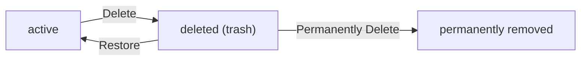
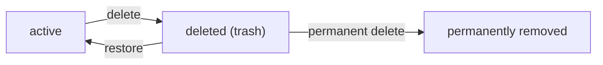
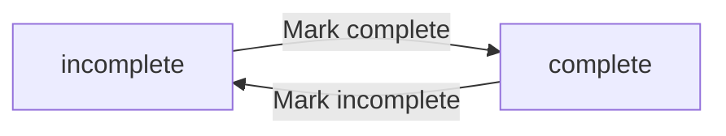
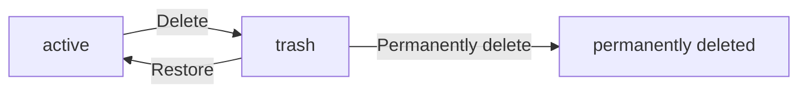
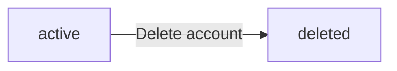

**privateTodoApp — Business concepts, relationships, and states from user perspective**

Business concepts, relationships, and states from user perspective

# Domain Concepts

Describe what each concept means in the business domain and its key attributes.

## User Concept

A User represents an individual who has registered to use the private todo application. Each user establishes their identity through an email address and a password, which serve as their credentials for accessing the system. Users have a display name that identifies them within their own session and profile area. Every user maintains a completely private collection of todos that no other user can view, access, or share. The application enforces strict isolation between users, making it a personal productivity tool rather than a collaborative platform. When a user decides to delete their account, the system permanently removes all their todos, including those currently in the trash, along with their profile information. This ensures that users have full control over their data and its complete removal from the application.

### Account Isolation and Data Removal

User accounts are completely isolated from one another. Each user can only see and interact with their own todos, profile information, and edit history. The application provides no way to access another user's data—no sharing features, no collaboration tools, and no visibility into other users' activities. When a user decides to delete their account, the system permanently removes all data associated with that user. This includes all of their todos (both active and those in the trash), all edit history for those todos, and their profile information. Account deletion is comprehensive and irreversible, giving users full control over the complete removal of their data from the application.

## Todo Concept

A Todo represents a task or item that a user wants to track and manage within their personal productivity system. Each todo must have a title, which provides a brief name or description of the task. A todo can optionally include a longer description for additional context or details about the task. Users can assign optional start dates and due dates to help organize when work should begin and when it needs completion. Every todo has a completion status that indicates whether the task is finished or still pending. The system automatically records the creation date for each todo when it is first added. Todos belong exclusively to the user who created them and remain completely private within their account. A todo can exist in either an active state, appearing in the normal todo list, or a deleted state, where it resides in the trash awaiting restoration or permanent removal. Each todo maintains a complete edit history that documents all changes made over its lifetime.

### Todo Definition and Attributes

A Todo represents a personal task or item that a user wants to track within their productivity system. Each todo serves as a manageable unit for organizing work, reminders, and goals.

Every todo must have a title, which provides a brief name identifying the task. The title is the only required field when creating a todo.

A todo can include an optional description for additional context, notes, or details about the task. This field can be left empty when the title alone is sufficient.

Users can assign an optional start date to indicate when work on the task should begin. This helps with planning and scheduling. The start date can be left empty for tasks without a defined beginning.

Users can assign an optional due date to indicate when the task needs to be completed. This helps track deadlines and prioritize work. The due date can be left empty for tasks without a specific deadline.

Every todo has a completion status that indicates whether the task is finished or still pending. Newly created todos are incomplete by default. Users can toggle the status between complete and incomplete at any time.

The system automatically records the creation date when a todo is first added. This timestamp helps users track when tasks were created and supports sorting by creation order.

Each todo maintains a complete edit history documenting all changes made over its lifetime. (Edit history details are defined in the EditHistory Concept section.)

### Todo Ownership and Privacy

Every todo belongs exclusively to the user who created it. This ownership is established at creation and cannot be transferred to another user.

All todos are completely private. A user can only see and interact with their own todos. There is no mechanism to view, access, share, or assign todos to other users. This privacy guarantee ensures each user's task list remains isolated and personal.

When a user deletes their account, all of their todos—including those in the trash—are permanently deleted. This cascade deletion ensures no orphaned data remains in the system.

### Todo States

A todo can exist in one of two states: active or deleted.

In the active state, a todo appears in the normal todo list where users can view, edit, complete, and manage it. Active todos are the primary working items in a user's productivity system.

In the deleted state, a todo has been soft-deleted by the user. Deleted todos are moved to the trash and no longer appear in the normal todo list. However, they are not permanently removed from the system.

Users can restore a deleted todo from the trash, returning it to the active state and making it visible in the normal todo list again.

Users can permanently delete a todo from the trash. Permanent deletion removes the todo and its entire edit history irreversibly.

## EditHistory Concept

EditHistory represents the chronological record of all modifications made to a todo throughout its existence. Each history entry captures the exact moment when an edit occurred, providing a clear timeline of changes. When a todo is modified, the system creates a new history entry that records which specific fields were altered and their new values. A history entry may document changes to the title, description, start date, or due date, but only includes information about fields that actually changed during that edit. Entries that represent edits where nothing changed are not created. The edit history allows users to review how a todo evolved from its original form to its current state. History entries are organized from most recent to oldest, enabling users to quickly see the latest modifications first. Each todo maintains its own independent edit history, separate from other todos. When a todo is permanently deleted from the trash, its entire edit history is also removed, ensuring complete data cleanup.

### Edit History Purpose

The edit history is a chronological record of all modifications made to a todo throughout its lifetime. Each todo maintains its own independent edit history, separate from other todos belonging to the same user. This allows users to review how a todo has evolved from its original form to its current state.

Every time a todo is edited, a single history entry is created to document that modification event. History entries are only created when actual changes are made — edits that result in no changes do not generate history entries. This ensures the history contains meaningful records of real modifications.

The edit history serves as an audit trail, enabling users to trace the complete timeline of changes applied to their todo items. Users can review past decisions, understand how a todo's details have been refined over time, and see the progression from initial creation to the current version.

### Edit History Entry Structure

Each history entry captures the moment when an edit occurred and records which specific fields were altered during that modification. The entry includes an edit timestamp indicating exactly when the change was made.

A history entry may document changes to any of the following fields:

- **Title change**: The new title value, if the todo's title was modified
- **Description change**: The new description value, if the todo's description was modified
- **Start date change**: The new start date value, if the todo's start date was modified
- **Due date change**: The new due date value, if the todo's due date was modified

Each history entry only includes information about fields that actually changed during that specific edit. Fields that remained unchanged are not recorded in that entry. This selective recording keeps the history focused on meaningful modifications without redundant information.

### Edit History Organization and Lifecycle

History entries are organized from most recent to oldest, enabling users to quickly see the latest modifications first. This reverse chronological order supports efficient review of recent changes while still providing access to the complete modification history.

The edit history exists as long as the parent todo exists. When a todo is permanently deleted from the trash, its entire edit history is also removed. This ensures complete data cleanup when a user chooses to irreversibly delete a todo item.

Soft-deleted todos (those in the trash) retain their edit history. If a deleted todo is restored from the trash, its full edit history remains intact and accessible. The history is only permanently removed when the todo itself is permanently deleted.

# Domain Relationships

Describe how concepts relate to each other from a business perspective.

## Conceptual Relationships

Describe how concepts relate to each other in business terms.

### User and Todo Ownership

Each user owns a private collection of todos. A todo belongs to exactly one user - the user who created it. This ownership relationship is established at creation and cannot be transferred to another user.

The ownership relationship enforces complete privacy: users can only view, edit, complete, or delete their own todos. There is no sharing, collaboration, or access to another user's todos under any circumstances.

When a user deletes their account, all their todos are permanently deleted, including those currently in the trash. This cascade deletion ensures no orphaned todos remain in the system.

### Todo and Edit History Association

Each todo has an edit history that records all modifications made to it. Every edit creates a new history entry that belongs to that specific todo.

An edit history entry belongs to exactly one todo and cannot exist independently. When a todo is permanently deleted from the trash, all its edit history entries are also deleted.

The relationship between a todo and its edit history is one-way: the history tracks changes to the todo, but changes to history entries themselves are not recorded. Users can view the edit history of any todo they own, but cannot modify or delete individual history entries.

### Relationship Privacy Model

All relationships in the system follow a strict privacy model centered on user ownership:

- Users can only access todos they own
- Users can only view edit history for todos they own
- There are no cross-user relationships - no shared todos, no collaborative features, no visibility into other users' data

This privacy model applies consistently across all operations: viewing, creating, editing, completing, deleting, restoring, and viewing history. The ownership relationship acts as the sole access control mechanism - if a user does not own a todo, they cannot interact with it in any way.

## Lifecycle and Retention

Describe concept lifecycle states and transitions only. Detailed retention/recovery policies belong in 05-non-functional. Operation details belong in 03-functional-requirements.

### Todo Lifecycle States

A todo exists in one of two visibility states: active or deleted (in trash).

**Active State**: A todo in the active state appears in the user's normal todo list. It can be viewed, edited, completed, marked incomplete, or deleted.

**Deleted State (Trash)**: When a todo is deleted, it transitions to the deleted state and moves to the trash. A deleted todo does not appear in the normal todo list. A deleted todo can be restored (returning to active state) or permanently deleted.

**Completion State**: Separately from visibility state, a todo has a completion state: incomplete or complete. The completion state is independent of whether the todo is active or deleted. A todo can be toggled between incomplete and complete regardless of its visibility state.

**State Transitions**:
- Active to deleted: When a user deletes their todo
- Deleted to active: When a user restores a todo from trash
- Deleted to permanently removed: When a user permanently deletes a todo from trash

### Todo Retention and Permanent Deletion

**Retention in Trash**: Deleted todos remain in the trash until the user chooses to restore or permanently delete them. There is no automatic expiration of deleted todos.

**Recovery**: A user can restore a deleted todo from the trash, returning it to the active state. The todo retains all its original attributes including title, description, start date, due date, completion status, and edit history.

**Permanent Deletion**: When a todo is permanently deleted from the trash, it is irrecoverably removed from the system. Permanent deletion also removes all associated edit history entries for that todo.

**User Account Deletion**: When a user deletes their account, all of their todos are permanently deleted, including any todos currently in the trash. This cascading deletion removes the user's entire todo collection and all associated edit histories.

**Edit History Retention**: Edit history entries are retained as long as the parent todo exists. When a todo is permanently deleted (either from trash or through account deletion), all of its edit history entries are also permanently removed.

# Business Categories and State Flows

Business category classifications and state flow definitions.

## Business Category Definitions

Define all business category classifications with their allowed values and descriptions.

### Completion Status

A classification that indicates whether a todo has been finished or remains pending.

**Allowed Values:**
- **Incomplete** – The default state for newly created todos, indicating the task has not yet been accomplished
- **Complete** – Indicates the user has marked the todo as finished

Users can toggle a todo between these two states at any time. The completion status is visible in the todo list and on individual todo detail views.

### Todo Visibility State

A classification that determines where a todo appears and whether it can be restored or is permanently removed.

**Allowed Values:**
- **Active** – The todo appears in the normal todo list and can be viewed, edited, completed, or deleted by the owning user
- **Deleted (Trashed)** – The todo has been soft-deleted, no longer appears in the normal todo list, and resides in the trash. The todo can be restored to active status or permanently deleted
- **Permanently Deleted** – The todo and its entire edit history have been irreversibly removed from the system

When a user deletes a todo, it transitions from Active to Deleted. From the trash, a todo can be restored (returning to Active) or permanently deleted. Account deletion cascades permanent deletion to all of the user's todos regardless of their visibility state.

### Account State

A classification that indicates whether a user account exists and is accessible.

**Allowed Values:**
- **Active** – The account is registered and the user can log in to access their todos
- **Deleted** – The account and all associated data (including todos in the trash and their edit histories) have been permanently removed

When a user deletes their account, all their todos—whether active or in trash—are permanently deleted along with their edit histories. Account deletion is irreversible.

## State Transitions

Define valid state transition paths for stateful concepts.

### Todo Completion Status

A todo has a completion status that can exist in one of two states: incomplete or complete. Newly created todos start in the incomplete state by default.

**States:**
- **Incomplete**: The todo has not been finished yet. This is the initial state for all newly created todos.
- **Complete**: The todo has been marked as finished by the user.

**Valid Transitions:**
- Incomplete → Complete: When the user marks the todo as complete
- Complete → Incomplete: When the user marks the todo as incomplete

This is a simple toggle mechanism allowing users to freely switch between the two states. There are no restrictions on how many times a todo can be toggled between complete and incomplete states.

**State Independence:**
The completion status operates independently from the todo lifecycle (active/trash). A todo can be complete or incomplete regardless of whether it is in the active list or in the trash. Completion status does not affect whether a todo can be deleted, restored, or permanently deleted.

### Todo Lifecycle Workflow

A todo progresses through a lifecycle workflow that determines its visibility and permanence in the system. The lifecycle has three main states: active, trash, and permanently deleted.

**States:**
- **Active**: The todo is visible in the user's normal todo list and can be viewed, edited, completed, or deleted.
- **Trash**: The todo has been soft-deleted and is only visible in the trash view. The todo still exists in the system and can be restored or permanently deleted.
- **Permanently Deleted**: The todo has been irrevocably removed from the system along with its entire edit history.

**Valid Transitions:**
- Active → Trash: When the user deletes the todo (soft delete)
- Trash → Active: When the user restores the todo from the trash
- Trash → Permanently Deleted: When the user permanently deletes the todo from the trash

**Transition Constraints:**
- A todo cannot transition directly from active to permanently deleted; it must go through the trash state first
- A permanently deleted todo cannot be restored; this transition is irreversible
- When a todo transitions to permanently deleted, its entire edit history is also deleted
- When a todo is restored from trash, it returns to the active state with all its data intact including completion status and edit history

**User Ownership:**
All lifecycle transitions are performed by the todo's owner. Only the user who created the todo can delete, restore, or permanently delete it.

### User Account Lifecycle

A user account has a simple lifecycle with two states: active and deleted.

**States:**
- **Active**: The user can log in, manage their todos, and perform all available operations.
- **Deleted**: The user account and all associated data have been permanently removed from the system.

**Valid Transition:**
- Active → Deleted: When the user deletes their account

**Transition Effects:**
When a user account transitions to the deleted state:
- All todos belonging to the user are permanently deleted, including those in the trash
- All edit history for those todos is permanently deleted
- The user's profile information is permanently deleted
- The user's email becomes available for re-registration (the user can sign up again with the same email)

**Irreversibility:**
The account deletion transition is irreversible. Once an account is deleted, there is no way to recover it or any of its associated data. Users should be made aware of this before confirming account deletion.