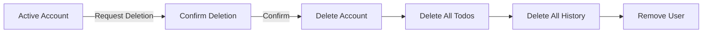
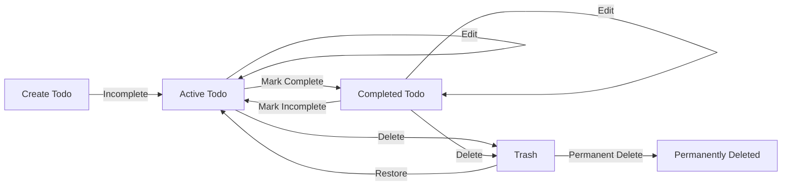

**todoApp — What operations users can perform, use cases, business workflows**

What operations users can perform, use cases, business workflows

# Core Business Operations

What the system must do for each business concept.

## User Operations

Users create accounts by providing an email address and password. Each email address must be unique across all user accounts in the system. After registration, users can authenticate by logging in with their registered email and password combination. Users have the ability to change their password at any time while logged in. Each user maintains a profile containing their display name, which can be updated as needed. Users cannot view or access other users' profiles, ensuring complete privacy between accounts. When a user chooses to delete their account, the system permanently removes all their data including all todos, todos in trash, and any associated history records. Account deletion is irreversible and removes the user's ability to access the application.

### User Registration

WHEN a guest registers for a new account, THE system SHALL require an email address and a password.

WHEN a guest submits a registration request, THE system SHALL validate that the email address is not already registered to an existing user.

IF the email address is already registered, THE system SHALL reject the registration request.

WHEN a guest successfully registers, THE system SHALL create a new user account with the provided email address.

WHEN a new user account is created, THE system SHALL create a user profile for that account.

THE system SHALL require the email address to be provided during registration.

THE system SHALL require the password to be provided during registration.

IF the registration is successful, THE system SHALL allow the user to access their new account.

THE system SHALL ensure each email address is associated with only one user account.

WHEN the system detects a duplicate email during registration, THE system SHALL not create a new account.

### User Login

WHEN a user logs in, THE system SHALL verify the provided email address and password combination.

IF the email address and password combination matches an existing account, THE system SHALL authenticate the user.

IF the email address does not exist in the system, THE system SHALL reject the login attempt.

IF the password does not match the registered password for the email, THE system SHALL reject the login attempt.

WHEN a user is successfully authenticated, THE system SHALL grant the user access to their account.

THE system SHALL not reveal whether a specific email address exists in the system when a login fails.

WHEN a user is not authenticated, THE system SHALL not allow access to any user-specific features.

THE system SHALL require both email and password to be provided for login.

### Password Change

WHEN a logged-in user requests to change their password, THE system SHALL require the current password for verification.

IF the provided current password is correct, THE system SHALL accept the password change request.

IF the provided current password is incorrect, THE system SHALL reject the password change request.

WHEN a password change is accepted, THE system SHALL update the user's password to the new value.

THE system SHALL allow a user to change their password at any time while logged in.

IF the password change is successful, THE system SHALL apply the new password for subsequent login attempts.

THE system SHALL require the new password to be provided during a password change operation.

### Profile and Display Name Management

WHEN a user views their own profile, THE system SHALL display their display name.

WHEN a logged-in user updates their display name, THE system SHALL save the new display name to their profile.

THE system SHALL allow users to change their display name at any time while logged in.

THE system SHALL require a display name to be present in the user profile.

WHEN a user account is created, THE system SHALL initialize a display name for the user profile.

THE system SHALL allow the display name to be updated multiple times.

### Account Deletion

WHEN a user deletes their account, THE system SHALL permanently remove all todos belonging to that user.

WHEN a user deletes their account, THE system SHALL permanently remove all todos in the trash belonging to that user.

WHEN a user deletes their account, THE system SHALL permanently remove all edit history records associated with the user's todos.

WHEN a user confirms account deletion, THE system SHALL permanently delete the user account.

IF a user account is deleted, THE system SHALL not allow recovery of the account.

IF a user account is deleted, THE system SHALL not allow recovery of any todos or history data.

THE system SHALL require user confirmation before permanently deleting an account.

WHEN account deletion is complete, THE system SHALL remove the user's ability to access the application.

THE system SHALL ensure account deletion is an irreversible operation.

### Privacy and Account Isolation

THE system SHALL ensure each user's todos are completely private to that user.

THE system SHALL not allow a user to view another user's profile.

THE system SHALL not allow a user to access another user's todos.

THE system SHALL not provide any mechanism for users to share todos with other users.

THE system SHALL isolate all user data so that each user can only access their own data.

WHEN a user attempts to access data belonging to another user, THE system SHALL deny access.

THE system SHALL ensure no user can discover or list other users in the application.

THE system SHALL treat each user account as a completely separate and isolated workspace.

## Todo Operations

Users create todos by providing a title, which is required, and optionally adding a description, start date, and due date. Newly created todos start in an incomplete state by default. Users can view a paginated list of their own todos, with each entry showing the title, completion status, start date if set, due date if set, and creation date. Users can access individual todo details to view the complete information including the full description. Users can toggle the completion status of any todo between complete and incomplete states. Editing a todo allows users to modify the title, description, start date, and due date, with each edit being automatically recorded. Users can delete their todos, which moves them to a trash area rather than permanently removing them. The trash maintains a paginated list of deleted todos. From the trash, users can restore todos back to the normal list or permanently delete them, which removes the todo and all its edit history permanently. Users can filter their todo list by completion status to show all todos, only complete, or only incomplete items. Sorting options include creation date, start date, and due date, with each supporting ascending or descending order. When sorting by date fields, todos without those dates appear at the end of the sorted list.

### Todo Creation

WHEN a member creates a todo, THE system SHALL require a title.

WHEN a member creates a todo, THE system SHALL allow an optional description.

WHEN a member creates a todo, THE system SHALL allow an optional start date.

WHEN a member creates a todo, THE system SHALL allow an optional due date.

WHEN a member creates a todo, THE system SHALL set the initial completion status to incomplete.

WHEN a member creates a todo, THE system SHALL associate the todo with the creating member.

IF a member attempts to create a todo without a title, THE system SHALL reject the request.

WHEN a member creates a todo, THE system SHALL record the creation date.

THE system SHALL allow creating a todo with only a title and no optional fields.

THE system SHALL allow creating a todo with any combination of optional fields populated.

### Viewing Todo List

WHEN a member views their todo list, THE system SHALL display only todos belonging to that member.

WHEN a member views their todo list, THE system SHALL present the list in paginated form.

WHEN a member views their todo list, THE system SHALL display the title of each todo.

WHEN a member views their todo list, THE system SHALL display the completion status of each todo.

WHEN a member views their todo list, THE system SHALL display the start date of each todo if set.

WHEN a member views their todo list, THE system SHALL display the due date of each todo if set.

WHEN a member views their todo list, THE system SHALL display the creation date of each todo.

WHEN a member filters the todo list by completion status, THE system SHALL support viewing all todos.

WHEN a member filters the todo list by completion status, THE system SHALL support viewing only complete todos.

WHEN a member filters the todo list by completion status, THE system SHALL support viewing only incomplete todos.

WHEN a member sorts by creation date, THE system SHALL support sorting newest first.

WHEN a member sorts by creation date, THE system SHALL support sorting oldest first.

WHEN a member sorts by start date, THE system SHALL support sorting earliest first.

WHEN a member sorts by start date, THE system SHALL support sorting latest first.

WHEN a member sorts by due date, THE system SHALL support sorting earliest first.

WHEN a member sorts by due date, THE system SHALL support sorting latest first.

WHEN sorting by start date, THE system SHALL place todos without a start date at the end of the list.

WHEN sorting by due date, THE system SHALL place todos without a due date at the end of the list.

### Viewing Single Todo

WHEN a member views a single todo, THE system SHALL display the todo title.

WHEN a member views a single todo, THE system SHALL display the todo description.

WHEN a member views a single todo, THE system SHALL display the todo start date if set.

WHEN a member views a single todo, THE system SHALL display the todo due date if set.

WHEN a member views a single todo, THE system SHALL display the todo completion status.

WHEN a member views a single todo, THE system SHALL display the todo creation date.

WHEN a member views a single todo, THE system SHALL only allow access to todos owned by that member.

IF a member attempts to view a todo they do not own, THE system SHALL deny access.

### Completing Todos

WHEN a member marks a todo as complete, THE system SHALL set the completion status to complete.

WHEN a member marks a todo as incomplete, THE system SHALL set the completion status to incomplete.

THE system SHALL allow toggling between complete and incomplete states.

WHEN a member toggles completion status, THE system SHALL only allow this operation on todos owned by that member.

IF a member attempts to toggle the completion status of a todo they do not own, THE system SHALL deny the operation.

### Editing Todos

WHEN a member edits a todo, THE system SHALL allow modifying the title.

WHEN a member edits a todo, THE system SHALL allow modifying the description.

WHEN a member edits a todo, THE system SHALL allow modifying the start date.

WHEN a member edits a todo, THE system SHALL allow modifying the due date.

WHEN a member edits a todo, THE system SHALL record the edit in the todo history.

WHEN a member edits a todo, THE system SHALL only allow editing on todos owned by that member.

IF a member attempts to edit a todo they do not own, THE system SHALL deny the operation.

IF a member attempts to edit a todo without providing a title, THE system SHALL reject the edit.

THE system SHALL allow editing any combination of fields in a single edit operation.

### Deleting Todos

WHEN a member deletes a todo, THE system SHALL move the todo to the trash.

WHEN a member deletes a todo, THE system SHALL NOT permanently remove the todo.

WHEN a member deletes a todo, THE system SHALL NOT delete the edit history.

WHEN a member deletes a todo, THE system SHALL remove the todo from the normal todo list.

WHEN a member deletes a todo, THE system SHALL only allow deletion of todos owned by that member.

IF a member attempts to delete a todo they do not own, THE system SHALL deny the operation.

### Trash Management

WHEN a member views the trash, THE system SHALL display only deleted todos belonging to that member.

WHEN a member views the trash, THE system SHALL present the list in paginated form.

WHEN a member restores a todo from the trash, THE system SHALL return the todo to the normal todo list.

WHEN a member restores a todo from the trash, THE system SHALL preserve all edit history.

WHEN a member permanently deletes a todo from the trash, THE system SHALL remove the todo permanently.

WHEN a member permanently deletes a todo from the trash, THE system SHALL delete all associated edit history.

THE system SHALL only allow restore operations on todos owned by that member.

THE system SHALL only allow permanent deletion on todos owned by that member.

IF a member attempts to restore a todo they do not own, THE system SHALL deny the operation.

IF a member attempts to permanently delete a todo they do not own, THE system SHALL deny the operation.

### Privacy Enforcement

THE system SHALL isolate each member's todos from all other members.

THE system SHALL prevent members from viewing other members' todos.

THE system SHALL prevent members from editing other members' todos.

THE system SHALL prevent members from deleting other members' todos.

THE system SHALL prevent members from restoring other members' todos.

THE system SHALL prevent members from accessing other members' todo history.

THE system SHALL ensure all todo operations verify ownership before execution.

THE system SHALL provide no mechanism for sharing or viewing another member's todos.

## TodoHistory Operations

Every todo maintains an edit history that records all modifications made over time. The system automatically creates a history entry each time a user edits a todo. Each history entry captures the timestamp when the edit occurred and records which fields were changed. Specifically, history entries document changes to the title, description, start date, and due date, but only include fields that were actually modified during that edit. Users can view the complete edit history for any of their todos to track how the todo has evolved. History entries are presented in chronological order starting with the most recent edit at the top. The edit history provides a complete audit trail of all modifications made to a todo throughout its lifecycle. When a todo is permanently deleted from the trash, all associated history entries are also permanently removed from the system.

### Automatic History Entry Creation

WHEN a member edits a todo, THE system SHALL automatically create a history entry without requiring any explicit action from the member.

WHEN a history entry is created, THE system SHALL only record fields that were actually modified during that edit session.

IF no fields were modified during an edit operation, THE system SHALL NOT create a history entry.

WHEN a history entry is created, THE system SHALL associate it with the todo that was edited.

THE system SHALL maintain the complete modification history for each todo as a collection of individual history entries.

### Edit Timestamp Recording

WHEN a history entry is created, THE system SHALL record the exact timestamp when the edit was made.

THE system SHALL use a consistent timestamp format for all history entries.

WHEN displaying history entries, THE system SHALL show when each edit occurred based on the recorded timestamp.

THE system SHALL preserve the original timestamp of each history entry and SHALL NOT allow modification of recorded edit times.

### Field Change Tracking

WHEN a member modifies the title of a todo, THE system SHALL record the new title value in the history entry.

WHEN a member modifies the description of a todo, THE system SHALL record the new description value in the history entry.

WHEN a member modifies the start date of a todo, THE system SHALL record the new start date value in the history entry.

WHEN a member modifies the due date of a todo, THE system SHALL record the new due date value in the history entry.

IF a field is not modified during an edit, THE system SHALL NOT include that field in the history entry.

IF multiple fields are modified in a single edit session, THE system SHALL record all modified fields in a single history entry.

WHEN a field is changed from a previous value to a new value, THE system SHALL capture what the field was changed to.

### Viewing Edit History

WHEN a member requests to view the edit history of a todo, THE system SHALL display all history entries associated with that todo.

WHEN displaying history entries, THE system SHALL sort them in chronological order with the most recent edit appearing first.

IF a todo has no edit history, THE system SHALL indicate that no history entries exist.

THE system SHALL only allow a member to view the edit history of todos they own.

IF a member attempts to view the edit history of a todo they do not own, THE system SHALL reject the request.

THE system SHALL provide a complete audit trail showing the evolution of each todo over time through its history entries.

### History Deletion with Permanent Todo Removal

WHEN a member permanently deletes a todo from the trash, THE system SHALL permanently delete all history entries associated with that todo.

WHEN history entries are deleted as part of permanent todo removal, THE system SHALL ensure no orphaned history entries remain in the system.

IF a todo is restored from the trash, THE system SHALL preserve all history entries that existed before the todo was moved to the trash.

THE system SHALL NOT allow members to selectively delete individual history entries.

THE system SHALL only delete history entries when the associated todo is permanently deleted from the trash.

# Business Actions and Workflows

Business actions and workflows beyond basic CRUD.

## User Actions

Users initiate their journey by signing up with a unique email address and a password, creating a new account that starts ready for use. The login workflow authenticates users by verifying their email and password combination, granting access to their private todo workspace. Users can change their password at any time through the profile settings, requiring their current password for security verification. The account deletion workflow permanently removes the user's account along with all associated data, including every todo and its complete edit history. This deletion is irreversible and cascades through all user-owned content. Users cannot view or access other users' profiles or data, ensuring complete privacy isolation. The display name can be updated independently without affecting authentication credentials. All user actions are scoped to the individual user's private workspace, with no shared or collaborative features available.

### User Registration Workflow

### Registration Process

WHEN a guest submits a registration request with an email and password, THE system SHALL create a new user account.

THE system SHALL require an email address for registration.

THE system SHALL require a password for registration.

THE system SHALL validate that the provided email is unique across all existing users.

IF the email is already registered, THE system SHALL reject the registration request.

WHEN registration succeeds, THE system SHALL create the user account ready for immediate use.

### Email Uniqueness

THE system SHALL ensure no two users can have the same email address.

IF a registration attempt uses an email that already exists, THE system SHALL NOT create a duplicate account.

THE system SHALL NOT reveal whether an email is already registered during the uniqueness check.

### Initial Account State

WHEN a new account is created, THE system SHALL initialize the user's display name to a default value.

THE system SHALL NOT require users to set a display name during registration.

### Login Authentication Process

### Authentication Flow

WHEN a user submits login credentials with email and password, THE system SHALL verify the credentials against stored authentication data.

IF the email and password combination matches an existing account, THE system SHALL grant the user access to their private workspace.

IF the email does not correspond to any registered account, THE system SHALL reject the login request.

IF the password does not match the stored credentials for the email, THE system SHALL reject the login request.

### Authentication Credential Management

THE system SHALL store user passwords in a securely hashed format.

THE system SHALL NOT store passwords in plain text.

THE system SHALL authenticate users using their registered email as the unique identifier.

### Session Establishment

WHEN authentication succeeds, THE system SHALL establish a session for the authenticated user.

THE system SHALL associate the session with the user's private workspace.

THE system SHALL NOT allow access to any other user's workspace through the established session.

### Password Change Verification

### Password Change Process

WHEN a user requests a password change, THE system SHALL require the current password for verification.

THE system SHALL validate the current password before allowing any password change.

IF the current password is incorrect, THE system SHALL reject the password change request.

WHEN the current password is verified, THE system SHALL allow the user to set a new password.

### Security Requirements

THE system SHALL NOT allow password changes without current password verification.

THE system SHALL apply the new password immediately upon successful change.

THE system SHALL NOT require the user to log in again after a successful password change.

### Error Handling

IF the current password verification fails, THE system SHALL NOT modify the stored password.

THE system SHALL allow the user to retry the password change after a failed verification.

### Account Deletion Cascade

### Deletion Process

WHEN a user requests account deletion, THE system SHALL permanently remove the user account.

THE system SHALL delete all todos owned by the user.

THE system SHALL delete all todos in the user's trash.

THE system SHALL delete all edit history entries associated with each deleted todo.

THE system SHALL delete the user's profile information.

### Permanent Data Removal

THE system SHALL perform account deletion as an irreversible operation.

THE system SHALL NOT allow recovery of any data after account deletion.

THE system SHALL NOT retain any user data after account deletion.

IF a user confirms account deletion, THE system SHALL NOT prompt for additional confirmation of individual data items.

### Post-Deletion State

WHEN account deletion completes, THE system SHALL terminate the user's session.

THE system SHALL make the user's email address available for future registration.

THE system SHALL NOT retain any association between the deleted account and its former data.

### Profile Display Name Update

### Display Name Management

WHEN a user updates their display name, THE system SHALL save the new display name to their profile.

THE system SHALL allow display name updates without affecting authentication credentials.

THE system SHALL NOT require password verification for display name changes.

THE system SHALL allow the display name to be changed multiple times.

### Display Name Requirements

THE system SHALL require a display name value for every user profile.

THE system SHALL NOT impose uniqueness constraints on display names.

THE system SHALL allow users to set their display name to any valid text value.

### Isolation from Authentication

THE system SHALL maintain display name separately from authentication credentials.

THE system SHALL NOT allow users to modify their email through display name settings.

THE system SHALL NOT allow users to modify their password through display name settings.

### Private Workspace Isolation

### Workspace Boundaries

THE system SHALL provide each user with a completely private workspace.

THE system SHALL isolate all user data within their private workspace.

THE system SHALL NOT allow any user to access another user's workspace.

THE system SHALL NOT provide any mechanism for users to share data between workspaces.

### User Data Privacy Boundaries

THE system SHALL restrict todo visibility to the owning user only.

THE system SHALL restrict todo history visibility to the owning user only.

THE system SHALL NOT expose user profiles to other users.

THE system SHALL NOT allow users to search for or discover other users.

### Cross-User Access Prevention

IF a user attempts to access another user's todos, THE system SHALL deny access.

IF a user attempts to access another user's profile, THE system SHALL deny access.

THE system SHALL NOT provide any collaborative or shared todo features.

THE system SHALL ensure complete data isolation between all user accounts.

## Todo Actions

Users create todos by providing a title and optionally adding a description, start date, and due date. Newly created todos default to incomplete status and immediately appear in the user's todo list. Users can toggle any todo between complete and incomplete states as a simple binary status change. The edit workflow allows users to modify the title, description, start date, and due date at any time, with each modification automatically recorded in the todo's history. Deleting a todo moves it to the trash rather than permanently removing it, allowing users to recover mistakenly deleted items. The trash provides a safety net where users can restore todos back to the active list or permanently delete them. Permanent deletion from trash removes the todo and all its edit history irreversibly. Users view their todos through paginated lists, with filtering options for all, complete, or incomplete todos. Sorting options include creation date, start date, and due date, with items lacking dates appearing at the end of sorted results. Each user can only view and manage their own todos, with complete data isolation between user accounts.

### Todo Creation Workflow

### Overview

THE system SHALL allow members to create todos with the following characteristics:

### Title Input

WHEN a member creates a todo, THE system SHALL:
1. Require a title to be provided
2. Accept the title as text input
3. Create the todo only when a title is provided

### Description Input

WHEN a member creates a todo, THE system SHALL:
1. Allow an optional description to be provided
2. Accept an empty description if the member chooses not to add one
3. Store the description value when provided

### Start Date and Due Date Setting

WHEN a member creates a todo, THE system SHALL:
1. Allow an optional start date to be set
2. Allow an optional due date to be set
3. Accept the start date and due date independently (either, both, or neither may be set)
4. Not require a start date to be set before a due date

### Default Status

WHEN a member creates a todo, THE system SHALL set the completion status to incomplete by default.

### Ownership Assignment

WHEN a member creates a todo, THE system SHALL associate the todo with the creating member's account.

### Completion Status Toggle

### Status Transitions

THE system SHALL support two completion states for todos: incomplete and complete.

### Marking as Complete

WHEN a member marks a todo as complete, THE system SHALL:
1. Change the todo's status from incomplete to complete
2. Preserve all other todo properties unchanged
3. Maintain the todo in the member's todo list

### Marking as Incomplete

WHEN a member marks a todo as incomplete, THE system SHALL:
1. Change the todo's status from complete to incomplete
2. Preserve all other todo properties unchanged
3. Maintain the todo in the member's todo list

### Toggle Operation

WHEN a member toggles a todo's completion status, THE system SHALL:
1. Switch the status between complete and incomplete
2. Perform the change as a single atomic operation
3. Require no additional confirmation beyond the toggle action

### History Recording

WHEN a member toggles a todo's completion status, THE system SHALL NOT create an edit history entry.

Note: Completion status changes are not recorded in edit history as they represent state transitions rather than content modifications.

### Soft Delete Workflow

### Deletion Action

WHEN a member deletes a todo, THE system SHALL:
1. Move the todo to the trash
2. Not permanently remove the todo from storage
3. Remove the todo from the normal todo list view
4. Preserve all todo properties including edit history

### Trash Placement

WHEN a todo is deleted, THE system SHALL:
1. Mark the todo as deleted
2. Retain association with the member who owns the todo
3. Retain the todo's edit history entries

### Visibility After Deletion

WHEN a todo has been deleted, THE system SHALL:
1. Exclude the todo from the normal paginated todo list
2. Include the todo in the trash list
3. Preserve the todo for restoration or permanent deletion

### Trash Restoration Process

### Restoration Action

WHEN a member restores a todo from the trash, THE system SHALL:
1. Remove the deleted marker from the todo
2. Return the todo to the normal todo list
3. Preserve all todo properties including edit history

### Visibility After Restoration

WHEN a todo has been restored, THE system SHALL:
1. Include the todo in the normal paginated todo list
2. Remove the todo from the trash list
3. Maintain all previous edit history entries

### Multiple Restoration Prevention

THE system SHALL prevent restoration of todos that are not currently in the trash.

### Permanent Deletion Workflow

### Permanent Deletion Action

WHEN a member permanently deletes a todo from the trash, THE system SHALL:
1. Irreversibly remove the todo and all associated data
2. Remove all edit history entries associated with the todo
3. Remove the todo from the trash list

### Irreversibility

THE system SHALL NOT provide any mechanism to recover a permanently deleted todo.

### Cascade Deletion

WHEN a member permanently deletes a todo, THE system SHALL delete all related edit history entries as part of the same operation.

### Paginated Todo Viewing

### List Display

WHEN a member views their todo list, THE system SHALL:
1. Display only todos belonging to the authenticated member
2. Exclude todos that are in the trash
3. Present todos across paginated results

### List Information

WHEN a member views their todo list, THE system SHALL display for each todo:
1. The todo title
2. The completion status
3. The start date (if set)
4. The due date (if set)
5. The creation date

### Single Todo Detail View

WHEN a member views a single todo's details, THE system SHALL display:
1. The todo title
2. The full description
3. The start date (if set)
4. The due date (if set)
5. The completion status
6. The creation date

### Filtering and Sorting

### Completion Status Filtering

WHEN a member filters their todo list by completion status, THE system SHALL support:
1. All todos (no filter applied)
2. Only complete todos
3. Only incomplete todos

### Creation Date Sorting

WHEN a member sorts their todo list by creation date, THE system SHALL support:
1. Newest first (descending order)
2. Oldest first (ascending order)

### Start Date Sorting

WHEN a member sorts their todo list by start date, THE system SHALL:
1. Support earliest first (ascending order)
2. Support latest first (descending order)
3. Place todos without a start date at the end of the sorted results

### Due Date Sorting

WHEN a member sorts their todo list by due date, THE system SHALL:
1. Support earliest first (ascending order)
2. Support latest first (descending order)
3. Place todos without a due date at the end of the sorted results

### Combined Filtering and Sorting

WHEN a member applies both a filter and a sort to their todo list, THE system SHALL:
1. First apply the completion status filter
2. Then apply the sorting to the filtered results
3. Respect the placement rules for todos without dates

### Private Todo Isolation

### Data Visibility

THE system SHALL ensure that each member's todos are completely private and visible only to the owning member.

### Access Restriction

WHEN any operation is performed on todos, THE system SHALL:
1. Verify the authenticated member owns the todo
2. Restrict all todo operations to the owning member
3. Prevent any access to another member's todos

### Cross-Member Access Prevention

THE system SHALL NOT provide any mechanism for a member to:
1. View another member's todos
2. Edit another member's todos
3. Delete another member's todos
4. Access another member's todo history

### Data Isolation Guarantee

THE system SHALL maintain complete isolation between member accounts such that no member can access, reference, or interact with todos belonging to any other member.

## TodoHistory Actions

Every edit to a todo's title, description, start date, or due date automatically creates a history entry that records what changed and when. The history workflow captures the timestamp of each edit and preserves the new values for any modified fields. Fields that remain unchanged during an edit do not generate history records for those specific attributes. Users can view the complete edit history for any of their todos, seeing a chronological log of all modifications. History entries display in reverse chronological order, showing the most recent changes first. The history provides an audit trail showing how a todo evolved over time through successive edits. When a todo is permanently deleted from the trash, its entire edit history is also permanently removed. History entries cannot be modified or deleted independently, they exist as immutable records tied to their parent todo. Users cannot view edit histories for todos they do not own, maintaining the privacy model throughout all historical data.

### Automatic History Creation on Edit

WHEN a user edits a todo's title, THE system SHALL automatically create a history entry recording the new title value.

WHEN a user edits a todo's description, THE system SHALL automatically create a history entry recording the new description value.

WHEN a user edits a todo's start date, THE system SHALL automatically create a history entry recording the new start date value.

WHEN a user edits a todo's due date, THE system SHALL automatically create a history entry recording the new due date value.

WHEN a user edits multiple fields of a todo in a single operation, THE system SHALL create one history entry containing all changed field values.

IF no fields are changed during an edit operation, THE system SHALL NOT create a history entry.

THE system SHALL create history entries only for the fields that were actually modified during an edit operation.

THE system SHALL NOT create history entries for unchanged fields.

WHEN a history entry is created, THE system SHALL link it permanently to its parent todo.

### Edit Timestamp Recording

WHEN a history entry is created, THE system SHALL record the exact timestamp when the edit was made.

THE system SHALL use the server's current timestamp as the edit timestamp for each history entry.

THE system SHALL store the edit timestamp in a manner that preserves chronological ordering of history entries.

THE system SHALL ensure the edit timestamp is immutable once recorded.

WHEN a user views edit history, THE system SHALL display the timestamp indicating when each edit occurred.

### Field Change Tracking

THE system SHALL track title changes in history entries when the title field is modified.

THE system SHALL track description changes in history entries when the description field is modified.

THE system SHALL track start date changes in history entries when the start date field is modified.

THE system SHALL track due date changes in history entries when the due date field is modified.

WHEN a field is changed, THE system SHALL store only the new value in the history entry for that specific field.

IF a field remains unchanged during an edit, THE system SHALL NOT record any value for that field in the history entry.

THE system SHALL preserve the complete audit trail showing how a todo evolved through successive edits.

### History Viewing and Ordering

WHEN a user requests to view a todo's edit history, THE system SHALL retrieve all history entries for that todo.

THE system SHALL display history entries in reverse chronological order, with the most recent edit appearing first.

IF a todo has no edit history, THE system SHALL return an empty history list.

THE system SHALL present each history entry with its edit timestamp and the values of any fields that were changed.

WHEN a user views the history, THE system SHALL show the chronological progression of changes from newest to oldest.

### History Entry Immutability and Deletion Cascade

THE system SHALL prevent modification of any history entry after it has been created.

THE system SHALL prevent deletion of individual history entries independently of their parent todo.

WHEN a todo is permanently deleted from the trash, THE system SHALL permanently delete all history entries associated with that todo.

WHEN a todo is soft-deleted to the trash, THE system SHALL preserve all history entries associated with that todo.

WHEN a todo is restored from the trash, THE system SHALL restore access to all preserved history entries.

IF a todo is permanently deleted, THE system SHALL ensure no history data remains for that todo.

### History Privacy and Access Control

THE system SHALL restrict history viewing access to the owner of the parent todo.

IF a user attempts to view the history of a todo they do not own, THE system SHALL reject the request.

THE system SHALL ensure edit histories remain private to each user within the todo application.

THE system SHALL NOT provide any mechanism for users to view, access, or share another user's todo edit histories.

THE system SHALL enforce the same privacy model on historical data as on the todo data itself.

# Error Scenarios and Edge Cases

Business-level error scenarios, edge case coverage, and expected system behaviors for exceptional conditions.

## User Error Scenarios

When a user attempts to register with an email already associated with an existing account, the system prevents registration and notifies the user that the email is already in use. Login attempts fail when the provided credentials do not match any account, with a generic error message to avoid revealing which field was incorrect. Users attempting to change their password must provide their current password, and the change is rejected if the current password is incorrect. Users cannot view or access other users' profiles, as this is a private application where each user's data is completely isolated. Account deletion is permanent and irreversible, removing all user data including todos in the trash and their complete edit history. Rate limiting prevents abuse of registration and login endpoints by restricting the number of attempts within a time window. Password changes require meeting security requirements, and attempts with weak passwords are rejected. Email addresses must be in a valid format to be accepted during registration. After account deletion, the email becomes available for new registrations, as all previous user data has been permanently removed.

### Duplicate Email Registration

WHEN a guest attempts to register with an email address already associated with an existing account, THE system SHALL reject the registration request.

THE system SHALL display a clear error message indicating the email is already in use.

IF a registration is rejected due to duplicate email, THE system SHALL NOT reveal any information about the existing account holder.

THE system SHALL treat email addresses as case-insensitive for uniqueness validation purposes.

### Invalid Login Credentials

WHEN a user attempts to log in with credentials that do not match any account, THE system SHALL reject the login attempt.

IF login fails due to invalid credentials, THE system SHALL display a generic error message that does not indicate whether the email or password was incorrect.

THE system SHALL NOT reveal account existence through differentiated error messages.

IF multiple consecutive login failures occur from the same source, THE system SHALL apply rate limiting as defined in the Authentication Rate Limiting section.

### Incorrect Current Password

WHEN a user attempts to change their password, THE system SHALL require the current password for verification.

IF the provided current password does not match the user's actual password, THE system SHALL reject the password change request.

THE system SHALL display an error message indicating the current password is incorrect.

THE system SHALL NOT allow password changes without successful current password verification.

### Unauthorized Profile Access

THE system SHALL ensure each user's profile is completely private.

IF a user attempts to access another user's profile, THE system SHALL deny access.

THE system SHALL NOT provide any mechanism to view, search, or retrieve another user's profile information.

THE system SHALL isolate all user data so that users can only access their own todos, history, and profile.

IF any unauthorized access attempt is detected, THE system SHALL prevent the action and may log the attempt for security purposes.

### Account Deletion Irreversibility

THE system SHALL treat account deletion as permanent and irreversible.

WHEN a user deletes their account, THE system SHALL permanently remove all user data including all todos, todos in trash, and complete edit history.

THE system SHALL NOT provide any mechanism to recover a deleted account or its data.

THE system SHALL NOT allow users to undo account deletion.

WHEN account deletion completes, THE system SHALL make the previously used email address available for new registrations.

THE system SHALL ensure all data associated with the deleted account is completely removed and cannot be retrieved.

### Authentication Rate Limiting

THE system SHALL apply rate limiting to registration attempts to prevent abuse.

THE system SHALL apply rate limiting to login attempts to prevent brute force attacks.

IF the rate limit is exceeded, THE system SHALL temporarily block further attempts from the same source.

THE system SHALL display an appropriate message when rate limiting is active.

THE system SHALL automatically restore access after the rate limit cooldown period expires.

### Password Security Requirements

WHEN a user sets or changes their password, THE system SHALL validate the password against security requirements.

IF a password does not meet security requirements, THE system SHALL reject the password change.

THE system SHALL require passwords to meet minimum complexity standards.

THE system SHALL display clear guidance on password requirements when rejection occurs.

THE system SHALL NOT store passwords in plaintext format.

### Email Format Validation

WHEN a user provides an email address during registration, THE system SHALL validate the email format.

IF the email address is not in a valid format, THE system SHALL reject the registration request.

THE system SHALL display a clear error message indicating the email format is invalid.

THE system SHALL accept valid email addresses that conform to standard email format conventions.

### Account Recovery Limitations

THE system SHALL NOT provide automated password recovery via email.

THE system SHALL NOT provide security questions for account recovery.

IF a user forgets their password, THE system SHALL NOT provide mechanisms to recover the account without the current password.

IF a user loses access to their account, THE system SHALL NOT allow administrative override to restore access.

THE system SHALL maintain strict security by requiring the current password for any account modifications.

## Todo Error Scenarios

Creating a todo without a title is not permitted, as the title is a required field, while description and dates may be left empty. Users cannot view, edit, or delete todos belonging to other users, and attempts to access another user's todo result in an access denied response. Attempting to view a todo that does not exist results in a not found response, distinguishing between missing items and unauthorized access. Todos that have been deleted and moved to trash cannot be edited while in the trash state, they must first be restored. Permanently deleting a todo from the trash removes it irreversibly, and subsequent attempts to access or restore it fail. When sorting todos by start date or due date, todos without these dates appear at the end of the sorted list, preserving the chosen sort order for dated items. Pagination handles edge cases gracefully, showing empty lists when no todos exist and navigating to valid pages only. Filtering by completion status works even when no todos match the selected filter, returning an empty list. Marking a todo as complete or incomplete is idempotent, so marking an already complete todo as complete has no adverse effect. Attempting to restore a todo that is not in the trash, or permanently delete a todo that has already been permanently deleted, results in an appropriate error response.

### Todo Creation Errors

### Missing Title Field

WHEN a user creates a todo without providing a title, THE system SHALL reject the request.

IF the title field is missing from the todo creation request, THE system SHALL return an error response indicating that the title is required.

IF the title field contains only whitespace characters, THE system SHALL treat it as missing and reject the request.

### Optional Fields Validation

WHEN a user creates a todo with an empty description, THE system SHALL accept the request and store an empty description.

WHEN a user creates a todo without a start date, THE system SHALL accept the request and leave the start date unset.

WHEN a user creates a todo without a due date, THE system SHALL accept the request and leave the due date unset.

### Todo Access Authorization

### Unauthorized Access Prevention

IF a user attempts to view a todo belonging to another user, THE system SHALL reject the request with an access denied response.

IF a user attempts to edit a todo belonging to another user, THE system SHALL reject the request with an access denied response.

IF a user attempts to delete a todo belonging to another user, THE system SHALL reject the request with an access denied response.

IF a user attempts to mark complete a todo belonging to another user, THE system SHALL reject the request with an access denied response.

### Cross-User Access Denial

THE system SHALL prevent any user from accessing todos created by other users.

WHEN a user requests a todo operation, THE system SHALL verify that the todo belongs to the requesting user before processing.

IF the todo ownership validation fails, THE system SHALL NOT reveal whether the todo exists for other users, returning only an access denied response.

### Ownership Validation

WHEN performing any todo operation, THE system SHALL validate that the authenticated user is the owner of the referenced todo.

IF the user is not the owner of the todo, THE system SHALL deny access regardless of the operation type.

### Non-Existent Todo Access

### Accessing Non-Existent Todos

IF a user attempts to view a todo that does not exist, THE system SHALL return a not found response.

IF a user attempts to edit a todo that does not exist, THE system SHALL return a not found response.

IF a user attempts to delete a todo that does not exist, THE system SHALL return a not found response.

IF a user attempts to mark complete a todo that does not exist, THE system SHALL return a not found response.

### Distinguishing Not Found from Unauthorized

WHEN a user attempts to access a todo that does not exist, THE system SHALL return a distinct not found response.

WHEN a user attempts to access a todo belonging to another user, THE system SHALL return an access denied response.

THE system SHALL maintain a clear distinction between not found errors and unauthorized access errors to avoid information leakage.

### Trashed Todo Restrictions

### Editing Trashed Todos

IF a user attempts to edit a todo that is currently in the trash, THE system SHALL reject the request.

WHEN a todo is in the trash state, THE system SHALL NOT allow any modifications to its title, description, start date, or due date.

WHEN a todo is in the trash state, THE system SHALL NOT allow marking it complete or incomplete.

IF a user wants to edit a trashed todo, THE system SHALL require the user to first restore the todo from the trash.

### Invalid Restore Operations

IF a user attempts to restore a todo that is not in the trash, THE system SHALL reject the request with an error indicating the todo is not in a restorable state.

WHEN a user attempts to restore a todo that is already in the normal list (not in trash), THE system SHALL return an error response.

### Invalid Permanent Delete Operations

IF a user attempts to permanently delete a todo that is not in the trash, THE system SHALL reject the request.

IF a user attempts to permanently delete a todo that has already been permanently deleted, THE system SHALL return a not found response.

### Permanent Deletion Irreversibility

### Permanent Deletion Consequences

WHEN a user permanently deletes a todo from the trash, THE system SHALL remove the todo and all associated data irreversibly.

IF a todo has been permanently deleted, THE system SHALL NOT allow any further access to that todo.

WHEN a todo is permanently deleted, THE system SHALL delete all edit history entries associated with that todo.

IF a user attempts to access a permanently deleted todo, THE system SHALL return a not found response.

IF a user attempts to restore a permanently deleted todo, THE system SHALL return a not found response.

THE system SHALL NOT provide any mechanism to recover permanently deleted todos.

### Sorting Edge Cases

### Sorting with Missing Dates

WHEN a user sorts todos by start date in ascending order, THE system SHALL place todos without a start date at the end of the sorted list.

WHEN a user sorts todos by start date in descending order, THE system SHALL place todos without a start date at the end of the sorted list.

WHEN a user sorts todos by due date in ascending order, THE system SHALL place todos without a due date at the end of the sorted list.

WHEN a user sorts todos by due date in descending order, THE system SHALL place todos without a due date at the end of the sorted list.

THE system SHALL preserve the relative order of todos with missing dates among themselves when sorting.

### Mixed Date Presence Sorting

WHEN sorting a list containing both dated and undated todos, THE system SHALL sort all dated todos according to the specified order before appending undated todos.

### Empty Pagination Handling

### Empty Todo List Display

WHEN a user views their todo list and no todos exist, THE system SHALL display an empty list.

WHEN a user views their trash and no deleted todos exist, THE system SHALL display an empty list.

WHEN a user views edit history for a todo and no history entries exist, THE system SHALL display an empty history list.

### Pagination with No Results

IF a user requests a page that has no items, THE system SHALL return an empty list with appropriate pagination metadata.

WHEN a user requests page one of an empty todo list, THE system SHALL return an empty list with zero total items.

IF a user requests a page number beyond the available pages for a non-empty list, THE system SHALL return an appropriate error response.

THE system SHALL NOT return an error for viewing the first page of an empty list.

### Filter with No Results

### Filtering Empty Results

WHEN a user filters todos by completion status and no todos match the filter, THE system SHALL return an empty list.

IF a user filters for complete todos and all todos are incomplete, THE system SHALL return an empty list.

IF a user filters for incomplete todos and all todos are complete, THE system SHALL return an empty list.

WHEN filtering returns no results, THE system SHALL NOT treat this as an error condition.

### Combined Filter and Sort

WHEN a user applies both a filter and a sort, and no todos match the filter criteria, THE system SHALL return an empty list regardless of the sort order specified.

### Completion Toggle Idempotency

### Idempotent Completion Operations

WHEN a user marks a todo as complete and the todo is already complete, THE system SHALL accept the request without error and leave the todo in the complete state.

WHEN a user marks a todo as incomplete and the todo is already incomplete, THE system SHALL accept the request without error and leave the todo in the incomplete state.

IF a user repeatedly marks the same todo as complete, THE system SHALL process each request successfully without adverse effects.

IF a user repeatedly marks the same todo as incomplete, THE system SHALL process each request successfully without adverse effects.

THE system SHALL NOT create duplicate history entries for repeated completion status changes to the same state.

WHEN a completion operation does not change the current state, THE system SHALL NOT record a history entry.

## TodoHistory Error Scenarios

Users cannot view the edit history of todos belonging to other users, and such attempts result in an access denied response. Accessing the history of a non-existent todo results in a not found response. When a todo is soft deleted and moved to trash, its edit history is preserved and remains accessible when viewing the todo in the trash. Permanently deleting a todo from the trash also permanently deletes all associated edit history entries, making recovery impossible. Todos that have never been edited have an empty edit history, which displays as an empty list. Each edit creates a separate history entry, so multiple edits to the same todo produce multiple chronological entries. History entries are sorted from most recent to oldest, and pagination applies to the history list as well. Editing only certain fields results in history entries where unchanged fields show no modification. Attempting to view history after the associated todo has been permanently deleted results in a not found response. The edit history cannot be modified or deleted separately from the todo itself, ensuring a complete and accurate audit trail.

### Unauthorized History Access

WHEN a user attempts to view the edit history of a todo belonging to another user, THE system SHALL deny access and return an access denied response.

IF a user requests history for a todo they do not own, THEN THE system SHALL NOT reveal any information about the todo's existence or ownership.

THE system SHALL ensure all history access requests are validated against the requesting user's ownership of the associated todo.

WHEN validating history access, THE system SHALL verify the user identity before processing any history retrieval request.

IF a user attempts to access history through any direct identifier manipulation, THEN THE system SHALL enforce ownership validation and deny unauthorized access.

THE system SHALL treat unauthorized history access attempts as security events requiring access denial without revealing todo existence.

### Non-Existent Todo History

WHEN a user requests the edit history of a todo that does not exist, THE system SHALL return a not found response.

IF the todo identifier provided does not correspond to any existing todo, THEN THE system SHALL NOT distinguish between "todo never existed" and "todo was previously deleted" in the response.

THE system SHALL validate todo existence before attempting to retrieve associated history entries.

WHEN a todo has been permanently deleted from the trash, THE system SHALL return a not found response for any subsequent history access attempts.

IF a history request references a permanently deleted todo, THEN THE system SHALL respond identically to requests for todos that never existed.

THE system SHALL ensure that history access attempts for non-existent todos do not leak information about previous todo states or deletion history.

### History Preservation in Trash

WHEN a todo is soft deleted and moved to the trash, THE system SHALL preserve all associated edit history entries.

THE system SHALL maintain the link between a soft deleted todo and its history entries while the todo remains in the trash.

WHEN a user views a todo in the trash, THE system SHALL allow access to the complete edit history of that todo.

IF a todo is in the trash state, THEN THE system SHALL NOT modify, remove, or hide any history entries associated with that todo.

WHEN retrieving history for a trashed todo, THE system SHALL return all history entries in the same order and format as active todos.

THE system SHALL ensure that history preservation during soft delete maintains complete audit trail integrity for potential restoration.

### History Permanent Deletion

WHEN a user permanently deletes a todo from the trash, THE system SHALL permanently delete all associated edit history entries.

IF a todo is permanently deleted, THEN THE system SHALL remove all history entries linked to that todo without possibility of recovery.

THE system SHALL execute history deletion atomically with todo permanent deletion to ensure complete data removal.

WHEN permanent deletion is initiated, THE system SHALL NOT allow selective preservation of history entries while deleting the todo.

IF permanent deletion completes successfully, THEN THE system SHALL ensure no residual history data remains accessible or recoverable.

THE system SHALL warn users that permanent deletion of a todo includes irreversible deletion of its entire edit history.

### Empty Edit History

WHEN a user views the edit history of a todo that has never been edited, THE system SHALL return an empty history list.

IF a todo was created but never subsequently modified, THEN THE system SHALL display zero history entries rather than an error.

THE system SHALL distinguish between "no history entries exist" and "error accessing history" in responses.

WHEN displaying an empty history, THE system SHALL present a clear indication that no edits have been made since creation.

IF history retrieval returns zero entries for a valid todo, THEN THE system SHALL treat this as a normal result, not an exceptional condition.

THE system SHALL allow users to access and view empty history without restriction when the todo exists and belongs to them.

### Multiple Edit Entries

WHEN a todo has been edited multiple times, THE system SHALL display each edit as a separate chronological history entry.

IF multiple edits have occurred, THEN THE system SHALL NOT combine or merge history entries into a single record.

THE system SHALL maintain complete independence between history entries to ensure accurate chronological tracking.

WHEN displaying multiple history entries, THE system SHALL sort them from most recent to oldest by edit timestamp.

IF the history contains multiple entries for the same field across different edits, THEN THE system SHALL preserve each change record independently.

THE system SHALL ensure that each history entry accurately reflects the state of the todo at the time of that specific edit.

### History Pagination Handling

WHEN a todo's edit history contains more entries than can be displayed at once, THE system SHALL paginate the history list.

IF a user requests a history page beyond the available entries, THE system SHALL return an empty result set for that page.

THE system SHALL apply pagination consistently whether history is accessed from active todos or trashed todos.

WHEN pagination is applied to history, THE system SHALL maintain the most-recent-to-oldest sorting across all pages.

IF pagination parameters are invalid or out of range, THEN THE system SHALL return appropriate error responses as defined for pagination errors.

THE system SHALL provide total count information with paginated history results to support user interface navigation.

### Partial Field Changes

WHEN a user edits only some fields of a todo, THE system SHALL create a history entry recording only the changed fields.

IF a field was not modified during an edit, THEN THE system SHALL record no change value for that field in the history entry.

THE system SHALL NOT record "unchanged" or null values for fields that were not edited.

WHEN viewing a history entry with partial changes, THE system SHALL clearly indicate which fields were modified in that edit.

IF only the title was changed, THEN THE history entry SHALL contain the title change but show no modification record for description, start date, or due date.

THE system SHALL allow history entries to have varying combinations of changed fields based on user edit behavior.

### History Immutability

THE system SHALL prevent any modification to history entries after they are created.

IF a user attempts to edit, delete, or alter a history entry, THEN THE system SHALL reject the request with an immutability error.

WHEN a todo is edited, THE system SHALL create a new history entry rather than modifying existing entries.

THE system SHALL NOT provide any user interface or mechanism for modifying recorded history entries.

IF a user requests deletion of specific history entries while keeping the todo, THEN THE system SHALL deny the request entirely.

THE system SHALL ensure that history entries cannot be modified separately from the todo itself.

### Audit Trail Preservation

THE system SHALL maintain a complete and accurate audit trail for each todo from creation forward.

IF a todo has history entries, THEN THE system SHALL preserve all entries without gaps in chronological sequence.

WHEN a user views the edit history, THE system SHALL display entries in an unmodified, chronological order.

THE system SHALL protect history integrity by preventing selective deletion, modification, or reordering of entries.

IF any discrepancy in history sequence is detected, THEN THE system SHALL treat this as a data integrity error.

WHEN a todo is restored from trash, THE system SHALL preserve all history entries without loss or corruption.

THE system SHALL ensure that the audit trail accurately represents the complete history of user actions on each todo.

### Cross-User History Denial

WHEN any user requests history for a todo, THE system SHALL first verify the requesting user owns that todo.

IF the requesting user does not own the todo, THEN THE system SHALL deny the history access request completely.

THE system SHALL NOT allow users to view, access, or enumerate history entries of other users' todos.

WHEN a cross-user history access attempt is detected, THE system SHALL respond with a generic access denied message.

IF multiple users collaborate on shared features in future versions, THEN cross-user history access SHALL be explicitly permitted only for authorized collaborators.

THE system SHALL log unauthorized history access attempts for security monitoring without exposing sensitive information.

THE system SHALL ensure that history access controls are enforced consistently across all access methods and interfaces.

# End-to-End User Scenarios

Cross-domain user scenarios, multi-step business flows, and end-to-end use cases.

## User User Scenarios

A new user signs up for the application by providing their email address and creating a password. The system validates that the email is unique and the password meets security requirements before creating the account. After signing up, the user can immediately log in using their email and password credentials. Returning users authenticate by entering their email and password to access their private todo workspace. Users who forget or wish to update their password can initiate a password change process to set a new credential. Each user maintains a profile containing their display name, which they can edit at any time through the profile settings. Privacy is strictly enforced throughout all user scenarios—users cannot view or access any information belonging to other users. When a user decides to delete their account, the system permanently removes all their data including every todo and its associated edit history. Account deletion is irreversible and removes all traces of the user's activity from the system.

### New User Onboarding Journey

### Overview

The new user onboarding journey describes the complete end-to-end process from a guest deciding to sign up to having full access to their private todo workspace.

### Registration Initiation

WHEN a guest initiates the sign-up process, THE system SHALL display a registration form requesting an email address and password.

### Email Uniqueness Validation

WHEN a guest submits their email address during registration, THE system SHALL verify that the email address is not already associated with an existing account.

IF the email address is already registered, THE system SHALL reject the registration and display an error message.

### Password Security Validation

WHEN a guest submits their password during registration, THE system SHALL validate that the password meets the defined security requirements.

IF the password does not meet security requirements, THE system SHALL reject the registration and display validation errors.

### Account Creation

WHEN all registration fields pass validation, THE system SHALL:
1. Create a new user account with the provided email address and hashed password
2. Create a user profile with a default display name
3. Initialize an empty private todo workspace

### Immediate Post-Registration Access

WHEN account creation completes successfully, THE system SHALL allow the new user to immediately log in using their registered credentials.

### First Login Experience

WHEN a newly registered user logs in for the first time, THE system SHALL:
1. Authenticate the user with their provided credentials
2. Grant access to their private todo workspace
3. Display an empty todo list ready for use

### User Authentication Flow

### Overview

The user authentication flow describes the complete process of a returning user accessing their account and private workspace.

### Login Initiation

WHEN a returning user initiates the login process, THE system SHALL display a login form requesting their email address and password.

### Credential Verification

WHEN a user submits login credentials, THE system SHALL:
1. Verify the email address corresponds to an existing account
2. Verify the provided password matches the stored hashed password for that account

IF the email address does not exist in the system, THE system SHALL reject the login attempt.

IF the password does not match the stored credential, THE system SHALL reject the login attempt.

### Authentication Success

WHEN both email and password credentials are verified successfully, THE system SHALL:
1. Establish an authenticated session for the user
2. Grant access to the user's private todo workspace
3. Allow the user to view, create, edit, and manage their todos

### Session Privacy

WHILE a user has an authenticated session, THE system SHALL ensure the user can only access their own todos, profile, and history data.

### Authentication Failure

IF login credentials are invalid, THE system SHALL:
1. Reject the authentication attempt
2. Display a generic error message without revealing which specific credential was incorrect
3. Allow the user to retry the login process

### Password Change Workflow

### Overview

The password change workflow describes the complete process of a user updating their authentication credential.

### Change Initiation

WHEN a user initiates a password change request, THE system SHALL require the user to provide their current password and a new password.

### Current Password Verification

WHEN a user submits their current password during the change process, THE system SHALL verify that the provided current password matches the stored credential.

IF the current password is incorrect, THE system SHALL reject the password change request.

### New Password Validation

WHEN a user submits a new password, THE system SHALL validate that the new password meets the defined security requirements.

IF the new password does not meet security requirements, THE system SHALL reject the password change and display validation errors.

### Password Update

WHEN the current password is verified and the new password passes validation, THE system SHALL:
1. Replace the stored password hash with a hash of the new password
2. Maintain the user's authenticated session
3. Allow continued access to the private workspace

### Subsequent Authentication

WHEN a user attempts to log in after changing their password, THE system SHALL accept only the new password for authentication.

IF a user attempts to authenticate with the old password after a password change, THE system SHALL reject the login attempt.

### Profile Management Scenario

### Overview

The profile management scenario describes how users manage their display name within their private workspace.

### Profile Access

WHEN an authenticated user accesses their profile, THE system SHALL display their current display name.

### Display Name Edit

WHEN a user initiates a display name edit, THE system SHALL allow the user to modify their display name value.

WHEN a user submits a new display name, THE system SHALL:
1. Update the user's profile with the new display name
2. Apply the change immediately to the user's session

### Profile Privacy

WHEN a user views their profile, THE system SHALL ensure that no other users can view or access this profile information.

IF any user attempts to access another user's profile, THE system SHALL deny access and display an authorization error.

### Profile Persistence

WHEN a user updates their display name, THE system SHALL persist the change so that the updated display name is visible in subsequent sessions.

### Account Deletion Lifecycle

### Overview

The account deletion lifecycle describes the complete irreversible process of removing a user account and all associated data.

### Deletion Initiation

WHEN a user initiates account deletion, THE system SHALL require explicit confirmation before proceeding.

### Deletion Warning

WHEN a user requests account deletion, THE system SHALL display a warning that:
1. Account deletion is permanent and irreversible
2. All todos will be permanently deleted
3. All edit history will be permanently deleted
4. The user will not be able to recover any data

### Deletion Confirmation

WHEN a user confirms account deletion, THE system SHALL proceed with the permanent removal process.

### Data Cleanup Process

WHEN account deletion is confirmed, THE system SHALL:
1. Permanently delete all todos belonging to the user (including todos in trash)
2. Permanently delete all edit history entries associated with each deleted todo
3. Remove the user's profile information
4. Remove the user's account credentials

### Irreversibility

IF a user attempts to recover an account after deletion, THE system SHALL reject the request as account deletion is permanent.

### Authentication After Deletion

WHEN a deleted user attempts to log in, THE system SHALL reject the authentication as the account no longer exists.

### Privacy Isolation Scenario

### Overview

The privacy isolation scenario describes how the system enforces complete data isolation between users throughout all operations.

### Workspace Isolation

WHEN a user accesses their todo workspace, THE system SHALL ensure:
1. The user sees only their own todos
2. The user sees only their own todo history
3. The user sees only their own profile information

### Cross-User Access Prevention

IF a user attempts to access any resource belonging to another user, THE system SHALL:
1. Deny the access request
2. Display an authorization error
3. Not reveal any information about the other user's data

### Private Workspace Guarantee

WHILE a user is authenticated, THE system SHALL guarantee that:
1. No user can view another user's todos
2. No user can edit another user's todos
3. No user can delete another user's todos
4. No user can view another user's profile
5. No user can view another user's edit history

### Registration Privacy

WHEN a new user registers, THE system SHALL create a completely isolated workspace that is inaccessible to all other users.

### Deletion Privacy

WHEN a user account is deleted, THE system SHALL ensure that all associated data is permanently removed and cannot be accessed by any user.

### Authentication Privacy

IF login credentials match a different user's account, THE system SHALL:
1. Authenticate only to the matching user's account
2. Never grant access to any other user's data
3. Never reveal which other users exist in the system

## Todo User Scenarios

Users create new todos by providing a required title and optionally adding a description, start date, and due date. Newly created todos start in an incomplete state and immediately appear in the user's todo list. Users browse their todos through a paginated list that displays each todo's title, completion status, dates, and creation timestamp. The list can be filtered to show all todos, only complete todos, or only incomplete todos. Users can also sort the list by creation date, start date, or due date, with todos lacking dates appearing at the end of sorted results. Clicking on a todo reveals its full details including the complete description. Users toggle a todo between complete and incomplete states at any time, allowing them to mark progress as work progresses. When editing a todo, users can modify the title, description, start date, or due date. Every edit automatically creates a history entry that records what changed and when. Users can delete todos they no longer need, which moves them to the trash rather than permanently removing them. Deleted todos remain in the trash where users can either restore them to the main list or permanently delete them. Permanent deletion from the trash also removes all associated edit history entries.

### Todo Creation Workflow

WHEN a user initiates todo creation, THE system SHALL present a creation form with a title field, description field, start date field, and due date field.

WHEN a user creates a todo, THE system SHALL require the title field to be provided.

WHEN a user creates a todo, THE system SHALL allow the description, start date, and due date fields to be left empty.

WHEN a user submits a new todo, THE system SHALL create the todo with a completed status set to false.

WHEN a todo is successfully created, THE system SHALL associate the todo with the creating user.

WHEN a todo is successfully created, THE system SHALL add the todo to the user's todo list.

IF the title is not provided, THE system SHALL reject the creation request.

WHEN a todo is created with an empty description, THE system SHALL store the description as empty.

WHEN a todo is created with empty date fields, THE system SHALL store those date fields as unset.

### Viewing Todo List Paginated

WHEN a user requests their todo list, THE system SHALL display only todos belonging to that user.

WHEN a user views their todo list, THE system SHALL show each todo's title, completion status, start date if set, due date if set, and creation date.

WHEN a user views their todo list, THE system SHALL NOT show todos that have been soft-deleted.

WHEN a user requests their todo list, THE system SHALL present the results across multiple pages.

WHEN a user navigates to a page of todos, THE system SHALL load and display the todos for that specific page.

WHEN a user views their todo list, THE system SHALL NOT display start date for todos that have no start date set.

WHEN a user views their todo list, THE system SHALL NOT display due date for todos that have no due date set.

### Filtering by Completion Status

WHEN a user views their todo list, THE system SHALL provide options to filter by completion status.

WHEN a user selects to view all todos, THE system SHALL display both complete and incomplete todos.

WHEN a user selects to view only complete todos, THE system SHALL display only todos with completed status set to true.

WHEN a user selects to view only incomplete todos, THE system SHALL display only todos with completed status set to false.

WHEN a filter is applied, THE system SHALL update the todo list to show only todos matching the selected completion status.

WHEN a user views deleted todos in the trash, THE system SHALL allow filtering by completion status within the trash list.

### Sorting by Date Fields

WHEN a user views their todo list, THE system SHALL provide sorting options for creation date, start date, and due date.

WHEN a user sorts by creation date newest first, THE system SHALL display todos with more recent creation dates before older ones.

WHEN a user sorts by creation date oldest first, THE system SHALL display todos with older creation dates before more recent ones.

WHEN a user sorts by start date earliest first, THE system SHALL display todos with earlier start dates before later start dates.

WHEN a user sorts by start date latest first, THE system SHALL display todos with later start dates before earlier start dates.

WHEN a user sorts by due date earliest first, THE system SHALL display todos with earlier due dates before later due dates.

WHEN a user sorts by due date latest first, THE system SHALL display todos with later due dates before earlier due dates.

WHEN a user sorts by start date, THE system SHALL place todos without a start date at the end of the sorted list.

WHEN a user sorts by due date, THE system SHALL place todos without a due date at the end of the sorted list.

### Todo Detail View Flow

WHEN a user selects a todo from their list, THE system SHALL display the full details of that todo.

WHEN a user views a todo's details, THE system SHALL show the title, description, start date, due date, completion status, and creation date.

WHEN a user views a todo's details, THE system SHALL display the full description even if it was left empty during creation.

WHEN a user attempts to view details of a todo that does not belong to them, THE system SHALL reject the access.

WHEN a user views a todo's details, THE system SHALL provide options to edit, complete, or delete the todo.

### Marking Todo Complete and Incomplete

WHEN a user marks a todo as complete, THE system SHALL update the todo's completion status to true.

WHEN a user marks a todo as incomplete, THE system SHALL update the todo's completion status to false.

WHEN a user toggles a todo's completion status, THE system SHALL switch between complete and incomplete states.

WHEN a user marks a todo as complete, THE system SHALL preserve all other todo properties unchanged.

WHEN a user marks a todo as incomplete, THE system SHALL preserve all other todo properties unchanged.

IF a user attempts to toggle completion status on a todo not belonging to them, THE system SHALL reject the request.

WHEN a todo's completion status is changed, THE system SHALL update the todo list to reflect the new status.

### Editing Todo Properties Workflow

WHEN a user initiates an edit on a todo, THE system SHALL present editable fields for title, description, start date, and due date.

WHEN a user modifies a todo's title, THE system SHALL record the title change in the todo's edit history.

WHEN a user modifies a todo's description, THE system SHALL record the description change in the todo's edit history.

WHEN a user modifies a todo's start date, THE system SHALL record the start date change in the todo's edit history.

WHEN a user modifies a todo's due date, THE system SHALL record the due date change in the todo's edit history.

WHEN a user saves edits to a todo, THE system SHALL create a history entry with the timestamp of the edit.

WHEN a user edits a todo, THE system SHALL record only the fields that were actually changed.

IF a user attempts to edit a todo not belonging to them, THE system SHALL reject the request.

WHEN a user edits a todo, THE system SHALL preserve the completion status unchanged.

### Soft Delete to Trash Workflow

WHEN a user deletes a todo, THE system SHALL mark the todo as deleted without permanently removing it.

WHEN a todo is soft-deleted, THE system SHALL remove the todo from the normal todo list view.

WHEN a todo is soft-deleted, THE system SHALL preserve all todo data including title, description, dates, completion status, and edit history.

WHEN a user deletes a todo, THE system SHALL move the todo to the user's trash.

IF a user attempts to delete a todo not belonging to them, THE system SHALL reject the request.

WHEN a todo is in the trash, THE system SHALL retain the association with the original user.

### Restoring from Trash Workflow

WHEN a user views their trash, THE system SHALL display all soft-deleted todos belonging to that user.

WHEN a user views their trash, THE system SHALL present the trash list with pagination.

WHEN a user restores a todo from the trash, THE system SHALL remove the deleted marker from the todo.

WHEN a todo is restored, THE system SHALL return the todo to the normal todo list.

WHEN a todo is restored, THE system SHALL preserve all todo properties and edit history.

IF a user attempts to restore a todo not belonging to them, THE system SHALL reject the request.

### Permanent Deletion Flow

WHEN a user permanently deletes a todo from the trash, THE system SHALL remove the todo and all associated data permanently.

WHEN a todo is permanently deleted, THE system SHALL delete all edit history entries associated with that todo.

WHEN a todo is permanently deleted, THE system SHALL remove the todo from the trash list.

IF a user attempts to permanently delete a todo not belonging to them, THE system SHALL reject the request.

WHEN a todo is permanently deleted, THE system SHALL NOT be able to recover the todo or its history.

WHEN a user deletes their account, THE system SHALL permanently delete all todos in the trash belonging to that user.

### Todo Lifecycle Management

WHEN a user creates a todo, THE system SHALL initialize the todo in an incomplete state.

WHEN a user marks a todo as complete, THE system SHALL transition the todo from incomplete to complete state.

WHEN a user marks a complete todo as incomplete, THE system SHALL transition the todo back to incomplete state.

WHEN a user soft-deletes a todo, THE system SHALL transition the todo to a trashed state regardless of completion status.

WHEN a user restores a trashed todo, THE system SHALL transition the todo back to the active list with its previous completion status preserved.

WHEN a user permanently deletes a trashed todo, THE system SHALL transition the todo to a permanently deleted state from which recovery is not possible.

### Optional Fields in Todo Creation

WHEN a user creates a todo without providing a description, THE system SHALL create the todo with an empty description value.

WHEN a user creates a todo without providing a start date, THE system SHALL create the todo with no start date value.

WHEN a user creates a todo without providing a due date, THE system SHALL create the todo with no due date value.

WHEN a todo has no start date set, THE system SHALL handle the todo appropriately in start date sorting operations.

WHEN a todo has no due date set, THE system SHALL handle the todo appropriately in due date sorting operations.

WHEN a user views a todo with optional fields empty, THE system SHALL display the todo without showing values for those fields.

WHEN a user edits a todo, THE system SHALL allow setting previously empty optional fields to values.

WHEN a user edits a todo, THE system SHALL allow clearing previously set optional fields to empty.

## TodoHistory User Scenarios

Each todo maintains an edit history that automatically captures every modification made to its properties. When a user edits a todo's title, description, start date, or due date, the system records a new history entry with the timestamp and what specifically changed. History entries only record fields that were actually modified—unchanged fields are not included in the entry. Users can access the complete edit history of any todo to review how it has evolved over time. The history list displays entries sorted from most recent to oldest, allowing users to see the latest changes first. Each history entry shows the date and time of the edit along with the new values that were set for each modified field. This historical record helps users understand the progression of their tasks and recover from unintended changes. When a todo is deleted and moved to the trash, its edit history is preserved in case the user restores it. However, when a user permanently deletes a todo from the trash, all associated history entries are also permanently removed. There is no way to recover edit history after a permanent deletion has occurred.

### Automatic History Recording

WHEN a user edits any property of their todo, THE system SHALL automatically create a new history entry for that todo.

THE system SHALL create exactly one history entry per edit operation, regardless of how many fields were changed in that single operation.

WHEN a history entry is created, THE system SHALL record the timestamp of when the edit occurred.

THE system SHALL only include fields in the history entry that were actually modified during the edit operation.

IF a field was not changed during an edit, THE system SHALL NOT include that field in the history entry.

THE system SHALL create history entries transparently without requiring any user action to initiate recording.

Each history entry SHALL be associated with exactly one todo and belong to that todo's edit history chain.

### Edit Timestamp Tracking

WHEN a history entry is created, THE system SHALL record the exact date and time the edit was made.

THE timestamp SHALL represent when the edit operation was committed, not when the user started editing.

THE system SHALL preserve timestamps in chronological order to establish an accurate timeline of changes.

Each history entry timestamp SHALL be immutable once recorded and SHALL NOT be modified by subsequent operations.

THE system SHALL ensure all history entries for a todo have unique timestamps or sequence identifiers to maintain proper ordering.

### Viewing Todo Edit History

WHEN a user views a todo's details, THE system SHALL provide access to view the complete edit history of that todo.

THE system SHALL display history entries sorted from most recent to oldest.

WHEN displaying the history list, THE system SHALL show the date and time of each edit.

THE system SHALL display which fields were modified in each history entry along with their new values.

THE system SHALL only allow the todo owner to view the edit history of their own todos.

IF a user attempts to view history of a todo they do not own, THE system SHALL reject the request.

WHEN a todo has no edit history, THE system SHALL display an empty history list.

### Field-Specific Change Records

WHEN a user modifies a todo's title, THE system SHALL record the new title value in the history entry's title change field.

WHEN a user modifies a todo's description, THE system SHALL record the new description value in the history entry's description change field.

WHEN a user modifies a todo's start date, THE system SHALL record the new start date value in the history entry's start date change field.

WHEN a user modifies a todo's due date, THE system SHALL record the new due date value in the history entry's due date change field.

IF multiple fields are modified in a single edit operation, THE system SHALL record all changed fields in a single history entry.

WHEN a field is set to empty or cleared, THE system SHALL record this as a valid change with an empty value.

THE system SHALL NOT record the completion status in edit history, as completion is a separate toggle operation.

### History Preservation in Trash

WHEN a user deletes a todo and it moves to the trash, THE system SHALL preserve all edit history entries associated with that todo.

WHILE a todo is in the trash, THE system SHALL maintain the complete edit history and SHALL NOT remove any history entries.

WHEN a user views a deleted todo in the trash, THE system SHALL allow viewing its preserved edit history.

THE system SHALL ensure that history entries remain intact and properly associated with the todo while it is in the trash state.

WHEN a user restores a todo from the trash, THE system SHALL restore the todo with all its edit history entries intact.

### Permanent History Deletion

WHEN a user permanently deletes a todo from the trash, THE system SHALL delete all history entries associated with that todo.

THE system SHALL perform permanent deletion of history entries immediately upon the todo's permanent deletion.

IF a todo is permanently deleted, THE system SHALL NOT retain any backup or archive of its edit history.

THE system SHALL NOT provide any mechanism to recover edit history after permanent deletion has occurred.

WHEN permanent deletion is initiated, THE system SHALL remove the todo and all associated history entries as a single atomic operation.

THE system SHALL NOT allow partial deletion where the todo is deleted but history remains.

### Recovering from Unintended Edits

WHEN a user needs to recover from an unintended edit, THE system SHALL provide the complete edit history to review what changes were made.

THE system SHALL display the timeline of changes in reverse chronological order so the user can identify recent unintended modifications.

WHEN viewing a history entry, THE system SHALL show the values that were set during that edit, allowing users to manually restore previous values.

THE system SHALL NOT provide an automatic undo feature, but SHALL provide sufficient information in the history for users to understand and manually correct unintended changes.

IF a user identifies an unintended change, THE user can create a new edit to set the field back to the desired value, which SHALL create a new history entry recording that correction.