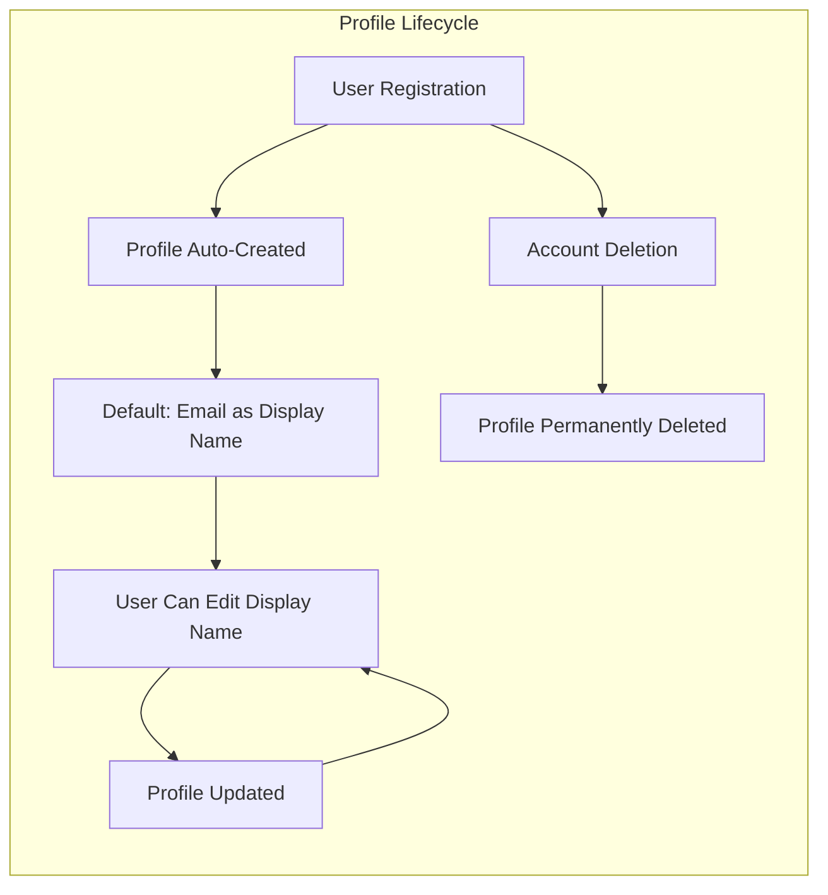
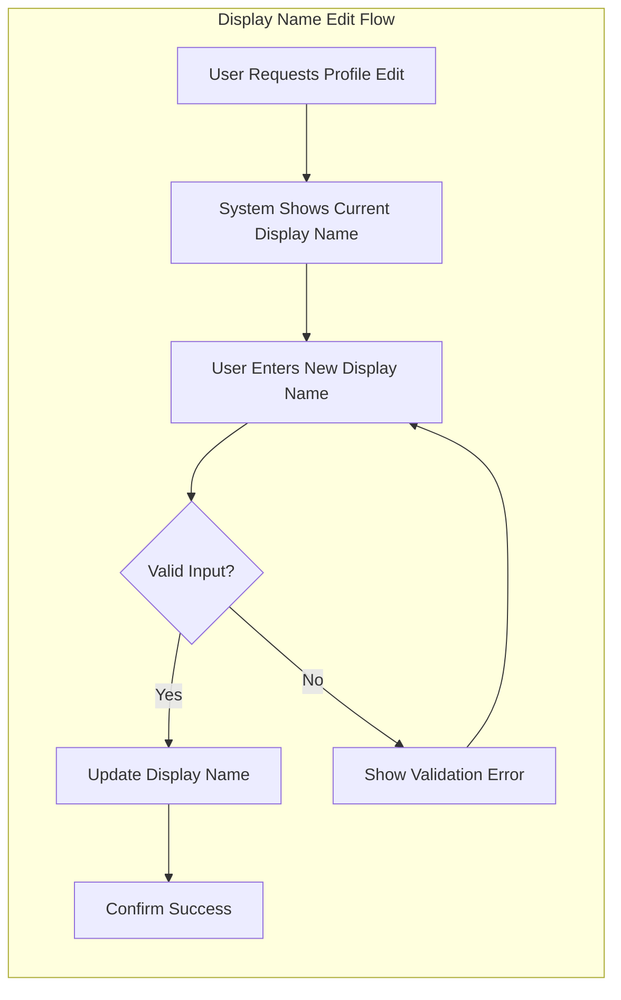
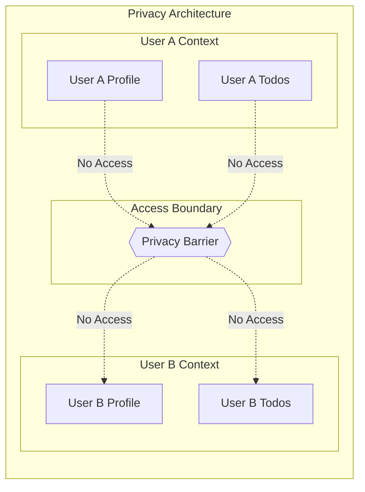
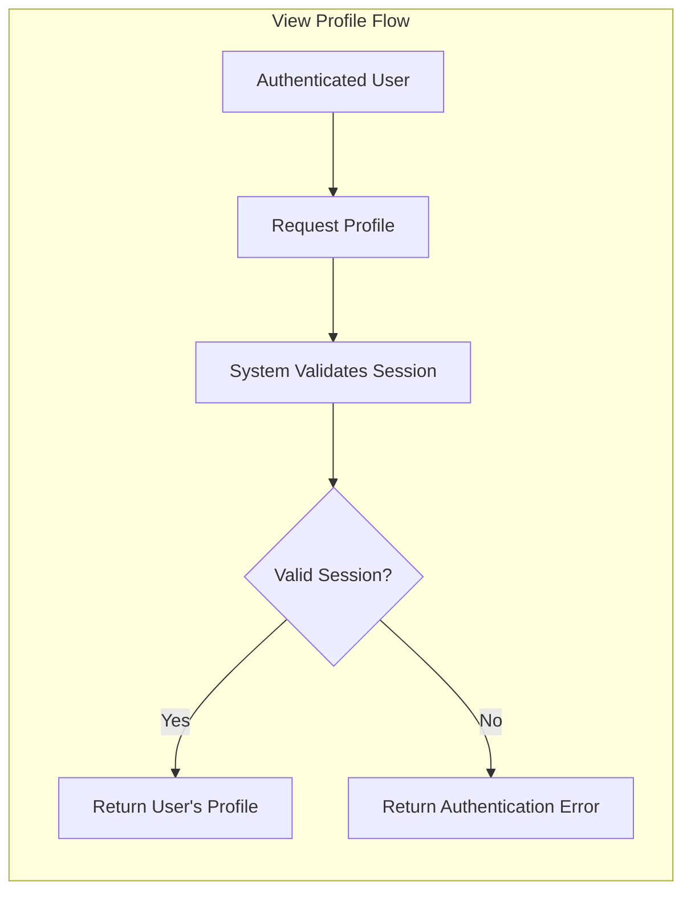
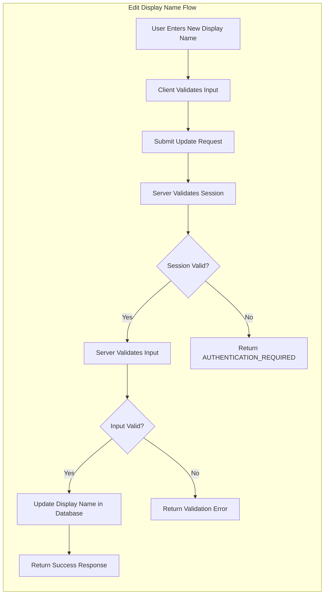
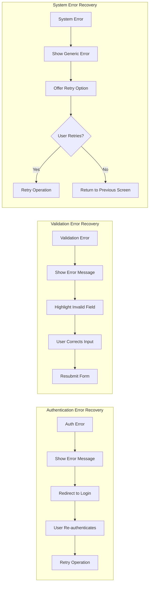

# User Profile Requirements

## Overview

This document specifies the complete user profile management requirements for the private multi-user Todo application. The profile system is designed with a **privacy-first philosophy**, ensuring that each user's profile information remains completely private and inaccessible to other users.

The user profile serves as the identity layer for the application, providing a display name that personalizes the user experience while maintaining absolute privacy boundaries between users.

## Profile Structure

### Profile Entity Definition

Each user in the system has exactly one profile that is automatically created upon account registration. The profile is an inseparable part of the user account and cannot exist independently.

#### Profile Fields

| Field | Data Type | Required | Constraints | Description |
|-------|-----------|----------|-------------|-------------|
| Display Name | String | Yes | 1-50 characters, not blank | User's chosen display name for personalization |

### Profile Lifecycle

### Profile Creation Requirements

**REQ-PROFILE-001**: WHEN a user successfully registers an account, THE system SHALL automatically create a user profile associated with that account.

**REQ-PROFILE-002**: WHEN a profile is created during registration, THE system SHALL initialize the display name to the user's email address as a default value.

**REQ-PROFILE-003**: THE profile SHALL be permanently linked to the user account and cannot be transferred to another account.

**REQ-PROFILE-004**: IF a user account is deleted, THEN THE system SHALL permanently delete the associated profile without possibility of recovery.

## Display Name Management

### Display Name Purpose

The display name serves as the user's chosen identifier within the application. Unlike the email address (which is used for authentication), the display name can be customized to reflect the user's preferred identity.

### Display Name Characteristics

**REQ-PROFILE-005**: THE display name SHALL be a non-empty string between 1 and 50 characters in length.

**REQ-PROFILE-006**: THE display name SHALL NOT consist solely of whitespace characters.

**REQ-PROFILE-007**: THE display name SHALL be stored and displayed exactly as entered by the user, preserving case sensitivity.

**REQ-PROFILE-008**: THE display name SHALL NOT be required to be unique across the system - multiple users may have identical display names.

### Display Name Editing

#### Edit Requirements

**REQ-PROFILE-009**: WHEN an authenticated user requests to edit their profile, THE system SHALL display the current display name for modification.

**REQ-PROFILE-010**: WHEN a user submits a new display name, THE system SHALL validate the input according to the display name constraints.

**REQ-PROFILE-011**: WHEN a user submits an invalid display name, THEN THE system SHALL reject the update and display an appropriate error message explaining the validation failure.

**REQ-PROFILE-012**: WHEN a user submits a valid display name, THE system SHALL update the display name immediately.

**REQ-PROFILE-013**: WHEN the display name is successfully updated, THE system SHALL confirm the update to the user.

#### Edit Restrictions

**REQ-PROFILE-014**: THE system SHALL NOT impose any limit on the number of times a user can edit their display name.

**REQ-PROFILE-015**: THE system SHALL NOT require a cooldown period between display name edits.

**REQ-PROFILE-016**: THE system SHALL NOT maintain a history of previous display names - only the current value is stored.

### Display Name Validation Rules

#### Length Validation

**REQ-PROFILE-017**: IF a submitted display name contains fewer than 1 character, THEN THE system SHALL reject the update with error code `PROFILE_DISPLAY_NAME_TOO_SHORT`.

**REQ-PROFILE-018**: IF a submitted display name exceeds 50 characters, THEN THE system SHALL reject the update with error code `PROFILE_DISPLAY_NAME_TOO_LONG`.

#### Content Validation

**REQ-PROFILE-019**: IF a submitted display name consists solely of whitespace characters, THEN THE system SHALL reject the update with error code `PROFILE_DISPLAY_NAME_BLANK`.

**REQ-PROFILE-020**: THE system SHALL accept display names containing letters (uppercase and lowercase), numbers, spaces, and common punctuation marks.

**REQ-PROFILE-021**: THE system SHALL NOT impose character set restrictions beyond the standard printable ASCII and Unicode characters.

#### Trim Behavior

**REQ-PROFILE-022**: WHEN storing a display name, THE system SHALL NOT automatically trim leading or trailing whitespace characters.

**REQ-PROFILE-023**: WHEN displaying a display name in the user interface, THE system SHALL preserve all whitespace characters as entered by the user.

## Profile Privacy Model

### Privacy Philosophy

This application is designed as a **completely private todo management system**. The fundamental privacy principle is that users operate in isolated environments with no visibility into other users' data, including their profiles.

### Privacy Architecture

### Privacy Enforcement Requirements

#### Complete Profile Isolation

**REQ-PRIVACY-001**: THE system SHALL enforce complete profile isolation - each user SHALL only be able to access their own profile.

**REQ-PRIVACY-002**: WHEN an authenticated user attempts to view a profile, THE system SHALL only return the user's own profile data.

**REQ-PRIVACY-003**: THE system SHALL NOT provide any mechanism for users to view other users' profiles.

**REQ-PRIVACY-004**: THE system SHALL NOT expose any endpoint, API, or interface that allows querying other users' profile information.

#### Access Denial Requirements

**REQ-PRIVACY-005**: IF a user attempts to access another user's profile through any means, THEN THE system SHALL deny access with an appropriate error response.

**REQ-PRIVACY-006**: WHEN denying access to another user's profile, THE system SHALL return a generic "access denied" message without confirming the existence of the target profile.

**REQ-PRIVACY-007**: THE system SHALL log all unauthorized profile access attempts for security monitoring purposes.

#### No Profile Discovery

**REQ-PRIVACY-008**: THE system SHALL NOT provide any user search functionality that could reveal profile information.

**REQ-PRIVACY-009**: THE system SHALL NOT display profile information in any public or shared interface.

**REQ-PRIVACY-010**: THE system SHALL NOT expose profile information in todo data, even for todos that might be shared (though sharing is not a feature of this application).

### Privacy Scope Matrix

| Action | Own Profile | Other Profiles |
|--------|-------------|----------------|
| View profile | ✅ Allowed | ❌ Denied |
| Edit display name | ✅ Allowed | ❌ Denied |
| View display name | ✅ Allowed | ❌ Denied |
| Delete profile (via account deletion) | ✅ Allowed | ❌ Denied |
| Search for profiles | ❌ Not Available | ❌ Not Available |
| List all profiles | ❌ Not Available | ❌ Not Available |

### Privacy in Data Responses

**REQ-PRIVACY-011**: WHEN returning user data in any API response, THE system SHALL only include profile information belonging to the authenticated user.

**REQ-PRIVACY-012**: THE system SHALL NOT embed other users' profile information in any response, including error messages or system notifications.

**REQ-PRIVACY-013**: WHEN displaying the authenticated user's own display name in the interface, THE system SHALL show the current value without exposing underlying user identifiers.

## Profile Operations

### Operation Overview

| Operation | Method | Description | Authentication Required |
|-----------|--------|-------------|------------------------|
| View Profile | Read | User views their own profile | Yes |
| Edit Display Name | Update | User updates their display name | Yes |
| Delete Profile | Delete | User deletes account (cascades to profile) | Yes |

### View Profile Operation

#### Operation Flow

#### Requirements

**REQ-OP-001**: WHEN an authenticated user requests to view their profile, THE system SHALL return the current display name.

**REQ-OP-002**: WHEN returning profile data, THE system SHALL include only the display name field (no internal identifiers or metadata).

**REQ-OP-003**: THE system SHALL provide the profile view functionality through a dedicated interface that clearly indicates the user is viewing their own profile.

**REQ-OP-004**: WHEN an unauthenticated user attempts to view a profile, THE system SHALL redirect to the login page with error code `AUTHENTICATION_REQUIRED`.

### Edit Display Name Operation

#### Operation Flow

#### Requirements

**REQ-OP-005**: WHEN an authenticated user submits a display name update, THE system SHALL validate the user's authentication status first.

**REQ-OP-006**: WHEN validating a display name update, THE system SHALL apply all display name validation rules defined in the Display Name Management section.

**REQ-OP-007**: WHEN a display name update is successful, THE system SHALL return the updated display name in the response.

**REQ-OP-008**: WHEN a display name update fails validation, THE system SHALL return a detailed error message indicating which validation rule was violated.

**REQ-OP-009**: THE system SHALL provide immediate feedback after a display name update attempt, whether successful or failed.

### Profile Deletion Operation

Profile deletion is handled exclusively through the account deletion process. There is no separate profile deletion operation.

**REQ-OP-010**: WHEN a user deletes their account, THE system SHALL automatically delete the associated profile as part of the account deletion cascade.

**REQ-OP-011**: WHEN a profile is deleted, THE system SHALL permanently remove the display name from storage without possibility of recovery.

**REQ-OP-012**: THE system SHALL NOT provide a mechanism to delete the profile independently of the account.

## Error Handling

### Error Categories

| Category | HTTP Status | Description |
|----------|-------------|-------------|
| Authentication Errors | 401 | User not authenticated or session expired |
| Validation Errors | 400 | Input does not meet validation requirements |
| System Errors | 500 | Internal system failure |

### Authentication Errors

#### Session-Related Errors

**REQ-ERR-001**: WHEN an unauthenticated user attempts any profile operation, THE system SHALL return HTTP 401 Unauthorized with error code `AUTHENTICATION_REQUIRED`.

**REQ-ERR-002**: WHEN a user's session has expired during a profile operation, THE system SHALL return HTTP 401 Unauthorized with error code `SESSION_EXPIRED`.

**REQ-ERR-003**: WHEN an invalid or malformed authentication token is detected, THE system SHALL return HTTP 401 Unauthorized with error code `INVALID_TOKEN`.

### Validation Errors

#### Display Name Validation Errors

**REQ-ERR-004**: WHEN a display name is empty or contains zero characters, THE system SHALL return HTTP 400 Bad Request with error code `PROFILE_DISPLAY_NAME_TOO_SHORT` and message "Display name must be at least 1 character."

**REQ-ERR-005**: WHEN a display name exceeds 50 characters, THE system SHALL return HTTP 400 Bad Request with error code `PROFILE_DISPLAY_NAME_TOO_LONG` and message "Display name must not exceed 50 characters."

**REQ-ERR-006**: WHEN a display name consists solely of whitespace, THE system SHALL return HTTP 400 Bad Request with error code `PROFILE_DISPLAY_NAME_BLANK` and message "Display name cannot be blank."

#### Input Format Errors

**REQ-ERR-007**: WHEN a profile update request contains malformed JSON, THE system SHALL return HTTP 400 Bad Request with error code `INVALID_REQUEST_FORMAT` and message "Invalid request format."

**REQ-ERR-008**: WHEN a profile update request is missing the required display name field, THE system SHALL return HTTP 400 Bad Request with error code `MISSING_DISPLAY_NAME` and message "Display name is required."

### System Errors

**REQ-ERR-009**: WHEN a database operation fails during profile update, THE system SHALL return HTTP 500 Internal Server Error with error code `INTERNAL_ERROR` without exposing internal details.

**REQ-ERR-010**: WHEN an unexpected error occurs during profile operations, THE system SHALL log the error with full details and return a generic error message to the user.

**REQ-ERR-011**: THE system SHALL NOT expose stack traces, database errors, or internal system details in error responses to users.

### Error Response Format

**REQ-ERR-012**: WHEN returning any error response, THE system SHALL use a consistent JSON format containing at minimum: error code, message, and timestamp.

**REQ-ERR-013**: WHEN returning a validation error, THE system SHALL include the field name that failed validation and the specific validation rule that was violated.

### Error Recovery Flows

## Integration Points

### Authentication System Integration

The profile system integrates tightly with the authentication system:

**REQ-INT-001**: WHEN a user successfully authenticates, THE system SHALL load the user's profile for display purposes.

**REQ-INT-002**: WHEN a user's session is validated, THE system SHALL confirm the profile exists and is accessible.

**REQ-INT-003**: WHEN a user logs out, THE system SHALL clear any cached profile data from the client.

### Todo System Integration

The profile system provides user identity information to the todo system:

**REQ-INT-004**: THE profile display name SHALL be used to identify the user in todo-related interfaces where user attribution is needed.

**REQ-INT-005**: WHEN a user views their todo list, THE system SHALL not require profile information to be displayed with each todo.

**REQ-INT-006**: WHEN a todo references the user (such as in audit logs), THE system SHALL use the user's internal identifier, not the display name, to maintain referential integrity.

### Account Management Integration

**REQ-INT-007**: WHEN a user initiates account deletion, THE system SHALL include profile deletion in the deletion workflow confirmation message.

**REQ-INT-008**: WHEN account deletion is processed, THE profile deletion SHALL occur within the same transaction as account deletion to ensure data consistency.

## Performance Requirements

### Response Time Expectations

**REQ-PERF-001**: WHEN a user requests to view their profile, THE system SHALL return the profile data within 200 milliseconds under normal conditions.

**REQ-PERF-002**: WHEN a user updates their display name, THE system SHALL complete the update and return confirmation within 300 milliseconds under normal conditions.

**REQ-PERF-003**: WHILE the system is under high load (defined as greater than 1000 concurrent requests), THE system SHALL still respond to profile operations within 1 second.

### Data Storage Efficiency

**REQ-PERF-004**: THE system SHALL store profile data efficiently to support fast retrieval and updates.

**REQ-PERF-005**: THE system SHALL not create unnecessary copies of profile data during read operations.

## Security Considerations

### Input Sanitization

**REQ-SEC-001**: WHEN accepting display name input, THE system SHALL sanitize the input to prevent injection attacks while preserving the user's intended characters.

**REQ-SEC-002**: THE system SHALL NOT interpret display names as executable code or commands.

**REQ-SEC-003**: WHEN storing display names, THE system SHALL use parameterized queries or equivalent protection against SQL injection.

### Access Control

**REQ-SEC-004**: THE system SHALL validate authentication status before processing any profile operation.

**REQ-SEC-005**: THE system SHALL verify that the authenticated user is accessing only their own profile data on every profile request.

**REQ-SEC-006**: WHEN detecting potential unauthorized access attempts, THE system SHALL log the attempt with user identifier, timestamp, and request details.

### Data Protection

**REQ-SEC-007**: THE system SHALL protect profile data in transit using TLS encryption.

**REQ-SEC-008**: THE system SHALL not expose profile data in server logs except for error debugging purposes, and even then, display names should be truncated or masked.

## Summary

The user profile system for this private Todo application is designed with the following core principles:

1. **Simplicity**: The profile contains only a display name, minimizing complexity while providing essential personalization.

2. **Privacy-First**: Complete isolation ensures that users can never access other users' profile information, maintaining the application's private nature.

3. **User Control**: Users have full control over their display name with no arbitrary restrictions on changes.

4. **Clear Validation**: Explicit validation rules ensure data quality while remaining user-friendly.

5. **Security**: Comprehensive security measures protect profile data from unauthorized access and injection attacks.

6. **Performance**: Fast response times ensure a smooth user experience during profile operations.

The profile system integrates seamlessly with authentication and todo management, providing a cohesive user identity layer while maintaining the strict privacy boundaries that define this application.

> *Developer Note: This document defines **business requirements only**. All technical implementations (architecture, APIs, database design, etc.) are at the discretion of the development team.*