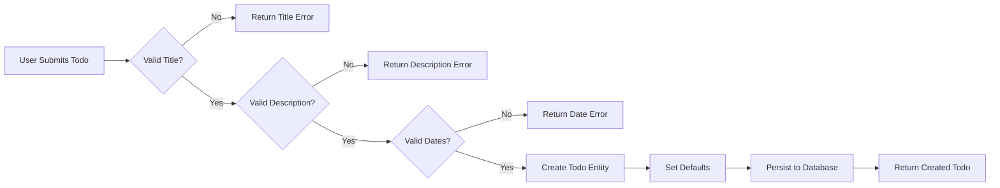
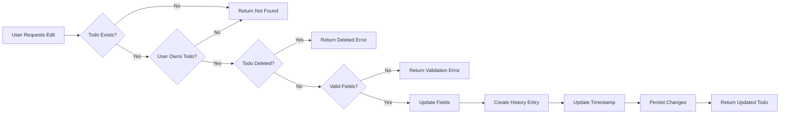
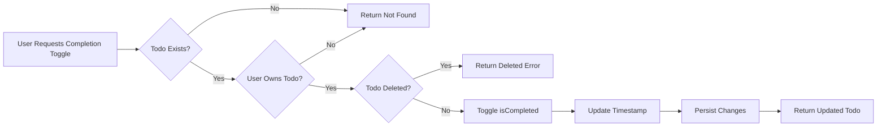

# Todo Core Operations

## Overview

This document specifies the fundamental todo operations for the todoApp multi-user Todo application. It covers the complete lifecycle of todos from creation through viewing, editing, and completion status management. All todo operations are strictly user-scoped, ensuring complete data privacy between users.

## Todo Entity Structure

### Todo Data Model

THE system SHALL maintain todo entities with the following structure:

| Field | Data Type | Required | Description |
|-------|-----------|----------|-------------|
| id | Unique Identifier | Yes | System-generated unique identifier for the todo |
| userId | User Reference | Yes | Reference to the user who owns this todo |
| title | String | Yes | The title of the todo (required) |
| description | String | No | Optional detailed description of the todo |
| startDate | Date/Time | No | Optional start date for the todo |
| dueDate | Date/Time | No | Optional due date for the todo |
| isCompleted | Boolean | Yes | Completion status (default: false) |
| isDeleted | Boolean | Yes | Soft delete flag (default: false) |
| createdAt | Date/Time | Yes | Timestamp when the todo was created |
| updatedAt | Date/Time | Yes | Timestamp when the todo was last modified |

### Field Constraints

THE system SHALL enforce the following constraints on todo fields:

| Field | Constraint | Validation Rule |
|-------|------------|-----------------|
| title | Required | Must not be empty, Maximum length: 200 characters |
| description | Optional | Maximum length: 5000 characters, Can be null or empty string |
| startDate | Optional | Can be null, Must be a valid date if provided |
| dueDate | Optional | Can be null, Must be a valid date if provided |
| isCompleted | Default | New todos must have isCompleted = false |
| isDeleted | Default | New todos must have isDeleted = false |

### User Ownership

THE system SHALL ensure that:

- Each todo is owned by exactly one user
- The userId field is immutable after creation
- Users cannot transfer todos to other users
- All todo operations are scoped to the authenticated user

## Todo Creation Requirements

### Creation Process

WHEN a user creates a new todo, THE system SHALL:

1. Validate the title is present and non-empty
2. Validate the title does not exceed 200 characters
3. Validate the description does not exceed 5000 characters (if provided)
4. Validate the start date is a valid date (if provided)
5. Validate the due date is a valid date (if provided)
6. Set isCompleted to false
7. Set isDeleted to false
8. Set createdAt to the current timestamp
9. Set updatedAt to the current timestamp
10. Associate the todo with the authenticated user
11. Generate a unique identifier for the todo
12. Persist the todo to the database
13. Return the created todo to the user

### Title Requirements

THE system SHALL enforce the following rules for todo titles:

- WHEN a user creates a todo without a title, THE system SHALL reject the creation and return a validation error
- WHEN a user creates a todo with an empty title (only whitespace), THE system SHALL reject the creation and return a validation error
- WHEN a user creates a todo with a title exceeding 200 characters, THE system SHALL reject the creation and return a validation error
- THE system SHALL trim leading and trailing whitespace from the title before validation

### Description Handling

THE system SHALL handle descriptions as follows:

- WHEN a user creates a todo without a description, THE system SHALL store null for the description field
- WHEN a user creates a todo with an empty description, THE system SHALL store null for the description field
- WHEN a user creates a todo with a description exceeding 5000 characters, THE system SHALL reject the creation and return a validation error
- THE system SHALL preserve the exact formatting of the description including line breaks and whitespace

### Date Field Handling

THE system SHALL handle date fields as follows:

- WHEN a user creates a todo without a start date, THE system SHALL store null for the startDate field
- WHEN a user creates a todo without a due date, THE system SHALL store null for the dueDate field
- WHEN a user provides an invalid date format for startDate, THE system SHALL reject the creation and return a validation error
- WHEN a user provides an invalid date format for dueDate, THE system SHALL reject the creation and return a validation error
- THE system SHALL accept and store dates in ISO 8601 format
- THE system SHALL accept dates without time components (date-only)
- THE system SHALL accept dates with time components (date-time)

### Default Values

THE system SHALL apply the following defaults for new todos:

| Field | Default Value |
|-------|---------------|
| isCompleted | false |
| isDeleted | false |
| description | null |
| startDate | null |
| dueDate | null |
| createdAt | Current timestamp |
| updatedAt | Current timestamp |

### Creation Response

WHEN a todo is successfully created, THE system SHALL return:

- The complete todo entity including the generated id
- All field values as stored in the database
- The creation timestamp

## Todo Viewing Requirements

### List View

WHEN a user requests to view their todo list, THE system SHALL:

1. Retrieve only todos owned by the authenticated user
2. Exclude todos where isDeleted = true
3. Apply any requested filters
4. Apply any requested sorting
5. Apply pagination
6. Return the paginated list of todos

### List Item Display

THE system SHALL display the following information for each todo in the list:

| Field | Display Requirement |
|-------|---------------------|
| title | Always displayed |
| isCompleted | Always displayed |
| startDate | Displayed if not null |
| dueDate | Displayed if not null |
| createdAt | Always displayed |
| id | Always displayed (for detail view navigation) |

### Detail View

WHEN a user requests to view a specific todo, THE system SHALL:

1. Validate the todo exists
2. Validate the todo belongs to the authenticated user
3. Validate the todo is not soft-deleted
4. Return all fields of the todo including the full description

### Detail View Display

THE system SHALL display the following information in the detail view:

| Field | Display Requirement |
|-------|---------------------|
| id | Always displayed |
| title | Always displayed |
| description | Displayed (may be empty) |
| startDate | Displayed (may be null) |
| dueDate | Displayed (may be null) |
| isCompleted | Always displayed |
| createdAt | Always displayed |
| updatedAt | Always displayed |

### Privacy Enforcement

THE system SHALL enforce strict privacy for todo viewing:

- WHEN a user attempts to view a todo belonging to another user, THE system SHALL deny access and return a not found error
- THE system SHALL NOT reveal the existence of todos belonging to other users
- WHEN a user requests a non-existent todo, THE system SHALL return the same error as when requesting another user's todo

### Empty State

WHEN a user has no todos (or no todos matching the current filter), THE system SHALL:

- Return an empty list
- Display appropriate empty state information to the user
- NOT return an error

## Todo Editing Requirements

### Editable Fields

THE system SHALL allow users to edit the following fields:

- title
- description
- startDate
- dueDate

### Non-Editable Fields

THE system SHALL NOT allow users to modify the following fields directly:

- id (immutable)
- userId (immutable)
- createdAt (immutable)
- isCompleted (use completion endpoints instead)
- isDeleted (use delete/restore endpoints instead)

### Edit Process

WHEN a user edits a todo, THE system SHALL:

1. Validate the todo exists
2. Validate the todo belongs to the authenticated user
3. Validate the todo is not soft-deleted
4. Validate all provided field values
5. Update only the specified fields
6. Set updatedAt to the current timestamp
7. Create a history entry recording the changes
8. Persist the changes to the database
9. Return the updated todo to the user

### Partial Updates

THE system SHALL support partial updates:

- WHEN a user updates only some fields, THE system SHALL preserve the values of unmodified fields
- WHEN a user provides null for an optional field, THE system SHALL set that field to null
- WHEN a user omits a field from the update request, THE system SHALL not modify that field

### Edit Validation

THE system SHALL apply the same validation rules for editing as for creation:

- WHEN a user edits a todo title to be empty, THE system SHALL reject the update and return a validation error
- WHEN a user edits a todo title to exceed 200 characters, THE system SHALL reject the update and return a validation error
- WHEN a user edits a todo description to exceed 5000 characters, THE system SHALL reject the update and return a validation error
- WHEN a user provides an invalid date format, THE system SHALL reject the update and return a validation error

### Edit History Recording

WHEN a user edits a todo, THE system SHALL create a history entry containing:

- The timestamp of the edit
- The new title value (if changed)
- The new description value (if changed)
- The new startDate value (if changed)
- The new dueDate value (if changed)

Refer to the Edit History System document (06-edit-history-system.md) for complete history specifications.

### Privacy Enforcement for Editing

THE system SHALL enforce strict privacy for todo editing:

- WHEN a user attempts to edit a todo belonging to another user, THE system SHALL deny access and return a not found error
- THE system SHALL NOT reveal the existence of todos belonging to other users through edit operations

## Completion Status Management

### Completion Toggle Overview

THE system SHALL provide a simple toggle mechanism for todo completion status:

- Todos can be marked as complete
- Todos can be marked as incomplete
- Completion status is a binary state (complete or incomplete)
- No partial completion states exist

### Mark as Complete

WHEN a user marks a todo as complete, THE system SHALL:

1. Validate the todo exists
2. Validate the todo belongs to the authenticated user
3. Validate the todo is not soft-deleted
4. Set isCompleted to true
5. Set updatedAt to the current timestamp
6. Persist the change to the database
7. Return the updated todo to the user

### Mark as Incomplete

WHEN a user marks a todo as incomplete, THE system SHALL:

1. Validate the todo exists
2. Validate the todo belongs to the authenticated user
3. Validate the todo is not soft-deleted
4. Set isCompleted to false
5. Set updatedAt to the current timestamp
6. Persist the change to the database
7. Return the updated todo to the user

### Idempotent Operations

THE system SHALL handle completion operations idempotently:

- WHEN a user marks an already complete todo as complete, THE system SHALL accept the operation without error and return the todo unchanged
- WHEN a user marks an already incomplete todo as incomplete, THE system SHALL accept the operation without error and return the todo unchanged

### Completion History

THE system SHALL NOT create history entries for completion status changes. History entries are only created for edits to title, description, startDate, and dueDate.

### Privacy Enforcement for Completion

THE system SHALL enforce strict privacy for completion operations:

- WHEN a user attempts to mark another user's todo as complete, THE system SHALL deny access and return a not found error
- WHEN a user attempts to mark another user's todo as incomplete, THE system SHALL deny access and return a not found error

## Business Rules and Validation

### Todo Creation Rules

| Rule ID | Rule Description | EARS Format |
|---------|------------------|-------------|
| BR-CREATE-001 | Title must be provided | WHEN a user creates a todo, THE system SHALL require a non-empty title |
| BR-CREATE-002 | Title length limit | WHEN a user creates a todo with a title exceeding 200 characters, THE system SHALL reject the creation |
| BR-CREATE-003 | Description length limit | WHEN a user creates a todo with a description exceeding 5000 characters, THE system SHALL reject the creation |
| BR-CREATE-004 | Default completion status | WHEN a user creates a todo, THE system SHALL set isCompleted to false |
| BR-CREATE-005 | Default delete status | WHEN a user creates a todo, THE system SHALL set isDeleted to false |
| BR-CREATE-006 | User ownership | WHEN a user creates a todo, THE system SHALL associate it with the authenticated user |

### Todo Editing Rules

| Rule ID | Rule Description | EARS Format |
|---------|------------------|-------------|
| BR-EDIT-001 | Title cannot be emptied | WHEN a user edits a todo title to be empty, THE system SHALL reject the edit |
| BR-EDIT-002 | Title length limit | WHEN a user edits a todo title to exceed 200 characters, THE system SHALL reject the edit |
| BR-EDIT-003 | Description length limit | WHEN a user edits a todo description to exceed 5000 characters, THE system SHALL reject the edit |
| BR-EDIT-004 | Timestamp update | WHEN a user edits a todo, THE system SHALL update the updatedAt timestamp |
| BR-EDIT-005 | History recording | WHEN a user edits a todo, THE system SHALL create a history entry |
| BR-EDIT-006 | Deleted todo editing | WHEN a user attempts to edit a deleted todo, THE system SHALL reject the operation |

### Todo Viewing Rules

| Rule ID | Rule Description | EARS Format |
|---------|------------------|-------------|
| BR-VIEW-001 | User scope | WHEN a user views todos, THE system SHALL return only todos owned by that user |
| BR-VIEW-002 | Exclude deleted | WHEN a user views the todo list, THE system SHALL exclude deleted todos |
| BR-VIEW-003 | Privacy protection | WHEN a user attempts to view another user's todo, THE system SHALL return a not found error |

### Completion Status Rules

| Rule ID | Rule Description | EARS Format |
|---------|------------------|-------------|
| BR-COMP-001 | Binary status | THE system SHALL maintain completion status as a boolean value |
| BR-COMP-002 | No history for completion | WHEN a user changes completion status, THE system SHALL NOT create a history entry |
| BR-COMP-003 | Deleted todo completion | WHEN a user attempts to change completion status of a deleted todo, THE system SHALL reject the operation |

### Date Handling Rules

| Rule ID | Rule Description | EARS Format |
|---------|------------------|-------------|
| BR-DATE-001 | Optional dates | WHEN a user creates or edits a todo, THE system SHALL accept null for startDate and dueDate |
| BR-DATE-002 | Date validation | WHEN a user provides an invalid date, THE system SHALL reject the operation |
| BR-DATE-003 | Date format | THE system SHALL accept dates in ISO 8601 format |

## Error Handling

### Creation Errors

| Error Scenario | System Behavior |
|----------------|-----------------|
| Missing title | IF title is not provided or empty, THEN THE system SHALL return error code TODO_TITLE_REQUIRED |
| Title too long | IF title exceeds 200 characters, THEN THE system SHALL return error code TODO_TITLE_TOO_LONG |
| Description too long | IF description exceeds 5000 characters, THEN THE system SHALL return error code TODO_DESCRIPTION_TOO_LONG |
| Invalid date format | IF a date field has invalid format, THEN THE system SHALL return error code TODO_INVALID_DATE |
| Unauthorized user | IF user is not authenticated, THEN THE system SHALL return authentication error |

### Viewing Errors

| Error Scenario | System Behavior |
|----------------|-----------------|
| Todo not found | IF requested todo does not exist or belongs to another user, THEN THE system SHALL return error code TODO_NOT_FOUND |
| Unauthorized user | IF user is not authenticated, THEN THE system SHALL return authentication error |

### Editing Errors

| Error Scenario | System Behavior |
|----------------|-----------------|
| Todo not found | IF todo to edit does not exist or belongs to another user, THEN THE system SHALL return error code TODO_NOT_FOUND |
| Todo deleted | IF todo is soft-deleted, THEN THE system SHALL return error code TODO_DELETED |
| Empty title | IF title is updated to empty, THEN THE system SHALL return error code TODO_TITLE_REQUIRED |
| Title too long | IF title exceeds 200 characters, THEN THE system SHALL return error code TODO_TITLE_TOO_LONG |
| Description too long | IF description exceeds 5000 characters, THEN THE system SHALL return error code TODO_DESCRIPTION_TOO_LONG |
| Invalid date format | IF a date field has invalid format, THEN THE system SHALL return error code TODO_INVALID_DATE |
| Unauthorized user | IF user is not authenticated, THEN THE system SHALL return authentication error |

### Completion Errors

| Error Scenario | System Behavior |
|----------------|-----------------|
| Todo not found | IF todo does not exist or belongs to another user, THEN THE system SHALL return error code TODO_NOT_FOUND |
| Todo deleted | IF todo is soft-deleted, THEN THE system SHALL return error code TODO_DELETED |
| Unauthorized user | IF user is not authenticated, THEN THE system SHALL return authentication error |

### Error Response Format

WHEN an error occurs, THE system SHALL return:

- An appropriate HTTP status code
- A structured error response containing:
  - Error code (machine-readable identifier)
  - Error message (human-readable description)
  - Field-specific validation errors (when applicable)

## Operation Flow Diagrams

### Todo Creation Flow

### Todo Edit Flow

### Completion Toggle Flow

## Performance Expectations

### Response Time Requirements

| Operation | Expected Response Time |
|-----------|------------------------|
| Create Todo | Less than 500 milliseconds |
| View Todo List | Less than 500 milliseconds |
| View Todo Detail | Less than 300 milliseconds |
| Edit Todo | Less than 500 milliseconds |
| Toggle Completion | Less than 300 milliseconds |

### Scalability Considerations

THE system SHALL support:

- Users with up to 10,000 todos per account
- Todo titles up to 200 characters
- Todo descriptions up to 5,000 characters
- Pagination to handle large todo lists efficiently

## Related Documents

- [Todo List Management](./05-todo-list-management.md) - Detailed specifications for listing, filtering, and sorting todos
- [Edit History System](./06-edit-history-system.md) - Complete history tracking specifications
- [Trash and Deletion](./07-trash-and-deletion.md) - Soft delete and permanent deletion operations
- [User Scenarios](./08-user-scenarios.md) - Complete user journeys including todo operations