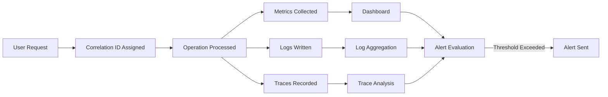

**todoApp — Performance SLOs, security policies, data integrity, storage requirements**

Performance SLOs, security policies, data integrity, storage requirements

# Performance Requirements

Performance SLOs and scalability targets.

## Performance SLOs

Define response time targets, throughput limits, and scalability requirements.

### Response Time SLOs

### Response Time Targets

THE system SHALL respond to user authentication requests (login, signup) within 2 seconds under normal load conditions.

THE system SHALL respond to todo list view requests within 1 second under normal load conditions.

THE system SHALL respond to single todo detail view requests within 500 milliseconds under normal load conditions.

THE system SHALL respond to todo creation requests within 1 second under normal load conditions.

THE system SHALL respond to todo update requests within 1 second under normal load conditions.

THE system SHALL respond to todo deletion requests within 1 second under normal load conditions.

THE system SHALL respond to trash list view requests within 1 second under normal load conditions.

THE system SHALL respond to todo restoration requests within 1 second under normal load conditions.

### Latency Under Load

WHEN system load exceeds 80% of capacity, THE system SHALL maintain response times within 3 seconds for read operations.

WHEN system load exceeds 80% of capacity, THE system SHALL maintain response times within 5 seconds for write operations.

IF a response time exceeds the defined SLO target, THE system SHALL log the performance violation for monitoring purposes.

### P95 and P99 Latency

THE system SHALL maintain P95 response latency below 2 seconds for all user-facing operations.

THE system SHALL maintain P99 response latency below 5 seconds for all user-facing operations.

THE system SHALL measure and report latency percentiles for performance monitoring.

### Throughput Requirements

### Concurrent User Support

THE system SHALL support at least 100 concurrent users without degradation in response time performance.

THE system SHALL support at least 1,000 registered users in total.

WHILE serving 100 concurrent users, THE system SHALL maintain response times within defined SLO targets.

### Request Throughput

THE system SHALL support at least 50 read requests per second across all users.

THE system SHALL support at least 20 write requests per second across all users.

THE system SHALL support at least 10 authentication requests per second.

### Data Volume Throughput

THE system SHALL handle todo lists containing up to 1,000 items per user without performance degradation.

THE system SHALL handle todo edit histories containing up to 500 entries per todo without performance degradation.

THE system SHALL complete pagination queries within 1 second for lists up to 1,000 items.

IF data volume exceeds the defined thresholds, THE system SHALL maintain graceful degradation rather than failure.

### Scalability Targets

### Horizontal Scalability

THE system SHALL support horizontal scaling to accommodate user growth.

WHEN user count increases by 50%, THE system SHALL scale to maintain performance SLOs without manual reconfiguration.

THE system SHALL support deployment across multiple instances to distribute load.

### Vertical Scalability

THE system SHALL support vertical scaling through resource allocation increases.

WHEN additional computing resources are allocated, THE system SHALL utilize them to improve throughput capacity.

### Performance Degradation Thresholds

THE system SHALL provide advance warning when resource utilization approaches 80% of capacity.

IF resource utilization reaches 90% of capacity, THE system SHALL alert administrators for scaling action.

WHEN resource utilization exceeds 95% of capacity, THE system SHALL reject new requests with an appropriate error message while continuing to serve existing sessions.

### Growth Projections

THE system SHALL be designed to scale from 1,000 users to 10,000 users without architectural changes.

THE system SHALL support a 10x increase in data volume per user without requiring schema modifications.

THE system SHALL maintain performance SLOs when total todo count reaches 100,000 items across all users.

## Rate Limiting and Throttling

Define rate limiting policies and abuse prevention requirements.

### API Rate Limiting Policies

### Request Limits

THE system SHALL limit each authenticated user to 200 requests per minute for todo operations.

THE system SHALL limit each authenticated user to 1000 requests per hour across all operations.

THE system SHALL limit unauthenticated guests to 20 requests per minute for authentication-related endpoints.

### Rate Limit Tracking

WHEN a user makes a request, THE system SHALL check the current request count against the applicable rate limit.

IF a user exceeds the per-minute rate limit, THE system SHALL reject subsequent requests until the minute window resets.

IF a user exceeds the per-hour rate limit, THE system SHALL reject subsequent requests until the hour window resets.

### Multi-User Isolation

THE system SHALL track rate limits independently for each user account.

IF one user exceeds their rate limit, THE system SHALL NOT affect other users' ability to make requests.

WHEN calculating rate limits, THE system SHALL count requests based on the authenticated user identity, not IP address alone.

### Authentication Rate Limiting

### Login Attempt Limits

THE system SHALL limit login attempts to 5 failed attempts per email address within a 15-minute window.

THE system SHALL limit login attempts to 10 failed attempts per IP address within a 15-minute window.

WHEN a login attempt fails, THE system SHALL record the failed attempt against both the email address and the originating IP address.

### Account Lockout

IF the failed login attempt limit is exceeded for an email address, THE system SHALL temporarily block login attempts for that email address.

WHEN an account is temporarily blocked from login, THE system SHALL enforce a 15-minute cooldown period before allowing further attempts.

IF a user successfully logs in, THE system SHALL reset the failed attempt counter for that email address.

### Signup Rate Limiting

THE system SHALL limit account creation to 5 new accounts per IP address per hour.

IF an IP address exceeds the signup rate limit, THE system SHALL reject further signup requests from that IP address for 1 hour.

### Throttling Response Behavior

### Request Rejection

WHEN a request is rejected due to rate limiting, THE system SHALL return a clear message indicating the rate limit has been exceeded.

THE system SHALL include a retry-after indication when rejecting a rate-limited request.

THE system SHALL NOT process or persist data from requests that exceed rate limits.

### Graceful Degradation

WHEN the system is under heavy load, THE system SHALL prioritize successful authentication attempts over other operations.

WHEN rate limiting is applied, THE system SHALL maintain responsiveness for users who have not exceeded their limits.

IF multiple rate limits apply to a single request, THE system SHALL enforce the most restrictive limit.

### User Notification

WHEN a user approaches 80% of their rate limit, THE system SHALL include a warning header in the response.

WHEN a user's rate limit resets, THE system SHALL allow immediate resumption of normal operations without manual intervention.

### Abuse Prevention and Cooldown

### Pattern Detection

WHEN the system detects rapid sequential requests from a single user, THE system SHALL apply progressive throttling to slow the request rate.

IF a user repeatedly exceeds rate limits within a 24-hour period, THE system SHALL apply an extended cooldown period of up to 1 hour.

THE system SHALL log all rate limit violations for security monitoring purposes.

### Cooldown Enforcement

WHEN a cooldown period is active for a user, THE system SHALL reject all non-essential requests from that user.

IF a user attempts requests during an active cooldown, THE system SHALL extend the cooldown period by an additional 5 minutes.

WHEN a cooldown period expires, THE system SHALL automatically restore normal access without requiring user action.

### Protection Scope

THE system SHALL apply rate limiting and throttling uniformly across all todo operations including create, read, update, and delete actions.

THE system SHALL NOT apply rate limiting to the password change operation when requested by an already-authenticated user during an active session.

THE system SHALL maintain separate rate limit counters for read operations versus write operations, allowing higher limits for read operations.

# Security Requirements

Security policies, encryption, and compliance requirements.

## Security Policies

Define security policies including encryption, input validation, and compliance.

### Password Security and Encryption

### Password Requirements

WHEN a user creates or changes a password, THE system SHALL require a minimum password length of 8 characters.

WHEN a user creates or changes a password, THE system SHALL allow passwords up to 128 characters in length.

WHEN a user creates or changes a password, THE system SHALL accept any printable ASCII characters in the password.

### Password Storage

THE system SHALL store all user passwords using a strong one-way hashing algorithm.

THE system SHALL use a hashing algorithm designed for password storage with an appropriate work factor.

THE system SHALL never store passwords in plain text under any circumstances.

### Password Transmission

WHEN a user submits credentials during authentication, THE system SHALL transmit the credentials exclusively over an encrypted connection.

THE system SHALL require TLS version 1.2 or higher for all data transmission.

THE system SHALL reject authentication attempts over unencrypted connections.

### Session Security

WHEN a user successfully authenticates, THE system SHALL generate a cryptographically secure session token.

THE system SHALL associate each session token with the authenticated user and prevent token reuse.

WHEN a user logs out, THE system SHALL invalidate the session token immediately.

IF an inactive session exceeds the configured timeout period, THE system SHALL terminate the session automatically.

### Email Handling

THE system SHALL store user email addresses in their original form for communication purposes.

THE system SHALL treat email addresses as sensitive information and protect them accordingly.

WHEN the system processes email addresses for display or logging, THE system SHALL apply appropriate data protection measures.

### Input Validation and Sanitization

### General Input Validation

WHEN the system receives any user input, THE system SHALL validate the input against expected data types and formats.

WHEN the system receives any user input, THE system SHALL reject input that exceeds defined maximum lengths.

IF user input fails validation, THE system SHALL reject the request with a clear error message.

THE system SHALL sanitize all user-provided data before processing or storage.

### Todo Title Validation

WHEN a user creates or edits a todo title, THE system SHALL require the title to be non-empty.

WHEN a user creates or edits a todo title, THE system SHALL accept titles up to a reasonable maximum length.

THE system SHALL preserve the original formatting of todo titles while preventing injection attacks.

### Description Validation

WHEN a user creates or edits a todo description, THE system SHALL accept empty descriptions as valid input.

WHEN a user creates or edits a todo description, THE system SHALL accept descriptions up to a reasonable maximum length.

THE system SHALL handle multi-line text in descriptions without introducing security vulnerabilities.

### Date Validation

WHEN a user sets a start date or due date, THE system SHALL validate that the provided value is a valid date.

WHEN a user sets a start date and due date together, THE system SHALL ensure the due date is not earlier than the start date.

IF an invalid date is provided, THE system SHALL reject the request with an appropriate error message.

### Display Name Validation

WHEN a user updates their display name, THE system SHALL validate that the name meets length requirements.

WHEN a user updates their display name, THE system SHALL sanitize the input to prevent injection attacks.

### Cross-Site Scripting Prevention

THE system SHALL escape or sanitize all user-provided content before rendering.

THE system SHALL prevent the execution of user-injected scripts in any context.

THE system SHALL apply context-appropriate encoding when displaying user content.

### Injection Prevention

THE system SHALL prevent SQL injection through proper parameter handling.

THE system SHALL prevent command injection through proper input sanitization.

THE system SHALL prevent path traversal attacks through proper path validation.

### Security Compliance Standards

### OWASP Top 10 Compliance

THE system SHALL be designed in accordance with OWASP Top 10 security risk mitigations.

THE system SHALL prevent broken access control by enforcing strict user isolation.

THE system SHALL prevent cryptographic failures by using current, approved encryption standards.

THE system SHALL prevent injection attacks through comprehensive input validation and parameterized operations.

THE system SHALL prevent insecure design by following security best practices throughout the architecture.

THE system SHALL prevent security misconfiguration by maintaining secure default settings.

### Data Access Control

THE system SHALL enforce that each user can only access their own data.

THE system SHALL verify user ownership before allowing any operation on a todo.

THE system SHALL deny access attempts to resources owned by other users.

THE system SHALL not expose information about the existence of other users' data.

### Authentication Security

THE system SHALL protect against brute force authentication attacks through rate limiting.

THE system SHALL not reveal whether an email address is registered during authentication failures.

THE system SHALL implement account lockout or delay mechanisms after multiple failed authentication attempts.

### Error Handling

THE system SHALL return generic error messages that do not reveal system internals.

THE system SHALL log detailed error information securely for administrator review.

THE system SHALL not expose stack traces, database details, or internal paths in error responses.

### Security Logging

THE system SHALL log authentication attempts for security monitoring.

THE system SHALL log account creation and deletion events.

THE system SHALL protect security logs from unauthorized access or modification.

THE system SHALL include timestamps and relevant identifiers in security log entries.

### Data Privacy Compliance

THE system SHALL allow users to delete their accounts and all associated data.

THE system SHALL permanently remove user data upon account deletion request.

THE system SHALL not retain user data beyond the user's account lifetime except where required by law.

THE system SHALL provide users with access to their own data upon request.

## Availability and Reliability

Define availability targets, reliability expectations, and failover policies.

### System Availability Target

THE system SHALL maintain a monthly uptime target of 99.5%.

THE system SHALL calculate availability as the percentage of time the system is operational and accessible to users within a calendar month.

THE system SHALL consider the following as downtime:
1. Users cannot authenticate when the system is expected to be available
2. Users cannot view, create, edit, or delete their todos
3. Users cannot access the trash or restore deleted todos
4. The system returns errors for more than 1% of requests within a 5-minute window

THE system SHALL exclude scheduled maintenance windows from uptime calculations, provided:
1. Maintenance is announced at least 24 hours in advance
2. Maintenance occurs during off-peak hours (defined as 2:00 AM to 6:00 AM in the system's primary timezone)
3. Each maintenance window does not exceed 4 hours
4. Total scheduled maintenance does not exceed 8 hours per month

THE system SHALL make the current availability status visible to users on the login page.

WHEN the system experiences an unplanned outage exceeding 15 minutes, THE system SHALL notify affected users via email once service is restored.

### Error Budget Policy

THE system SHALL establish an error budget based on the 99.5% availability target, allowing for approximately 3.6 hours of unplanned downtime per month.

THE system SHALL track error budget consumption as unplanned incidents occur.

WHEN the error budget has been exhausted for the current month, THE system SHALL:
1. Postpone non-critical feature releases until the next budget cycle
2. Prioritize reliability improvements over new features
3. Notify the system administrators of the budget exhaustion

THE system SHALL reset the error budget at the beginning of each calendar month.

THE system SHALL carry over unused error budget to the following month, up to a maximum of 2 months' worth of budget.

WHEN a critical incident occurs that consumes more than 50% of the monthly error budget in a single event, THE system SHALL require a post-incident review to be completed within 5 business days.

IF the system experiences three or more incidents within a single week, THEN the system SHALL trigger a reliability review to identify root causes.

### Reliability Requirements

THE system SHALL successfully complete user-initiated operations (create, read, update, delete todos) with a success rate of at least 99.9% when the system is available.

THE system SHALL preserve all user data, including todos and edit history, with a durability target of 99.999999% (eleven nines) over any 12-month period.

WHEN the system experiences a failure during an ongoing operation, THE system SHALL either complete the operation successfully or leave the data in its original state without partial changes.

THE system SHALL recover from any single component failure within 30 minutes without data loss.

WHEN a user attempts an operation during a temporary system degradation, THE system SHALL:
1. Attempt to complete the operation with a timeout of 30 seconds
2. Return a clear error message if the operation cannot be completed
3. Preserve any partially entered data for retry when possible

THE system SHALL maintain separate reliability metrics for each core function:
1. User authentication operations
2. Todo creation and editing
3. Todo viewing and listing
4. Trash operations (delete, restore, permanent delete)

WHEN any core function's reliability drops below 99% for more than 1 hour, THE system SHALL alert system administrators.

THE system SHALL guarantee that a todo's edit history remains consistent with its current state after any system recovery.

# Data Integrity and Storage

Data integrity constraints and storage requirements.

## Data Integrity and Storage

Define backup policies, data retention, and storage tier requirements.

### Data Integrity Constraints

### Referential Integrity

THE system SHALL maintain referential integrity between Users and their Todos.

THE system SHALL maintain referential integrity between Todos and their TodoHistories.

### Cascade Delete Rules

WHEN a user deletes their account, THE system SHALL permanently delete:
1. All todos owned by that user
2. All todo history entries for those todos
3. All todos in the trash belonging to that user

WHEN a todo is permanently deleted from trash, THE system SHALL delete all associated TodoHistory entries.

### Data Validation Integrity

WHEN a todo is created or updated, THE system SHALL ensure the start date does not exceed the due date.

IF a todo's start date exceeds its due date, THE system SHALL reject the operation.

WHEN a todo history entry is created, THE system SHALL record at least one field change.

### Entity Relationship Integrity

THE system SHALL ensure every Todo is associated with exactly one User.

THE system SHALL ensure every TodoHistory entry is associated with exactly one Todo.

THE system SHALL prevent orphaned TodoHistory entries when their parent Todo exists.

### User Data Isolation

THE system SHALL ensure all todos and todo history entries are isolated by user.

THE system SHALL prevent any user from accessing another user's data through data integrity constraints.

### Soft Delete Integrity

WHEN a todo is soft deleted, THE system SHALL preserve:
1. All todo field values
2. The association with the owning user
3. All associated TodoHistory entries

WHEN a todo is restored from trash, THE system SHALL restore the todo to its original state with all history intact.

### Backup and Recovery Policies

### Backup Frequency

THE system SHALL perform automated backups of all user data at least once every 24 hours.

THE system SHALL perform incremental backups every 6 hours to capture recent changes.

### Backup Retention

THE system SHALL retain daily backups for a minimum of 30 days.

THE system SHALL retain weekly backups for a minimum of 90 days.

THE system SHALL retain monthly backups for a minimum of 1 year.

### Recovery Objectives

THE system SHALL maintain a Recovery Point Objective (RPO) of no more than 6 hours for user data.

THE system SHALL maintain a Recovery Time Objective (RTO) of no more than 4 hours for full system restoration.

### Backup Scope

THE system SHALL include the following data in backups:
1. User account information
2. All active todos
3. All soft-deleted todos (trash)
4. All todo history entries

THE system SHALL encrypt all backup data at rest.

### Recovery Procedures

WHEN a data recovery is initiated, THE system SHALL provide point-in-time recovery capability within the backup retention period.

THE system SHALL verify backup integrity before marking backups as complete.

THE system SHALL maintain backup logs documenting:
1. Backup start and completion times
2. Data volume backed up
3. Any errors encountered during backup

### Data Retention Policy

### Active Data Retention

THE system SHALL retain active todos for the duration of the owning user's account.

THE system SHALL retain todo history entries for the lifetime of their parent todo.

### Trash Retention

THE system SHALL retain soft-deleted todos in the trash for a minimum of 30 days.

THE system SHALL notify users before automatically permanently deleting todos from trash.

WHEN a todo has been in trash for more than 30 days, THE system SHALL permanently delete the todo and its history.

### Account Deletion Retention

WHEN a user requests account deletion, THE system SHALL retain user data for a grace period of 7 days.

IF the grace period expires after account deletion request, THE system SHALL permanently purge all user data including:
1. User account record
2. All active todos
3. All todos in trash
4. All todo history entries

### History Retention

THE system SHALL retain all history entries for a todo until the todo is permanently deleted.

THE system SHALL NOT impose a limit on the number of history entries per todo.

### Retention Override

WHEN a user manually permanently deletes a todo from trash, THE system SHALL immediately remove all associated data without waiting for the retention period.

### Data Purging

THE system SHALL permanently purge deleted data in a manner that prevents recovery.

THE system SHALL maintain audit logs of data purging operations for internal compliance.

### Storage Allocation and Management

### Per-User Storage Allocation

THE system SHALL allocate storage for each user to store their todos and todo history.

THE system SHALL allow each user to create up to 10,000 active todos.

THE system SHALL allow each user to store up to 1,000 soft-deleted todos in trash.

### Storage Enforcement

IF a user reaches their active todo limit, THE system SHALL reject new todo creation with an appropriate message.

IF a user reaches their trash limit, THE system SHALL require the user to permanently delete items before soft-deleting additional todos.

### History Storage

THE system SHALL NOT impose a separate limit on todo history entries.

THE system SHALL count history entries toward the overall user storage allocation.

### Storage Monitoring

THE system SHALL monitor aggregate storage usage across all users.

THE system SHALL alert administrators when total storage utilization exceeds 80% of allocated capacity.

### Storage Optimization

THE system SHALL apply compression to todo description fields that exceed 1,000 characters.

THE system SHALL store null values efficiently for optional fields (description, start date, due date).

### Storage Tiers

THE system SHALL store active todos on high-performance storage tier.

THE system SHALL store soft-deleted todos on standard storage tier.

THE system SHALL archive todo history entries older than 1 year to cold storage while maintaining accessibility.

## Audit and Observability

Define audit logging, monitoring, alerting, and observability requirements.

### Audit Trail Requirements

### Purpose
THE system SHALL maintain an immutable audit trail of all security-relevant events and user actions.

### Authentication Events
WHEN a user successfully authenticates, THE system SHALL record an audit entry containing the user identifier, timestamp, and authentication method.

WHEN a user authentication attempt fails, THE system SHALL record an audit entry containing the email address attempted, timestamp, and failure reason.

WHEN a user logs out, THE system SHALL record an audit entry containing the user identifier and timestamp.

### Account Lifecycle Events
WHEN a user account is created, THE system SHALL record an audit entry containing the new user identifier, email address, and timestamp.

WHEN a user changes their password, THE system SHALL record an audit entry containing the user identifier and timestamp.

WHEN a user deletes their account, THE system SHALL record an audit entry containing the user identifier, timestamp, and indication of cascading data deletion.

### Todo Operations Audit
WHEN a todo is created, updated, completed, or deleted, THE system SHALL record an audit entry containing the todo identifier, user identifier, operation type, and timestamp.

WHEN a todo is permanently deleted from trash, THE system SHALL record an audit entry containing the todo identifier, user identifier, and timestamp.

WHEN a todo is restored from trash, THE system SHALL record an audit entry containing the todo identifier, user identifier, and timestamp.

### Audit Entry Integrity
THE system SHALL ensure audit entries are append-only and cannot be modified or deleted.

THE system SHALL include a unique identifier for each audit entry.

THE system SHALL record the source IP address for all authentication-related audit entries.

### Audit Retention
THE system SHALL retain audit entries for a minimum of 90 days.

THE system SHALL preserve audit entries even when the associated user account is deleted.

### System Logging Requirements

### Application Logging
THE system SHALL generate logs for all application-level events including startup, shutdown, and configuration changes.

WHEN an error occurs, THE system SHALL log the error details including error type, message, timestamp, and relevant context.

WHEN a warning condition is detected, THE system SHALL log the warning with appropriate context for troubleshooting.

### Security Event Logging
WHEN a potential security violation is detected, THE system SHALL log the event with details including the nature of the violation, user context, and timestamp.

WHEN rate limiting is triggered, THE system SHALL log the event including the user identifier, endpoint, and timestamp.

WHEN suspicious activity is detected, THE system SHALL log the event with sufficient detail for security analysis.

### Log Structure and Format
THE system SHALL include timestamp, log level, source component, and message in every log entry.

THE system SHALL use a consistent, structured format for all log entries.

THE system SHALL ensure log entries do not contain sensitive information such as passwords or authentication tokens.

### Log Severity Levels
THE system SHALL support the following log severity levels: DEBUG, INFO, WARNING, ERROR, CRITICAL.

THE system SHALL allow configuration of minimum log severity level for production environments.

### Log Retention and Storage
THE system SHALL retain application logs for a minimum of 30 days.

THE system SHALL ensure log storage does not impact application performance.

THE system SHALL prevent unauthorized access to log files.

### System Monitoring Requirements

### Health Monitoring
THE system SHALL expose a health check endpoint that indicates whether the application is operational.

WHEN the health check is requested, THE system SHALL respond with the current operational status within 5 seconds.

THE system SHALL report the status of critical dependencies including database connectivity.

### Performance Metrics Collection
THE system SHALL collect performance metrics including response latency, request throughput, and error rates.

THE system SHALL collect resource utilization metrics including CPU usage, memory usage, and storage consumption.

THE system SHALL collect user activity metrics including active sessions and request counts per user.

### Monitoring Granularity
THE system SHALL aggregate performance metrics at intervals no longer than 1 minute.

THE system SHALL maintain historical performance data for a minimum of 30 days.

THE system SHALL support querying historical metrics for trend analysis.

### Availability Monitoring
THE system SHALL track application uptime and availability percentage.

THE system SHALL record and report all service interruptions with duration and impact.

THE system SHALL calculate availability metrics according to the defined SLO targets.

### Database Monitoring
THE system SHALL monitor database connection pool utilization.

THE system SHALL monitor database query response times.

THE system SHALL track database storage growth and capacity utilization.

### Alerting Requirements

### Performance Alerts
IF the system response latency exceeds the defined SLO threshold, THEN THE system SHALL generate an alert.

IF the error rate exceeds 1% of total requests over a 5-minute window, THEN THE system SHALL generate an alert.

IF the application becomes unresponsive, THEN THE system SHALL generate a critical alert within 1 minute.

### Resource Alerts
IF CPU utilization exceeds 80% for more than 5 minutes, THEN THE system SHALL generate a warning alert.

IF memory utilization exceeds 85%, THEN THE system SHALL generate a warning alert.

IF storage utilization exceeds 90%, THEN THE system SHALL generate a critical alert.

### Security Alerts
WHEN multiple failed authentication attempts are detected from a single source, THE system SHALL generate a security alert.

WHEN an account is deleted, THE system SHALL generate an informational alert.

IF unusual traffic patterns are detected, THE system SHALL generate a security alert for investigation.

### Alert Delivery
THE system SHALL deliver alerts to designated recipients through configured notification channels.

THE system SHALL support multiple notification channels including email and system dashboard.

THE system SHALL include relevant context in alert notifications to facilitate rapid diagnosis.

### Alert Severity and Escalation
THE system SHALL categorize alerts by severity: INFO, WARNING, CRITICAL.

IF a CRITICAL alert is not acknowledged within 15 minutes, THEN THE system SHALL escalate the alert to backup recipients.

THE system SHALL track alert acknowledgment and resolution times.

### Observability Requirements

### Distributed Tracing
WHEN a user request is processed, THE system SHALL assign a unique correlation identifier for end-to-end tracing.

THE system SHALL propagate correlation identifiers across all internal operations for a single user request.

THE system SHALL record timing information for each processing step within a user request.

### Metrics and Dashboards
THE system SHALL provide dashboards displaying key performance indicators including latency percentiles, throughput, and error rates.

THE system SHALL provide dashboards displaying user activity metrics including daily active users and request volumes.

THE system SHALL allow authorized operators to create custom metric queries and visualizations.

### Log Aggregation and Search
THE system SHALL aggregate logs from all application components into a centralized logging system.

THE system SHALL support searching logs by time range, severity level, and text content.

THE system SHALL support correlating logs with specific user requests using correlation identifiers.

### Observability Data Retention
THE system SHALL retain detailed tracing data for a minimum of 7 days.

THE system SHALL retain aggregated metrics data for a minimum of 90 days.

THE system SHALL provide data export capabilities for long-term retention and analysis.

### Incident Response Support
THE system SHALL enable rapid diagnosis of production issues through integrated log, metric, and trace correlation.

THE system SHALL provide sufficient context in observability data to identify root causes without requiring access to user data.

THE system SHALL support audit trail queries for security incident investigation.

### Observability Flow

# Concurrency and Data Consistency

Concurrency control policies, race condition handling, and data consistency guarantees.

## Concurrency Control Policies

Define optimistic/pessimistic locking strategies, conflict resolution, and retry semantics for concurrent operations.

### Optimistic Locking Strategy

THE system SHALL track a version number for each todo to enable concurrent edit detection.

WHEN a user edits a todo, THE system SHALL compare the submitted version number against the current version number stored in the database.

IF the submitted version number matches the current version, THE system SHALL accept the edit and increment the version number by one.

IF the submitted version number does not match the current version, THE system SHALL reject the edit and return an error indicating a concurrent modification conflict.

THE system SHALL NOT use pessimistic locking for todo operations because contention is expected to be low in a private todo application.

WHEN a todo is created, THE system SHALL initialize its version number to one.

WHEN a todo is restored from trash, THE system SHALL preserve its existing version number.

### Conflict Detection and Resolution

WHEN a concurrent edit conflict is detected, THE system SHALL return an error response containing the current todo state and version number.

IF an edit is rejected due to a version mismatch, THE system SHALL NOT create a history entry for the rejected change.

THE system SHALL require the user to explicitly reload the todo and reapply their changes when a conflict occurs.

IF a user attempts to save an edit to a todo that has been modified from another session, THE system SHALL preserve the earlier saved version and reject the later submission.

WHEN displaying a conflict error, THE system SHALL provide a message indicating that the todo was modified by another session or device.

THE system SHALL NOT automatically merge conflicting changes; THE system SHALL require manual resolution by the user.

### Race Condition Prevention

WHEN a user performs multiple operations on the same todo simultaneously, THE system SHALL serialize the operations to prevent data corruption.

IF a user attempts to delete a todo that is currently being edited in another session, THE system SHALL proceed with the deletion and invalidate the pending edit session.

WHEN a todo is moved to trash, THE system SHALL atomically update the todo's deletion status without affecting its version tracking.

WHEN a todo is permanently deleted from trash, THE system SHALL atomically delete the todo and all its associated history records.

IF a user attempts to restore a todo from trash while simultaneously editing it, THE system SHALL process only one operation based on the submitted version and reject the conflicting operation.

WHEN a todo's completion status is toggled, THE system SHALL treat this as an edit operation and require version validation to prevent race conditions.

### Atomic Operations

THE system SHALL ensure that todo creation operations are atomic, creating the todo with all initial attributes in a single transaction.

WHEN a user permanently deletes their account, THE system SHALL atomically delete the user, all their todos, and all history records without leaving orphaned data.

WHEN a todo edit is saved, THE system SHALL atomically update the todo attributes, increment the version, and create the history entry.

IF any part of a multi-step operation fails, THE system SHALL roll back all changes and return the todo to its previous state.

THE system SHALL NOT allow partial updates that could leave a todo in an inconsistent state.

### Retry Semantics

IF an operation fails due to a concurrent modification conflict, THE system SHALL require the user to reload the current state before retrying.

THE system SHALL NOT automatically retry operations that fail due to version conflicts.

WHEN a conflict error occurs, THE system SHALL display the current todo state to the user to facilitate manual reapplication of changes.

IF an operation fails due to a system error rather than a conflict, THE system SHALL allow the user to retry the same operation without requiring a reload.

THE system SHALL distinguish between conflict errors and transient system errors in error responses.

WHEN a user retries after a conflict, THE system SHALL validate the new version number to ensure no further conflicts have occurred.

## Data Consistency Guarantees

Define consistency models, transactional boundary requirements, and idempotency guarantees.

### Data Consistency Model

### Read-After-Write Consistency

WHEN a user completes an operation, THE system SHALL ensure subsequent reads reflect the completed operation immediately.

### Cross-Entity Consistency

WHEN a user modifies a todo, THE system SHALL maintain consistency between the todo and its associated edit history entries.

### User Isolation Consistency

WHEN a user performs any operation, THE system SHALL ensure no other user's data is affected.

THE system SHALL guarantee that each user's todos, history entries, and profile remain isolated from all other users.

### State Visibility Consistency

WHEN a todo transitions between states (incomplete to complete, active to deleted), THE system SHALL reflect the current state across all views:

1. Normal todo list shows only non-deleted, incomplete or complete todos
2. Trash view shows only soft-deleted todos
3. Single todo detail view shows the current state
4. Edit history view shows chronological history entries

### Temporal Consistency

THE system SHALL maintain consistent creation dates and edit timestamps across all history entries.

WHEN a todo is edited, THE system SHALL record the edit timestamp using the server's authoritative clock.

### Consistency After Restoration

WHEN a user restores a todo from trash, THE system SHALL return the todo to its last known state before deletion, including all edit history entries.

### Transactional Boundaries

### Account Deletion Boundary

WHEN a user deletes their account, THE system SHALL treat the entire operation as a single transactional boundary:

1. Delete the user profile
2. Delete all user's todos
3. Delete all edit history entries for those todos
4. Remove all associated data

IF any part of the account deletion fails, THE system SHALL roll back all changes and preserve the user's account and data.

### Todo History Transaction Boundary

WHEN a user edits a todo, THE system SHALL perform the following within a single transactional boundary:

1. Update the todo's current state
2. Create a corresponding history entry

IF either operation fails, THE system SHALL roll back and leave the todo in its original state.

### Permanent Deletion Boundary

WHEN a user permanently deletes a todo from trash, THE system SHALL remove both the todo AND all associated edit history entries within a single transactional boundary.

IF the permanent deletion fails partially, THE system SHALL roll back and preserve both the todo and its history.

### Soft Delete Boundary

WHEN a user soft-deletes a todo, THE system SHALL mark the todo as deleted while preserving:

1. The todo record itself
2. All edit history entries
3. All associated metadata

### Restoration Boundary

WHEN a user restores a todo from trash, THE system SHALL atomically change the todo's deletion status without modifying any other data.

### Operation Atomicity

### All-or-Nothing Operations

THE system SHALL guarantee that multi-step operations complete entirely or not at all.

### Account Registration Atomicity

WHEN a user registers a new account, THE system SHALL atomically create:

1. The user account with email and password
2. An empty profile with default display name

IF account creation fails, THE system SHALL not leave partial registration data.

### Todo Creation Atomicity

WHEN a user creates a todo, THE system SHALL persist the complete todo with all provided fields:

1. Title (required)
2. Description (optional)
3. Start date (optional)
4. Due date (optional)
5. Completion status (default incomplete)

IF creation fails, THE system SHALL not persist a partial todo record.

### Edit Operation Atomicity

WHEN a user edits a todo, THE system SHALL atomically:

1. Validate all changes
2. Apply all changes to the todo
3. Create the history entry with changed fields only

IF validation fails or any step fails, THE system SHALL preserve the original todo state.

### Bulk Operation Atomicity

IF the system performs operations affecting multiple entities, THE system SHALL complete all affected entities consistently or none at all.

### No Partial Visibility

THE system SHALL NOT expose partially completed operations to users.

WHEN an operation is in progress, THE system SHALL present either the pre-operation state or the post-operation state, never an intermediate state.

### Idempotency Guarantees

### State Transition Idempotency

THE system SHALL treat repeated state transition requests as idempotent:

1. Marking an already-complete todo as complete results in the todo remaining complete
2. Marking an already-incomplete todo as incomplete results in the todo remaining incomplete

### Soft Delete Idempotency

THE system SHALL treat repeated soft-delete requests for the same todo as idempotent.

WHEN a user attempts to soft-delete an already soft-deleted todo, THE system SHALL return success without error.

### Restoration Idempotency

THE system SHALL handle repeated restoration requests appropriately.

WHEN a user attempts to restore a todo that is already in the normal list, THE system SHALL return success without error.

### Permanent Deletion Idempotency

IF a user attempts to permanently delete a todo that no longer exists, THE system SHALL return an appropriate error indicating the todo was not found.

### No Duplicate History Entries

WHEN an idempotent operation is repeated (e.g., marking complete when already complete), THE system SHALL NOT create duplicate edit history entries.

THE system SHALL create edit history entries only when actual changes occur to the todo's data.

### Safe Retries for Read Operations

THE system SHALL guarantee that repeated read operations (viewing todo list, viewing todo details, viewing edit history) are idempotent and return consistent results.

### Idempotency Error Handling

WHEN an idempotent operation is retried after a transient failure, THE system SHALL:

1. Recognize the operation has already been applied (if applicable)
2. Return the current state
3. NOT create duplicate records or side effects