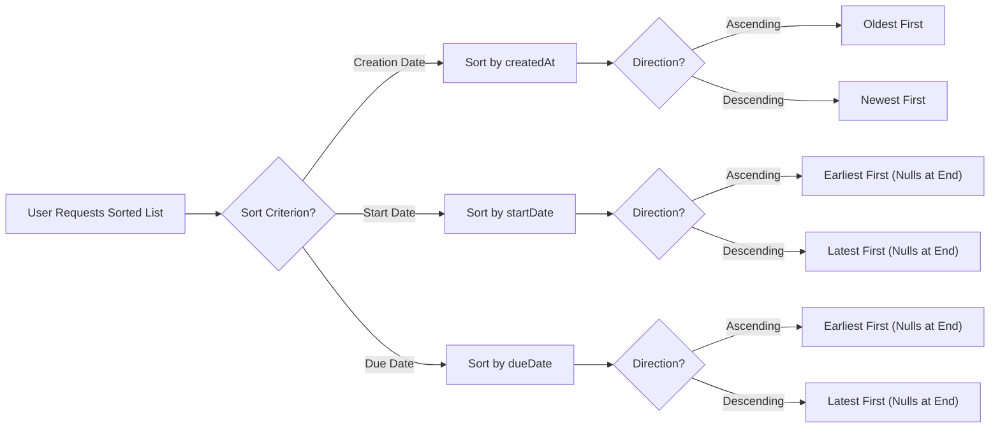

# Todo List Management Requirements

## 1. Overview

This document specifies the requirements for viewing, paginating, filtering, and sorting todo lists in the multi-user Todo application. Users manage their personal todo lists with complete privacy—each user can only access their own todos.

### Scope
- Todo list viewing and display
- Pagination for large todo collections
- Filtering by completion status
- Multiple sorting options
- Combined filter and sort operations

---

## 2. List Viewing Requirements

### 2.1 Data Scope and Privacy

**REQ-LIST-001**: THE system SHALL display only todos belonging to the authenticated user.

**REQ-LIST-002**: WHEN a user requests their todo list, THE system SHALL exclude todos belonging to other users from the results.

**REQ-LIST-003**: THE system SHALL never expose another user's todo data through list operations.

### 2.2 List Display Content

**REQ-LIST-004**: WHEN a user views their todo list, THE system SHALL display the following information for each todo:

| Field | Display Requirement |
|-------|-------------------|
| Title | Always displayed |
| Completion Status | Always displayed (Complete/Incomplete) |
| Start Date | Displayed if set, otherwise hidden |
| Due Date | Displayed if set, otherwise hidden |
| Creation Date | Always displayed |

**REQ-LIST-005**: THE system SHALL NOT display the full description in the list view—users must access individual todo details to view descriptions.

### 2.3 List Exclusions

**REQ-LIST-006**: WHEN a user views the main todo list, THE system SHALL exclude soft-deleted todos (todos in trash).

**REQ-LIST-007**: WHEN a user views the trash list, THE system SHALL display only soft-deleted todos.

---

## 3. Pagination Requirements

### 3.1 Pagination Overview

The todo list uses pagination to handle large numbers of todos efficiently, ensuring consistent performance regardless of the total todo count.

### 3.2 Page Size

**REQ-PAGE-001**: THE system SHALL display a maximum of 20 todos per page.

**REQ-PAGE-002**: THE system SHALL support a configurable page size between 10 and 50 items per page.

**REQ-PAGE-003**: WHEN a user does not specify a page size, THE system SHALL use 20 items as the default.

### 3.3 Page Navigation

**REQ-PAGE-004**: WHEN a user requests a specific page number, THE system SHALL return the corresponding set of todos.

**REQ-PAGE-005**: WHEN a user requests page 1 or does not specify a page, THE system SHALL return the first page of results.

**REQ-PAGE-006**: WHEN a user requests a page number that exceeds the total number of pages, THE system SHALL return an empty result set with metadata indicating the last valid page.

**REQ-PAGE-007**: WHEN a user requests page 0 or a negative page number, THE system SHALL return a validation error.

### 3.4 Pagination Metadata

**REQ-PAGE-008**: WHEN returning a paginated list, THE system SHALL include the following metadata:

| Metadata Field | Description |
|---------------|-------------|
| currentPage | Current page number (1-indexed) |
| totalPages | Total number of available pages |
| totalItems | Total count of todos matching the current filter |
| itemsPerPage | Number of items in the current page |
| hasNextPage | Boolean indicating if a next page exists |
| hasPreviousPage | Boolean indicating if a previous page exists |

### 3.5 Pagination Response Structure

**REQ-PAGE-009**: WHEN returning a paginated list, THE system SHALL include the following information:

```
Paginated Response Contains:
- Array of todo items (with title, completion status, start date, due date, creation date)
- Current page number
- Total pages count
- Total items count
- Items per page count
- Has next page indicator
- Has previous page indicator
```

### 3.6 Empty Page Handling

**REQ-PAGE-010**: WHEN a page contains no todos (empty result set), THE system SHALL return an empty array with valid pagination metadata.

---

## 4. Filtering by Completion Status

### 4.1 Filter Options

The system provides three distinct filter modes based on todo completion status.

**REQ-FILTER-001**: THE system SHALL support the following completion status filters:

| Filter Mode | Description |
|------------|-------------|
| All | Display all todos regardless of completion status |
| Complete | Display only todos marked as complete |
| Incomplete | Display only todos marked as incomplete |

### 4.2 Default Filter

**REQ-FILTER-002**: WHEN a user does not specify a filter, THE system SHALL apply the "All" filter by default.

### 4.3 Filter Behavior

**REQ-FILTER-003**: WHEN a user selects the "All" filter, THE system SHALL return both complete and incomplete todos.

**REQ-FILTER-004**: WHEN a user selects the "Complete" filter, THE system SHALL return only todos where the completion status is "Complete".

**REQ-FILTER-005**: WHEN a user selects the "Incomplete" filter, THE system SHALL return only todos where the completion status is "Incomplete".

### 4.4 Filter Scope

**REQ-FILTER-006**: THE system SHALL apply completion status filters only to active todos—not to todos in the trash.

**REQ-FILTER-007**: WHEN viewing the trash list, THE system SHALL NOT apply completion status filters (trash has a separate list view).

### 4.5 Filter Validation

**REQ-FILTER-008**: WHEN a user provides an invalid filter value, THE system SHALL return a validation error indicating valid filter options.

---

## 5. Sorting Options

### 5.1 Sorting Criteria

The system supports sorting todos by three different date fields, each with two sort directions.

**REQ-SORT-001**: THE system SHALL support the following sorting criteria:

| Criterion | Sort Field | Description |
|----------|-----------|-------------|
| Creation Date | createdAt | Date when todo was created |
| Start Date | startDate | User-defined start date (optional) |
| Due Date | dueDate | User-defined due date (optional) |

### 5.2 Sort Directions

**REQ-SORT-002**: THE system SHALL support two sort directions for each criterion:

| Direction | Behavior |
|----------|----------|
| Ascending | Oldest/earliest dates first |
| Descending | Newest/latest dates first |

**REQ-SORT-003**: WHEN sorting by Creation Date:
- Ascending = Oldest todos first (chronological order)
- Descending = Newest todos first (reverse chronological order)

**REQ-SORT-004**: WHEN sorting by Start Date:
- Ascending = Earliest start date first
- Descending = Latest start date first

**REQ-SORT-005**: WHEN sorting by Due Date:
- Ascending = Earliest due date first
- Descending = Latest due date first

### 5.3 Default Sort

**REQ-SORT-006**: WHEN a user does not specify a sort criterion, THE system SHALL sort by Creation Date in Descending order (newest first).

### 5.4 Handling Todos Without Dates

Critical business rule: Optional date fields require special handling during sorting.

**REQ-SORT-007**: WHEN sorting by Start Date, THE system SHALL place todos without a start date at the END of the list, regardless of sort direction.

**REQ-SORT-008**: WHEN sorting by Due Date, THE system SHALL place todos without a due date at the END of the list, regardless of sort direction.

**REQ-SORT-009**: WHEN sorting by Creation Date, THE system SHALL NOT need special handling—creation date is always set.

### 5.5 Sorting Logic Diagram



### 5.6 Sort Validation

**REQ-SORT-010**: WHEN a user provides an invalid sort criterion, THE system SHALL return a validation error indicating valid criteria.

**REQ-SORT-011**: WHEN a user provides an invalid sort direction, THE system SHALL return a validation error indicating valid directions.

---

## 6. Combined Filter and Sort Operations

### 6.1 Combination Behavior

Users can combine filtering and sorting in a single request to customize their todo list view.

**REQ-COMBINE-001**: THE system SHALL support simultaneous filtering by completion status AND sorting by any available criterion.

**REQ-COMBINE-002**: WHEN both filter and sort parameters are provided, THE system SHALL first apply the filter, then sort the filtered results.

### 6.2 Execution Order

**REQ-COMBINE-003**: WHEN processing a combined filter and sort request, THE system SHALL execute operations in this order:

1. Apply completion status filter
2. Sort the filtered results
3. Apply pagination to the sorted, filtered results

### 6.3 Combined Request Flow


### 6.4 Pagination with Combined Operations

**REQ-COMBINE-004**: THE system SHALL calculate total pages and total items based on the filtered result set, not the total todo count.

**REQ-COMBINE-005**: WHEN filtering reduces the result set, THE system SHALL recalculate pagination metadata to reflect the filtered count.

---

## 7. Empty State Handling

### 7.1 Empty List States

The system handles various scenarios where no todos match the user's request.

**REQ-EMPTY-001**: WHEN a user has no todos at all, THE system SHALL return an empty list with appropriate metadata.

**REQ-EMPTY-002**: WHEN a filter results in zero matching todos, THE system SHALL return an empty list with metadata showing zero total items.

### 7.2 Empty State Response

**REQ-EMPTY-003**: WHEN returning an empty list, THE system SHALL include:

| Field | Value |
|-------|-------|
| Todo Array | Empty array `[]` |
| Current Page | 1 |
| Total Pages | 0 |
| Total Items | 0 |
| Items Per Page | Requested or default value |
| Has Next Page | false |
| Has Previous Page | false |

### 7.3 Empty State User Experience

**REQ-EMPTY-004**: WHEN a user views an empty trash list, THE system SHALL return an empty list (the client application may display an appropriate message).

---

## 8. Performance Expectations

### 8.1 Response Time Requirements

**REQ-PERF-001**: WHEN a user requests a paginated todo list, THE system SHALL respond within 200 milliseconds for typical request patterns.

**REQ-PERF-002**: WHEN a user requests a filtered and sorted list, THE system SHALL respond within 300 milliseconds.

**REQ-PERF-003**: THE system SHALL maintain response times under 500 milliseconds even when a user has 10,000 or more todos.

### 8.2 Performance Under Load

**REQ-PERF-004**: THE system SHALL efficiently handle users with large todo collections through proper indexing and pagination.

**REQ-PERF-005**: THE system SHALL NOT retrieve full todo descriptions during list operations to optimize performance.

### 8.3 Database Optimization Expectations

**REQ-PERF-006**: THE system SHALL be designed to support efficient querying by:
- User ID (for data isolation)
- Completion status (for filtering)
- Creation date (for sorting)
- Start date (for sorting with null handling)
- Due date (for sorting with null handling)

---

## 9. Error Handling

### 9.1 Validation Errors

**REQ-ERROR-001**: WHEN a user provides an invalid page number (negative or zero), THE system SHALL return a validation error with code `INVALID_PAGE_NUMBER`.

**REQ-ERROR-002**: WHEN a user provides an invalid filter value, THE system SHALL return a validation error with code `INVALID_FILTER_VALUE`.

**REQ-ERROR-003**: WHEN a user provides an invalid sort criterion, THE system SHALL return a validation error with code `INVALID_SORT_CRITERION`.

**REQ-ERROR-004**: WHEN a user provides an invalid sort direction, THE system SHALL return a validation error with code `INVALID_SORT_DIRECTION`.

### 9.2 Authentication Errors

**REQ-ERROR-005**: WHEN an unauthenticated user attempts to access a todo list, THE system SHALL return an authentication error with HTTP status 401.

**REQ-ERROR-006**: WHEN an authentication token expires during a list request, THE system SHALL return an authentication error indicating token refresh is required.

---

## 10. Complete Request Parameters Summary

### 10.1 List Request Parameters

| Parameter | Type | Required | Default | Valid Values |
|-----------|------|----------|---------|-------------|
| page | Integer | No | 1 | ≥ 1 |
| pageSize | Integer | No | 20 | 10-50 |
| filter | String | No | "all" | "all", "complete", "incomplete" |
| sortBy | String | No | "createdAt" | "createdAt", "startDate", "dueDate" |
| sortOrder | String | No | "desc" | "asc", "desc" |

### 10.2 Parameter Validation Rules

**REQ-PARAM-001**: THE system SHALL validate all request parameters before processing.

**REQ-PARAM-002**: THE system SHALL apply default values for any omitted optional parameters.

---

## 11. Business Rules Summary

### 11.1 Data Isolation Rules

- Users can ONLY see their own todos
- Soft-deleted todos are excluded from the main list
- All list operations are scoped to the authenticated user

### 11.2 Sorting Rules

- Default sort: Creation Date, Descending (newest first)
- Todos without optional dates always appear at the END when sorting by that date field
- This null placement rule applies regardless of sort direction

### 11.3 Filtering Rules

- Default filter: "All" (both complete and incomplete)
- Filter only applies to active todos, not trash
- Filter determines the total count for pagination

### 11.4 Pagination Rules

- Default page size: 20 items
- Page size range: 10-50 items
- Empty pages return valid metadata with zero items

---

## 12. Requirements Traceability Matrix

| ID | Requirement | Priority | Category |
|----|-------------|----------|----------|
| REQ-LIST-001 | Display only user's own todos | Critical | Privacy |
| REQ-LIST-006 | Exclude trash from main list | High | Business Logic |
| REQ-PAGE-001 | Max 20 items per page | Medium | Performance |
| REQ-PAGE-006 | Handle invalid page numbers | Medium | Error Handling |
| REQ-FILTER-001 | Three completion status filters | High | Feature |
| REQ-SORT-001 | Three sorting criteria | High | Feature |
| REQ-SORT-007 | Null dates at end (startDate) | High | Business Logic |
| REQ-SORT-008 | Null dates at end (dueDate) | High | Business Logic |
| REQ-COMBINE-001 | Support filter + sort combination | High | Feature |
| REQ-PERF-001 | 200ms response time | Medium | Performance |
| REQ-ERROR-005 | Authentication required | Critical | Security |