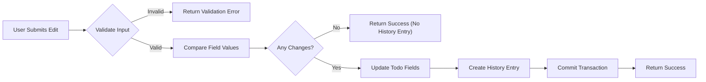
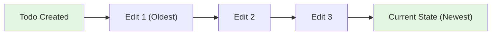
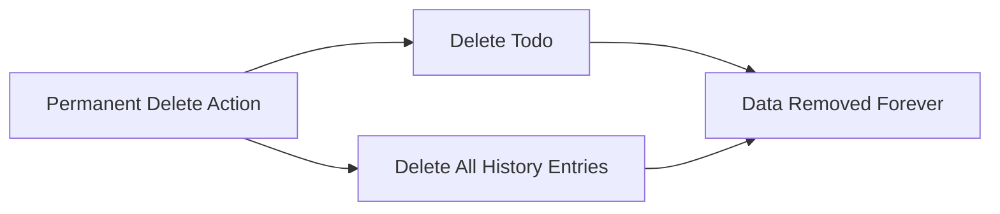
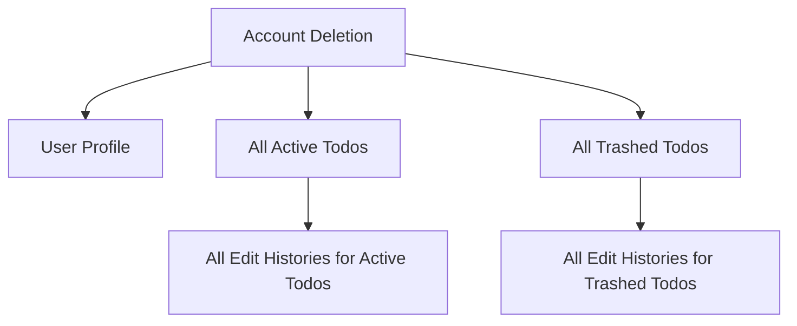

# Edit History System Requirements

## 1. Overview

The Edit History System provides a comprehensive audit trail for all modifications made to todos. Every time a user edits a todo, the system automatically captures and stores the changes, enabling users to review the complete evolution of their tasks over time. This system supports transparency, accountability, and the ability to track how todo details have changed throughout their lifecycle.

### 1.1 Purpose

THE Edit History System SHALL provide a complete and immutable record of all modifications made to todo items.

### 1.2 Scope

The Edit History System applies to:
- All todo field modifications (title, description, start date, due date)
- All authenticated users with todos
- All todos regardless of completion status or deletion status

### 1.3 Key Principles

- **Automatic Capture**: History entries are created automatically without user intervention
- **Immutable Records**: Once created, history entries cannot be modified or deleted (except through permanent todo deletion)
- **User-Scoped Access**: Users can only view history for their own todos
- **Complete Audit Trail**: Every edit creates a history entry, capturing all field changes

---

## 2. History Entry Structure

### 2.1 Entry Composition

Each history entry SHALL contain the following components:

| Component | Description | Required |
|-----------|-------------|----------|
| Timestamp | The exact date and time when the edit was made | Yes |
| Title Change | The new title value (if the title was modified) | Conditional |
| Description Change | The new description value (if the description was modified) | Conditional |
| Start Date Change | The new start date value (if the start date was modified) | Conditional |
| Due Date Change | The new due date value (if the due date was modified) | Conditional |

### 2.2 Field Change Recording

WHEN a user edits a todo, THE system SHALL record the new value for each modified field in the history entry.

#### 2.2.1 Title Changes

IF the title field is modified during an edit, THEN THE system SHALL record the new title value in the history entry.

- **Data Type**: Text string
- **Maximum Length**: Same as todo title maximum length
- **Empty Values**: Not applicable (title is required on todos)

#### 2.2.2 Description Changes

IF the description field is modified during an edit, THEN THE system SHALL record the new description value in the history entry.

- **Data Type**: Text string (may be empty)
- **Empty Values**: THE system SHALL record empty description values as a valid change
- **Null Handling**: WHEN the description is changed to empty, THE system SHALL record this as an empty string change

#### 2.2.3 Start Date Changes

IF the start date field is modified during an edit, THEN THE system SHALL record the new start date value in the history entry.

- **Data Type**: Date and time (ISO 8601 format)
- **Null Values**: WHEN the start date is cleared (removed), THE system SHALL record a null value
- **Timezone**: THE system SHALL store dates in UTC and display them in the user's timezone

#### 2.2.4 Due Date Changes

IF the due date field is modified during an edit, THEN THE system SHALL record the new due date value in the history entry.

- **Data Type**: Date and time (ISO 8601 format)
- **Null Values**: WHEN the due date is cleared (removed), THE system SHALL record a null value
- **Timezone**: THE system SHALL store dates in UTC and display them in the user's timezone

### 2.3 Timestamp Requirements

THE system SHALL record the exact timestamp of each edit with the following characteristics:
- **Precision**: At least to the second
- **Timezone**: Stored in UTC
- **Immutability**: Once recorded, the timestamp cannot be changed

### 2.4 Conditional Field Recording

THE system SHALL only include field change records in a history entry for fields that were actually modified during that edit operation.

**Example Scenarios**:

| Edit Action | Fields Recorded in History Entry |
|-------------|----------------------------------|
| User changes only the title | Timestamp + New title value |
| User changes title and description | Timestamp + New title + New description |
| User changes all four fields | Timestamp + All four new values |
| User changes start date to empty | Timestamp + Null start date value |

---

## 3. Automatic History Creation

### 3.1 Trigger Conditions

WHEN a user submits an edit to any todo field, THE system SHALL automatically create a new history entry.

### 3.2 Creation Timing

THE system SHALL create the history entry at the same time as the todo update is committed, ensuring atomic consistency between the todo and its history.

### 3.3 Edit Detection Rules

#### 3.3.1 Meaningful Changes Only

THE system SHALL create a history entry only when at least one field value actually changes.

IF a user submits an edit request but no field values have changed compared to the current todo state, THEN THE system SHALL NOT create a history entry.

#### 3.3.2 Case Sensitivity

THE system SHALL treat text field changes as case-sensitive when determining if a modification occurred.

**Example**: Changing title from "Buy groceries" to "buy groceries" SHALL be recorded as a change.

#### 3.3.3 Whitespace Handling

THE system SHALL consider whitespace changes as meaningful edits.

**Example**: Changing description from "Meeting at 3pm" to "Meeting at  3pm" (double space) SHALL be recorded as a change.

### 3.4 Field-Specific Creation Rules

| Field Type | Change Detection Rule |
|------------|---------------------|
| Title | Any difference in string value (case-sensitive, whitespace-sensitive) |
| Description | Any difference in string value, including changes to/from empty string |
| Start Date | Any difference in date/time value, including setting/clearing the date |
| Due Date | Any difference in date/time value, including setting/clearing the date |

### 3.5 Creation Process Flow



---

## 4. History Viewing Requirements

### 4.1 Access Control

#### 4.1.1 Owner-Only Access

WHEN a user requests to view the edit history of a todo, THE system SHALL verify that the user owns that todo.

IF the user does not own the todo, THEN THE system SHALL deny access and return an appropriate error message.

#### 4.1.2 Private History Model

THE system SHALL enforce complete privacy for edit history:
- Users can only view history for their own todos
- There is no mechanism to share or expose history to other users
- History access is tied to todo ownership
- No administrator or third party can access a user's todo history

### 4.2 History Retrieval

#### 4.2.1 Single Todo History

WHEN a user views a single todo's details, THE system SHALL provide access to view the complete edit history for that todo.

#### 4.2.2 History Entry Details

WHEN a user views the edit history, THE system SHALL display for each entry:
- The timestamp of when the edit was made
- Any field values that were changed in that edit
- Clear indication of which fields were modified

### 4.3 History Availability

#### 4.3.1 Active Todos

THE system SHALL make edit history available for all active (non-deleted) todos.

#### 4.3.2 Trashed Todos

WHILE a todo is in the trash (soft deleted), THE system SHALL retain its edit history and make it accessible when viewing the todo details.

#### 4.3.3 Restored Todos

WHEN a todo is restored from trash, THE system SHALL preserve all existing edit history and continue appending new history entries for subsequent edits.

### 4.4 Viewing Interface Requirements

THE system SHALL provide the following viewing capabilities:

| Capability | Requirement |
|------------|-------------|
| History List | Display all history entries for a specific todo |
| Entry Details | Show all field changes within each history entry |
| Timestamp Display | Show edit timestamps in user's local timezone |
| Empty State | Display appropriate message when no history exists |

---

## 5. History Sorting and Display

### 5.1 Default Sorting

THE system SHALL sort history entries from most recent to oldest (reverse chronological order).

### 5.2 Sorting Implementation

WHEN a user views the edit history of a todo, THE system SHALL return history entries sorted by timestamp in descending order (newest first).

**Example Order**:

| Order | Entry | Timestamp |
|-------|-------|----------|
| 1st | Most recent edit | 2024-01-15 14:30:00 |
| 2nd | Previous edit | 2024-01-14 09:15:00 |
| 3rd | Earlier edit | 2024-01-10 16:45:00 |
| 4th | Oldest edit | 2024-01-08 11:00:00 |

### 5.3 Display Formatting

#### 5.3.1 Timestamp Format

THE system SHALL display history entry timestamps in a human-readable format showing:
- Full date (year, month, day)
- Time (hours, minutes)
- User's local timezone indication

**Example Display**: "January 15, 2024 at 2:30 PM (EST)"

#### 5.3.2 Field Change Display

THE system SHALL clearly indicate which fields were modified in each history entry:
- Modified fields should be visibly highlighted
- Non-modified fields should not appear in the history entry display
- Field names should be displayed in a user-friendly format

**Example Entry Display**:
```
Edited on: January 15, 2024 at 2:30 PM
Changes made:
  • Title: "Complete project report" (changed from previous)
  • Due Date: January 20, 2024 (changed from previous)
```

### 5.4 Chronological Relationship

THE system SHALL maintain clear chronological ordering to help users understand the evolution of their todo:



---

## 6. History Retention Policy

### 6.1 Retention Duration

THE system SHALL retain edit history for the entire lifetime of a todo.

### 6.2 No Automatic Deletion

THE system SHALL NOT automatically delete or archive history entries based on age or quantity.

### 6.3 History Entry Limits

THE system SHALL NOT impose a maximum limit on the number of history entries per todo.

### 6.4 Deletion Scenarios

#### 6.4.1 Permanent Todo Deletion

WHEN a todo is permanently deleted from the trash, THE system SHALL delete all associated history entries.

**Cascade Behavior**:



#### 6.4.2 Account Deletion

WHEN a user deletes their account, THE system SHALL permanently delete all todos and their associated edit histories, including todos in the trash.

#### 6.4.3 Soft Delete (Move to Trash)

WHEN a todo is moved to trash (soft deleted), THE system SHALL preserve all edit history and make it accessible.

### 6.5 History Recovery

THE system SHALL NOT provide a mechanism to recover deleted history entries once they have been permanently removed.

---

## 7. Performance Considerations

### 7.1 Response Time Requirements

#### 7.1.1 History Viewing

WHEN a user requests the edit history for a todo, THE system SHALL return the history list within 2 seconds for todos with up to 100 history entries.

#### 7.1.2 History Entry Creation

WHEN a user edits a todo, THE history entry creation SHALL NOT add more than 100 milliseconds to the overall edit operation response time.

### 7.2 Scalability Expectations

THE system SHALL be designed to handle:
- Todos with 50+ history entries without performance degradation
- Users viewing history for multiple todos in succession without delays
- Concurrent history creation for multiple users simultaneously

### 7.3 Storage Efficiency

THE system SHALL efficiently store history entries, minimizing storage overhead while maintaining complete audit trail integrity.

### 7.4 Query Optimization

THE system SHALL optimize history retrieval queries to ensure fast loading times even for todos with extensive edit histories.

---

## 8. Edge Cases and Exception Handling

### 8.1 Empty History State

WHEN a user views the history of a todo that has never been edited, THE system SHALL display an appropriate message indicating that no edit history exists.

**Example Message**: "This todo has not been edited since creation."

### 8.2 Large History Display

WHEN a todo has a very large number of history entries (50+), THE system SHALL:
- Display all entries without pagination (as per current requirements)
- Load and render entries efficiently to maintain responsive user experience

### 8.3 Concurrent Edits

IF multiple edit requests are submitted simultaneously for the same todo, THE system SHALL process them sequentially to maintain accurate history ordering.

### 8.4 Data Validation Errors

IF a user attempts to edit a todo with invalid data, THE system SHALL:
- NOT create a history entry
- Return a clear validation error message
- Preserve the existing todo state and history

### 8.5 Missing or Corrupted History

IF a history entry cannot be retrieved due to data inconsistency, THE system SHALL:
- Log the error for administrative review
- Continue displaying available history entries
- NOT expose internal error details to the user

### 8.6 History Access After Todo Modification

WHEN a todo has been recently modified and a user requests its history, THE system SHALL ensure that:
- The most recent history entry is immediately visible
- No caching delays prevent viewing the latest history
- History timestamps accurately reflect the modification time

---

## 9. User Experience Requirements

### 9.1 Transparency

THE system SHALL provide clear visibility into the edit history:
- Users should easily understand when edits occurred
- Users should clearly see what changed in each edit
- The chronological flow should be intuitive

### 9.2 Accessibility

THE edit history SHALL be accessible through:
- The single todo detail view
- A clear indication that history is available for viewing
- Simple navigation to access the history

### 9.3 Error Messages

WHEN history-related errors occur, THE system SHALL display user-friendly error messages:

| Scenario | User-Facing Message |
|----------|-------------------|
| Unauthorized access | "You don't have permission to view this history." |
| Todo not found | "This todo no longer exists." |
| System error | "Unable to load edit history. Please try again." |

---

## 10. Integration with Other Features

### 10.1 Todo Creation

WHEN a todo is initially created, THE system SHALL NOT create a history entry. History tracking begins with the first edit.

### 10.2 Completion Status Changes

THE system SHALL NOT record completion status changes (complete/incomplete toggles) in the edit history. History entries are created only for changes to title, description, start date, and due date.

### 10.3 Trash and Restoration

THE edit history SHALL remain intact and accessible during the following operations:

| Operation | History Behavior |
|-----------|-----------------|
| Soft delete (move to trash) | History preserved, accessible when viewing trash item |
| Restore from trash | History preserved, continues with new edits |
| Permanent delete | History permanently deleted |

### 10.4 Account Deletion Cascade

WHEN a user deletes their account, THE system SHALL remove:



---

## 11. Summary

The Edit History System provides a comprehensive audit trail that:

1. **Automatically captures** all todo field modifications without user intervention
2. **Records complete change details** including timestamp and new field values
3. **Maintains chronological order** from most recent to oldest
4. **Ensures complete privacy** with user-scoped access controls
5. **Preserves history** through soft delete and restore operations
6. **Provides immutable records** that cannot be modified after creation
7. **Supports full lifecycle** from todo creation through permanent deletion

### Key Business Rules Summary

| Rule | Requirement |
|------|-------------|
| Automatic Creation | Every edit creates a history entry |
| Field Tracking | Only modified fields are recorded |
| Timestamp | Required for every entry, immutable |
| Sorting | Most recent first (descending by timestamp) |
| Retention | Lifetime of todo, no automatic deletion |
| Privacy | Owner-only access, no sharing |
| Deletion | Permanent delete removes all history |
| Completion Status | Not tracked in history |
| Creation Event | No history entry for initial todo creation |

---

> **Note**: This document specifies business requirements for the Edit History System. Technical implementation details such as database schema design, API endpoints, and storage architecture are at the discretion of the development team.