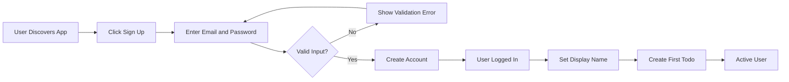
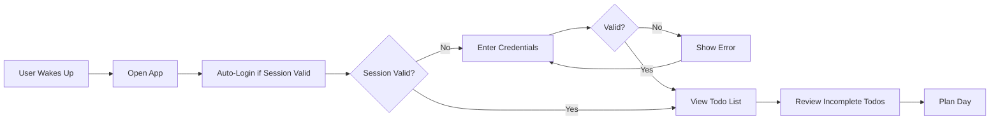
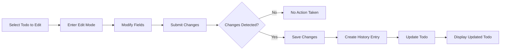
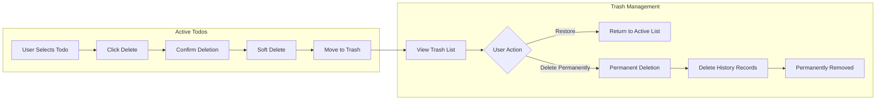
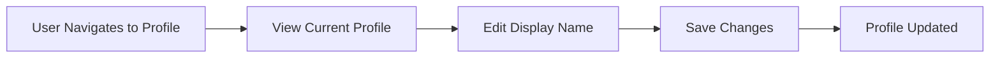

# User Scenarios

This document describes the complete user journeys and scenarios for the Todo Application, from initial registration through daily usage to account management. Each scenario provides concrete examples that backend developers can use to understand the expected system behavior.

## 1. User Registration Journey

### 1.1 Complete Registration Flow

The registration journey covers the complete process from a new user discovering the application to becoming an active user with their first todo.

#### Scenario 1.1.1: Successful Registration

**Given**: A new user wants to create an account

**When**: The user provides a valid email address "newuser@example.com" and a password "SecurePass123!"

**Then**: THE system SHALL create a new user account with a unique identifier

**And**: THE system SHALL automatically authenticate the user

**And**: THE system SHALL create an empty profile with no display name set

**And**: THE user SHALL be able to immediately access their empty todo list

#### Scenario 1.1.2: Registration with Duplicate Email

**Given**: A user attempts to register with email "existing@example.com"

**When**: An account with this email already exists in the system

**Then**: THE system SHALL reject the registration request

**And**: THE system SHALL display an error message indicating the email is already registered

**And**: THE system SHALL NOT reveal whether the email exists or not for security purposes

#### Scenario 1.1.3: Registration with Invalid Password

**Given**: A user attempts to register with email "test@example.com" and password "123"

**When**: The password does not meet the security requirements (minimum 8 characters, uppercase, lowercase, digit, special character)

**Then**: THE system SHALL reject the registration request

**And**: THE system SHALL display specific validation errors explaining password requirements

**And**: THE system SHALL preserve the email input to avoid re-entry

#### Scenario 1.1.4: Registration with Invalid Email Format

**Given**: A user attempts to register with email "invalid-email" and password "SecurePass123!"

**When**: The email format is invalid (missing @ symbol and domain)

**Then**: THE system SHALL reject the registration request

**And**: THE system SHALL display error code INVALID_EMAIL_FORMAT

**And**: THE system SHALL preserve the password input to avoid re-entry

### 1.2 First-Time User Experience

#### Scenario 1.2.1: Setting Display Name After Registration

**Given**: A newly registered user with no display name set

**When**: The user navigates to their profile for the first time

**Then**: THE system SHALL display an empty or placeholder display name field

**And**: THE user SHALL be able to set their display name

**And**: THE system SHALL save the display name immediately upon submission

#### Scenario 1.2.2: Creating First Todo

**Given**: A newly registered user with an empty todo list

**When**: The user creates their first todo with title "Buy groceries" and description "Milk, eggs, bread"

**Then**: THE system SHALL create the todo with a unique identifier

**And**: THE todo SHALL be marked as incomplete by default

**And**: THE todo SHALL appear in the user's todo list immediately

**And**: THE creation timestamp SHALL be recorded

#### Scenario 1.2.3: Viewing Empty Todo List

**Given**: A newly registered user with no todos

**When**: The user views their todo list

**Then**: THE system SHALL display an empty state message

**And**: THE system SHALL indicate that no todos exist

**And**: THE system SHALL provide guidance to create the first todo

---

## 2. Daily Todo Management Flow

### 2.1 Morning Routine - Reviewing Todos

This scenario represents a typical user's morning interaction with the application.

#### Scenario 2.1.1: Viewing Todo List on Login

**Given**: An authenticated user with 15 existing todos (10 incomplete, 5 complete)

**When**: The user opens the application or logs in

**Then**: THE system SHALL display the todo list with pagination (default 20 items per page)

**And**: THE system SHALL show todos sorted by creation date descending (newest first)

**And**: THE system SHALL display for each todo: title, completion status, start date (if set), due date (if set), and creation date

**And**: THE response time SHALL be within 300 milliseconds

#### Scenario 2.1.2: Filtering for Today's Focus

**Given**: A user with multiple todos including some with start dates and due dates

**When**: The user filters to show only incomplete todos

**Then**: THE system SHALL display only todos with completion status "incomplete"

**And**: THE system SHALL maintain the current sort order

**And**: THE pagination SHALL reset to page 1

**And**: THE total count SHALL reflect only incomplete todos

#### Scenario 2.1.3: Sorting by Due Date

**Given**: A user with 20 todos, 15 having due dates and 5 without due dates

**When**: The user sorts by due date ascending (earliest first)

**Then**: THE system SHALL display todos with due dates ordered from earliest to latest

**And**: THE system SHALL place todos without due dates at the end of the list

**And**: THE sorting SHALL complete within 300 milliseconds

### 2.2 Creating New Todos Throughout the Day

#### Scenario 2.2.1: Quick Todo Creation

**Given**: An authenticated user wants to capture a quick task

**When**: The user creates a todo with only a title "Call dentist"

**Then**: THE system SHALL create the todo successfully without requiring description or dates

**And**: THE todo SHALL appear at the appropriate position in the list based on current sorting

**And**: THE system SHALL not require any optional fields

**And**: THE creation timestamp SHALL be recorded

#### Scenario 2.2.2: Todo Creation with Full Details

**Given**: An authenticated user wants to create a detailed todo

**When**: The user creates a todo with:
- Title: "Prepare presentation for client meeting"
- Description: "Include Q4 sales data, market analysis, and competitive landscape"
- Start date: "2024-01-15"
- Due date: "2024-01-20"

**Then**: THE system SHALL create the todo with all provided information

**And**: THE system SHALL store dates in ISO 8601 format

**And**: THE todo SHALL appear in the list with dates visible

**And**: No edit history SHALL be created for initial creation

#### Scenario 2.2.3: Todo Creation with Maximum Length Title

**Given**: A user creates a todo with a title at exactly 200 characters

**When**: The title is at the maximum allowed length

**Then**: THE system SHALL accept and create the todo

**And**: THE system SHALL store the complete title without truncation

**And**: THE todo SHALL display correctly in the list view

#### Scenario 2.2.4: Todo Creation with Empty Description

**Given**: A user creates a todo with title "Quick reminder" and no description

**When**: The description field is left empty

**Then**: THE system SHALL create the todo with description set to null

**And**: THE todo SHALL function normally without a description

**And**: THE detail view SHALL indicate no description is present

### 2.3 Completing Tasks

#### Scenario 2.3.1: Marking Todo as Complete

**Given**: A user viewing their todo list with incomplete todo "Buy groceries"

**When**: The user marks the todo as complete

**Then**: THE system SHALL update the todo's completion status to "complete"

**And**: THE todo SHALL visually indicate completion

**And**: THE completion SHALL be reflected immediately in the list

**And**: No edit history entry SHALL be created for completion status changes

#### Scenario 2.3.2: Marking Complete Todo as Incomplete

**Given**: A user with a completed todo "Buy groceries"

**When**: The user marks the todo as incomplete

**Then**: THE system SHALL update the todo's completion status back to "incomplete"

**And**: THE todo SHALL appear in the incomplete filter view

**And**: THE system SHALL maintain all other todo properties unchanged

#### Scenario 2.3.3: Completing Todo with No History Impact

**Given**: A user marks a todo as complete, then incomplete, then complete again

**When**: The user toggles completion status multiple times

**Then**: THE system SHALL update the status each time

**And**: No edit history entries SHALL be created for any completion status changes

**And**: Only the current completion status SHALL be reflected

### 2.4 Viewing Todo Details

#### Scenario 2.4.1: Viewing Single Todo

**Given**: A user with a todo that has a long description

**When**: The user selects the todo to view details

**Then**: THE system SHALL display the complete todo information including:
- Full title
- Full description (without truncation)
- Start date (if set)
- Due date (if set)
- Creation date
- Last modified date
- Completion status
- Edit history access option

**And**: THE system SHALL show the entire description without truncation

#### Scenario 2.4.2: Viewing Todo with No Dates

**Given**: A user selects a todo with no start date or due date

**When**: The user views the todo details

**Then**: THE system SHALL display date fields as empty or "not set"

**And**: THE todo SHALL function normally without dates

**And**: THE sorting behavior SHALL handle missing dates correctly

---

## 3. Todo Editing with History

### 3.1 Edit Workflow Overview

### 3.2 Editing Scenarios

#### Scenario 3.2.1: Editing Todo Title

**Given**: A user viewing todo "Call dentist" created on 2024-01-10

**When**: The user changes the title to "Call dentist to schedule annual checkup" and saves

**Then**: THE system SHALL update the todo's title

**And**: THE system SHALL create an edit history entry containing:
- Timestamp of the edit
- The new title value
- Indication that description, start date, and due date were not changed (null in history)

**And**: THE todo's last modified timestamp SHALL be updated

#### Scenario 3.2.2: Editing Multiple Fields

**Given**: A user viewing a todo with:
- Title: "Prepare presentation"
- Description: "Q4 sales data"
- No start or due dates

**When**: The user updates:
- Description to: "Q4 sales data, market analysis, competitive landscape"
- Due date to: "2024-01-25"

**Then**: THE system SHALL update both fields

**And**: THE system SHALL create a single edit history entry recording:
- Timestamp of the edit
- The new description value
- The new due date value
- Indication that title and start date were not changed (null in history)

#### Scenario 3.2.3: Clearing Optional Fields

**Given**: A user viewing a todo with due date "2024-01-20"

**When**: The user clears the due date field and saves

**Then**: THE system SHALL set the due date to null

**And**: THE system SHALL create an edit history entry noting the due date was cleared (null value)

**And**: THE todo SHALL appear at the end when sorting by due date

#### Scenario 3.2.4: Editing with No Actual Changes

**Given**: A user viewing a todo titled "Buy groceries"

**When**: The user opens edit mode and saves without modifying any fields

**Then**: THE system SHALL NOT create a history entry

**And**: THE system SHALL return success status

**And**: THE todo SHALL remain unchanged

### 3.3 Viewing Edit History

#### Scenario 3.3.1: Viewing Complete Edit History

**Given**: A todo that has been edited 5 times since creation

**When**: The user views the edit history

**Then**: THE system SHALL display all 5 history entries

**And**: THE entries SHALL be sorted from most recent to oldest

**And**: Each entry SHALL show:
- When the edit was made (timestamp)
- What the title was changed to (if changed)
- What the description was changed to (if changed)
- What the start date was changed to (if changed)
- What the due date was changed to (if changed)

#### Scenario 3.3.2: No Edit History Display

**Given**: A newly created todo that has never been edited

**When**: The user attempts to view edit history

**Then**: THE system SHALL display an empty history or a message indicating no edits have been made

**And**: THE system SHALL still provide access to the history section for future edits

#### Scenario 3.3.3: History Entry Details

**Given**: A user viewing a history entry from 2024-01-15 14:30:00

**When**: The history entry shows changes to title and start date

**Then**: THE system SHALL display:
- Edit timestamp: "January 15, 2024 at 2:30 PM"
- Title changed to: "Updated title text"
- Start date changed to: "2024-01-20"
- Description: not changed
- Due date: not changed

---

## 4. Trash and Recovery Workflow

### 4.1 Deletion Flow Overview

### 4.2 Soft Delete Scenarios

#### Scenario 4.2.1: Deleting a Todo

**Given**: A user with an active todo "Buy groceries"

**When**: The user deletes the todo

**Then**: THE system SHALL perform a soft delete

**And**: THE todo SHALL be removed from the active todo list

**And**: THE todo SHALL appear in the trash list

**And**: THE todo's edit history SHALL be preserved

**And**: THE deletion timestamp SHALL be recorded

#### Scenario 4.2.2: Deleting Multiple Todos Sequentially

**Given**: A user with 3 todos: "Task A", "Task B", "Task C"

**When**: The user deletes all three todos in sequence

**Then**: THE system SHALL move all three todos to the trash

**And**: THE trash list SHALL show all three todos

**And**: THE active todo list SHALL be empty

**And**: Each todo SHALL retain its edit history

#### Scenario 4.2.3: Deleting Already Trashed Todo

**Given**: A user viewing a todo already in trash

**When**: The user attempts to delete it again from the active list

**Then**: THE system SHALL return an error indicating the todo is not found

**And**: THE todo SHALL remain in the trash

### 4.3 Trash Viewing Scenarios

#### Scenario 4.3.1: Viewing Trash List

**Given**: A user with 5 deleted todos in the trash

**When**: The user navigates to the trash view

**Then**: THE system SHALL display all soft-deleted todos

**And**: THE list SHALL be paginated

**And**: Each entry SHALL show: title, deletion date, and original creation date

**And**: THE response time SHALL be within 500 milliseconds

#### Scenario 4.3.2: Empty Trash Display

**Given**: A user with no deleted todos

**When**: The user navigates to the trash view

**Then**: THE system SHALL display an empty state message

**And**: THE system SHALL indicate that no deleted todos exist

### 4.4 Restore Scenarios

#### Scenario 4.4.1: Restoring Single Todo from Trash

**Given**: A user with a deleted todo "Buy groceries" in the trash

**When**: The user selects the todo and clicks restore

**Then**: THE system SHALL move the todo back to the active todo list

**And**: THE todo SHALL be removed from the trash list

**And**: THE todo's completion status SHALL be preserved

**And**: THE edit history SHALL remain intact

**And**: THE original creation date SHALL be preserved

#### Scenario 4.4.2: Restoring Multiple Todos

**Given**: A user with 3 deleted todos in the trash

**When**: The user restores all three todos

**Then**: THE system SHALL move all three todos back to the active list

**And**: THE trash list SHALL be empty

**And**: THE active todo list SHALL show all three todos

#### Scenario 4.4.3: Restore After Multiple Delete Cycles

**Given**: A todo that has been deleted and restored twice before

**When**: The user deletes it a third time and then restores it

**Then**: THE system SHALL restore the todo successfully

**And**: THE edit history SHALL continue accumulating

**And**: THE previous delete/restore cycles SHALL NOT create history entries

### 4.5 Permanent Deletion Scenarios

#### Scenario 4.5.1: Permanently Deleting a Todo

**Given**: A user with a deleted todo "Buy groceries" in the trash with 3 edit history entries

**When**: The user selects the todo and clicks "Delete Permanently"

**Then**: THE system SHALL permanently remove the todo from the database

**And**: THE system SHALL delete all associated edit history entries

**And**: THE todo SHALL be removed from the trash list

**And**: THE action SHALL be irreversible

#### Scenario 4.5.2: Permanent Deletion Confirmation

**Given**: A user attempting to permanently delete a todo

**When**: The user clicks "Delete Permanently"

**Then**: THE system SHALL require explicit confirmation before proceeding

**And**: THE confirmation message SHALL warn that the action is permanent and cannot be undone

**And**: THE system SHALL only proceed upon explicit user confirmation

#### Scenario 4.5.3: Canceling Permanent Deletion

**Given**: A user viewing the permanent deletion confirmation dialog

**When**: The user cancels the operation

**Then**: THE system SHALL NOT delete the todo

**And**: THE todo SHALL remain in the trash unchanged

---

## 5. Account Management Scenarios

### 5.1 Profile Management Flow

#### Scenario 5.1.1: Updating Display Name

**Given**: A user with display name "John"

**When**: The user changes their display name to "John Smith"

**Then**: THE system SHALL update the display name

**And**: THE new display name SHALL be immediately visible

**And**: THE update timestamp SHALL be recorded

#### Scenario 5.1.2: Clearing Display Name

**Given**: A user with display name "John"

**When**: The user clears the display name field

**Then**: THE system SHALL reject the update (display name cannot be empty)

**And**: THE system SHALL display error code PROFILE_DISPLAY_NAME_TOO_SHORT

#### Scenario 5.1.3: Profile Privacy Enforcement

**Given**: User A attempts to view User B's profile

**When**: User A makes any request to access User B's profile data

**Then**: THE system SHALL deny the request

**And**: THE system SHALL return an authorization error

**And**: THE system SHALL NOT reveal any information about User B

### 5.2 Password Management

#### Scenario 5.2.1: Changing Password

**Given**: An authenticated user with current password "OldPass123!"

**When**: The user changes their password to "NewSecure456!"

**Then**: THE system SHALL update the password

**And**: THE system SHALL invalidate all existing sessions except the current one

**And**: THE user SHALL remain logged in on the current session

**And**: THE user SHALL need to re-authenticate on other devices

#### Scenario 5.2.2: Password Change with Invalid Current Password

**Given**: A user attempting to change password

**When**: The user provides an incorrect current password

**Then**: THE system SHALL reject the password change request

**And**: THE system SHALL display error code INVALID_CURRENT_PASSWORD

**And**: THE system SHALL NOT reveal whether the account exists

#### Scenario 5.2.3: Password Change with Weak New Password

**Given**: A user changing password with correct current password

**When**: The new password is "password" (does not meet complexity requirements)

**Then**: THE system SHALL reject the password change

**And**: THE system SHALL display specific validation errors for password requirements

### 5.3 Account Deletion

#### Scenario 5.3.1: Complete Account Deletion

**Given**: A user with:
- 10 active todos (5 in trash)
- Each todo has 2-3 edit history entries
- A profile with display name

**When**: The user deletes their account

**Then**: THE system SHALL permanently delete:
- The user account record
- All active todos (10 todos)
- All soft-deleted todos (5 todos in trash)
- All edit history entries for all todos
- The user profile data

**And**: THE action SHALL be irreversible

**And**: THE user SHALL be immediately logged out

**And**: THE email SHALL become available for new registrations

#### Scenario 5.3.2: Account Deletion with Empty Todo List

**Given**: A user with no todos and no data in trash

**When**: The user deletes their account

**Then**: THE system SHALL delete the user account and profile

**And**: THE deletion SHALL complete without errors despite no associated data

#### Scenario 5.3.3: Account Deletion Confirmation

**Given**: A user attempting to delete their account

**When**: The user initiates account deletion

**Then**: THE system SHALL require explicit confirmation

**And**: THE confirmation SHALL warn that:
- All todos will be permanently deleted
- All todos in trash will be permanently deleted
- All edit history will be lost
- The action cannot be undone

**And**: THE system SHALL require password re-entry for security

---

## 6. Edge Cases and Exception Handling

### 6.1 Authentication Edge Cases

#### Scenario 6.1.1: Session Expiration During Operation

**Given**: A user editing a todo with an expired session

**When**: The user attempts to save the edited todo

**Then**: THE system SHALL detect the expired session

**And**: THE system SHALL return HTTP 401 Unauthorized

**And**: THE system SHALL redirect the user to the login page

**And**: THE edit data may be preserved client-side for recovery after re-authentication

#### Scenario 6.1.2: Concurrent Login from Multiple Devices

**Given**: A user logged in on Device A and attempts to log in on Device B

**When**: The user successfully logs in on Device B

**Then**: THE system SHALL allow login on Device B

**And**: THE session on Device A SHALL remain valid

**And**: THE user SHALL be able to use both devices simultaneously

#### Scenario 6.1.3: Login with Incorrect Credentials

**Given**: A user attempting to login with email "user@example.com" and wrong password

**When**: The password does not match the stored credentials

**Then**: THE system SHALL reject the login attempt

**And**: THE system SHALL display error code INVALID_CREDENTIALS

**And**: THE system SHALL NOT reveal whether the email exists

**And**: THE system SHALL implement rate limiting after 5 failed attempts

#### Scenario 6.1.4: Account Locked After Failed Attempts

**Given**: A user has made 5 consecutive failed login attempts

**When**: The user attempts another login

**Then**: THE system SHALL return error code ACCOUNT_LOCKED

**And**: THE system SHALL indicate the remaining lock duration (15 minutes)

**And**: THE user SHALL NOT be able to attempt login until lock expires

### 6.2 Todo Operations Edge Cases

#### Scenario 6.2.1: Creating Todo with Maximum Length Title

**Given**: A user creating a todo with a title at exactly 200 characters

**When**: The title is at the maximum allowed character length

**Then**: THE system SHALL accept the creation

**And**: THE system SHALL store the complete title without truncation

#### Scenario 6.2.2: Creating Todo with Overlength Title

**Given**: A user creating a todo with a title of 201 characters

**When**: The title exceeds the maximum allowed length

**Then**: THE system SHALL reject the creation

**And**: THE system SHALL return error code TODO_TITLE_TOO_LONG

**And**: THE system SHALL preserve other form data for correction

#### Scenario 6.2.3: Editing a Todo Deleted by Another Session

**Given**: A user with two devices (Device A and Device B) viewing the same todo

**When**: The user deletes the todo on Device A, then attempts to edit it on Device B

**Then**: THE system SHALL detect the todo no longer exists in active list

**And**: THE system SHALL return error code TODO_NOT_FOUND

**And**: THE system SHALL redirect the user to the todo list

#### Scenario 6.2.4: Sorting Todos When All Have No Dates

**Given**: A user with 10 todos, none having start dates or due dates

**When**: The user sorts by due date (earliest first)

**Then**: THE system SHALL display all todos

**And**: THE sort order SHALL fall back to creation date as secondary criterion

**And**: THE user experience SHALL remain consistent

#### Scenario 6.2.5: Pagination at Boundaries

**Given**: A user with exactly 20 todos (page size is 20)

**When**: The user navigates to page 2

**Then**: THE system SHALL return an empty list

**And**: THE pagination metadata SHALL indicate currentPage = 2, totalPages = 1

**And**: THE system SHALL not return an error

#### Scenario 6.2.6: Viewing History of a Todo with Many Edits

**Given**: A todo with 100 edit history entries

**When**: The user views the edit history

**Then**: THE system SHALL display all history entries

**And**: THE most recent entries SHALL appear first

**And**: THE response time SHALL be within 2 seconds

### 6.3 Deletion Edge Cases

#### Scenario 6.3.1: Restoring a Todo with Same Title as Existing

**Given**: A deleted todo "Buy groceries" in the trash

**And**: The user created a new todo with the same title "Buy groceries" after the original was deleted

**When**: The user restores the deleted todo from trash

**Then**: THE system SHALL allow both todos to exist

**And**: THE system SHALL NOT treat titles as unique identifiers

**And**: Both todos SHALL appear in the active list with different IDs

#### Scenario 6.3.2: Permanent Deletion During Restoration

**Given**: A user viewing a todo in trash, preparing to restore it

**When**: Another session permanently deletes that todo before the restore completes

**And**: The user clicks restore

**Then**: THE system SHALL detect the todo no longer exists

**And**: THE system SHALL return error code TODO_NOT_FOUND

**And**: THE system SHALL refresh the trash list

### 6.4 Data Integrity Edge Cases

#### Scenario 6.4.1: Concurrent Edits to the Same Todo

**Given**: A user editing a todo on two devices simultaneously

**When**: The user saves different changes on Device A and Device B within seconds

**Then**: THE system SHALL accept the last saved version

**And**: THE system SHALL create an edit history entry for the last save

**And**: THE previous edit history SHALL be preserved

**Note**: This represents a last-write-wins scenario.

#### Scenario 6.4.2: Empty Description Handling

**Given**: A user creates a todo with title "Quick task" and no description

**When**: The user later views the todo details

**Then**: THE system SHALL display the description as empty or show a placeholder

**And**: THE system SHALL not require description for any operation

### 6.5 Performance Edge Cases

#### Scenario 6.5.1: Loading Large Todo List

**Given**: A user with 1,000 todos in their active list

**When**: The user opens the todo list

**Then**: THE system SHALL load only the first page (20 todos)

**And**: THE initial response time SHALL be within 500 milliseconds

**And**: THE pagination controls SHALL indicate total number of pages (50)

#### Scenario 6.5.2: Searching in Large History

**Given**: A todo with 500 edit history entries

**When**: The user views the edit history

**Then**: THE system SHALL load all history entries

**And**: THE response time SHALL be within 2 seconds

**And**: THE most recent entries SHALL load first

---

## 7. Summary of User Flow Patterns

### 7.1 Common User Workflows

| User Goal | Primary Actions | Success Indicator |
|-----------|----------------|-------------------|
| Daily planning | View list → Filter incomplete → Prioritize | Clear understanding of tasks |
| Capture task | Create todo with title only | Todo appears in list |
| Plan detailed project | Create todo with all fields | Todo with dates appears |
| Complete task | Mark todo complete | Todo shows completed status |
| Fix mistake | Edit todo fields | History shows changes |
| Remove unwanted | Delete → Confirm | Todo in trash |
| Recover deleted | View trash → Restore | Todo back in list |
| Clean up | Permanent delete from trash | Todo permanently removed |
| Update profile | Edit display name | Name updated |
| Secure account | Change password | Password changed |
| Leave service | Delete account | All data removed |

### 7.2 Error Recovery Patterns

| Error Scenario | User Action | System Response |
|----------------|-------------|-----------------|
| Invalid input | Correct and retry | Accept valid input |
| Session expired | Re-login | Restore context if possible |
| Todo not found | Return to list | Show updated list |
| Permission denied | Verify account | Allow access to own data only |
| Network error | Retry action | Process if recovered |
| Validation error | Fix input | Accept corrected data |
| Account locked | Wait 15 minutes | Allow login attempt |

---

## 8. Developer Implementation Notes

### 8.1 Key Implementation Considerations

1. **User Isolation**: Every query MUST filter by user ID to ensure data privacy
2. **Soft Delete Pattern**: Use a deleted_at timestamp or is_deleted flag rather than actually removing records
3. **History Tracking**: Create history entries ONLY on edit, not on creation or completion status change
4. **Pagination Default**: Apply consistent pagination (default 20 items per page)
5. **Date Handling**: Allow null dates and handle sorting edge cases (nulls at end)
6. **Session Management**: Implement JWT with appropriate expiration times

### 8.2 Critical Business Rules to Enforce

- Users can NEVER access another user's data
- Edit history is created ONLY on field modifications
- Soft delete preserves all data including history
- Permanent delete cascades to history records
- Account deletion removes ALL user data including trash
- Completion status toggle does NOT create history entries
- Optional fields can be null and do not block operations
- Display name cannot be empty (minimum 1 character)

---

## 9. Response Code Summary

| Scenario | HTTP Status | Error Code |
|----------|-------------|------------|
| Successful operation | 200 | N/A |
| Resource created | 201 | N/A |
| Invalid input | 400 | Validation error codes |
| Authentication required | 401 | AUTHENTICATION_REQUIRED |
| Invalid credentials | 401 | INVALID_CREDENTIALS |
| Token expired | 401 | TOKEN_EXPIRED |
| Access denied | 403 | FORBIDDEN |
| Resource not found | 404 | TODO_NOT_FOUND |
| Account locked | 423 | ACCOUNT_LOCKED |
| Server error | 500 | INTERNAL_ERROR |
