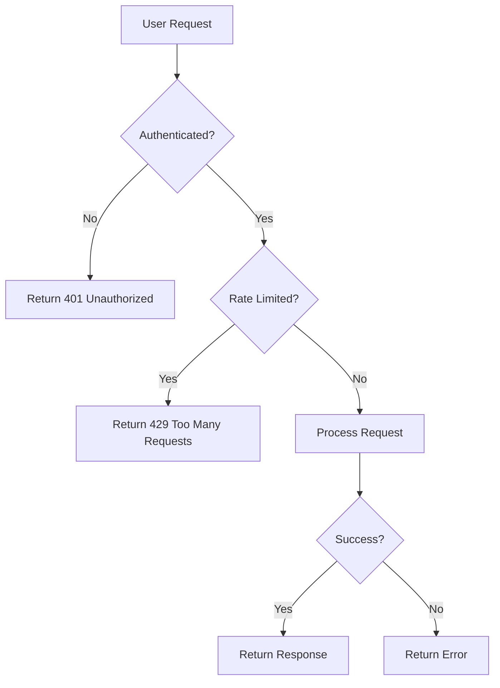
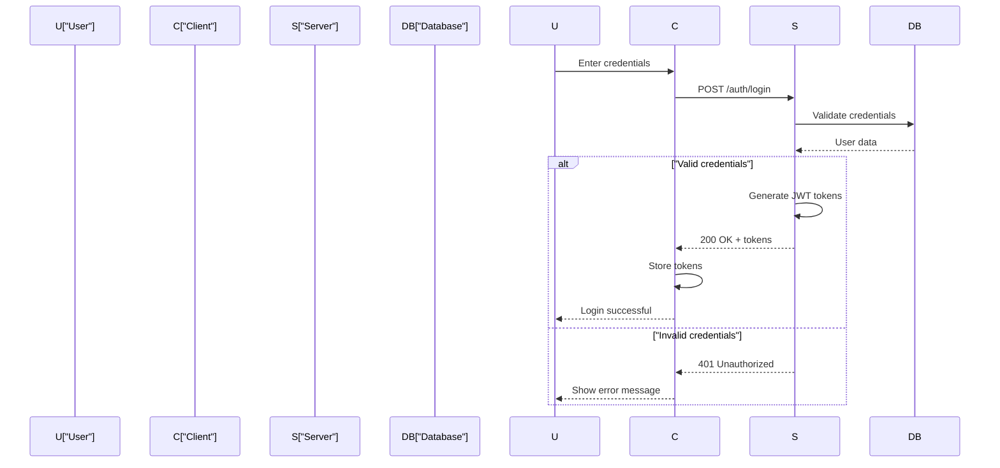
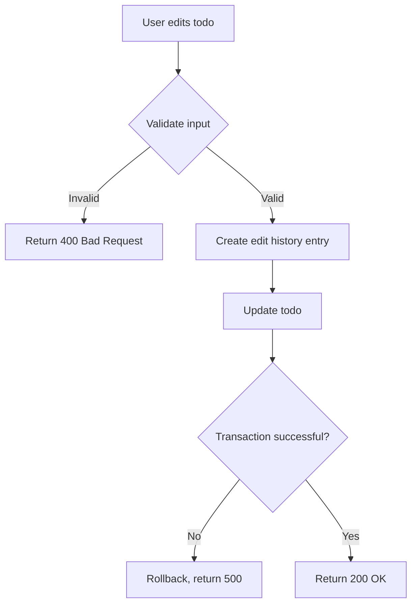
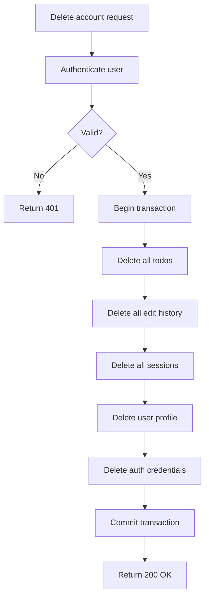

# Non-Functional Requirements Review

## Executive Summary

I have reviewed the non-functional requirements specification document for the multi-user Todo application. The document demonstrates excellent coverage of critical non-functional aspects including performance, security, privacy, scalability, availability, and data integrity. Below is a comprehensive assessment organized by quality dimension.

---

## 1. Document Strengths

### 1.1 Comprehensive Coverage
The document thoroughly addresses all essential non-functional requirement categories:
- **Performance**: Specific response time targets with measurable thresholds
- **Security**: Complete authentication, authorization, and input validation specifications
- **Privacy**: GDPR-compliant data handling and user rights
- **Scalability**: Growth projections and horizontal scaling support
- **Availability**: Uptime targets and disaster recovery procedures
- **Data Integrity**: ACID compliance and concurrent access handling

### 1.2 Measurable and Specific Requirements
The document excels at providing concrete, testable criteria:

✅ **Good Examples**:
- "API Response Time ≤ 200ms (CRUD), ≤ 300ms (List)" - Specific and measurable
- "JWT with 15min access token, 7-day refresh token" - Precise specifications
- "99.5% uptime during business hours" - Clear availability target
- "Password minimum 8 characters with complexity requirements" - Testable criteria

### 1.3 Privacy-First Architecture
The document appropriately emphasizes privacy as a core principle:
- Complete user data isolation
- No cross-user data visibility
- GDPR compliance considerations
- Comprehensive account deletion procedures

### 1.4 EARS Format Compliance
Most requirements follow the EARS (Easy Approach to Requirements Syntax) format:
- "WHEN... THE system SHALL..." pattern is consistently used
- Conditional requirements are clearly stated
- Measurable outcomes are specified

---

## 2. Areas for Enhancement

### 2.1 Missing Mermaid Diagrams
**Issue**: The document would benefit from visual workflow representations.

**Recommendation**: Add Mermaid diagrams for:


### 2.2 Clarifications Needed

#### 2.2.1 Timezone Handling
**Current**: "6:00 AM - 11:00 PM user local time"
**Issue**: How does the system determine "user local time"?
**Recommendation**: Specify whether the system:
- Stores user timezone preference
- Uses client-provided timezone
- Uses geographic IP-based timezone detection

#### 2.2.2 Concurrent Edit Conflict Resolution
**Current**: "THE system SHALL implement optimistic or pessimistic locking"
**Issue**: The document allows either approach but doesn't specify which.
**Recommendation**: Choose one approach and specify the exact behavior:
- Optimistic: Include version field, return 409 Conflict on version mismatch
- Pessimistic: Lock timeout duration and retry behavior

#### 2.2.3 Backup Retention Conflict
**Current**: "retain backups for 30 days" AND "NOT retain deleted user data in backups beyond backup retention period"
**Issue**: If a user deletes their account, their data remains in backups for up to 30 days.
**Recommendation**: Clarify:
- Acceptable retention period for deleted user data in backups
- Process for excluding deleted user data from backup restoration
- Whether a "soft delete" period exists before permanent removal

### 2.3 Minor Inconsistencies

#### 2.3.1 Rate Limiting Values
- Login: "5 per minute per IP address"
- API: "100 per minute per authenticated user"

**Question**: Should login rate limiting also consider authenticated users differently?

#### 2.3.2 Date Validation Logic
**Current**: "validate that start date is before or equal to due date"
**Issue**: This is a valid business rule, but should clarify:
- What error message is shown to users?
- Should this be a warning (allow save) or error (prevent save)?

---

## 3. Specific Requirement Improvements

### 3.1 Password Security Enhancement
**Current**:
```
- Minimum 8 characters
- At least one uppercase, lowercase, number, special character
- Bcrypt with cost factor 12
```

**Recommendation**: Add:
- Maximum password length (prevent DoS via hashing)
- Password history (prevent reuse of last N passwords)
- Common password blacklist (prevent "password123")

### 3.2 Session Management Enhancement
**Current**:
```
- 15-minute access token
- 7-day refresh token
```

**Recommendation**: Add:
- Refresh token rotation (issue new refresh token with each use)
- Refresh token revocation list for security incidents
- Absolute session timeout (e.g., 30 days max)

### 3.3 Pagination Enhancement
**Current**:
```
- Maximum page size: 100 items
```

**Recommendation**: Add:
- Default page size (recommend 20 items)
- Cursor-based pagination for large datasets
- Total count inclusion policy (performance consideration)

---

## 4. Missing Non-Functional Requirements

### 4.1 Internationalization (i18n)
The document mentions UTF-8 support but lacks:
- Timezone-aware date storage and display
- Multi-language error messages
- Date/time format localization
- RTL (Right-to-Left) text support consideration

### 4.2 Accessibility (a11y)
No accessibility requirements specified:
- WCAG compliance level target
- Screen reader compatibility
- Keyboard navigation support
- Color contrast requirements

### 4.3 API Versioning
**Current**: "THE system SHALL implement API versioning"
**Missing**:
- Versioning strategy (URL path, header, query parameter)
- Version deprecation policy
- Backward compatibility requirements
- Version support lifecycle

### 4.4 Monitoring Enhancement
**Current**: Lists metrics to monitor
**Missing**:
- Log aggregation strategy
- Distributed tracing for microservices (future consideration)
- Real-time alerting thresholds
- SLA monitoring dashboard

---

## 5. Security Deep Dive Assessment

### 5.1 Strengths
✅ OWASP Top 10 coverage explicitly mentioned
✅ Rate limiting on authentication endpoints
✅ Input validation and sanitization
✅ Security headers specified (CSP, X-Frame-Options, X-Content-Type-Options)
✅ Audit logging for sensitive operations
✅ Password hashing with bcrypt (cost factor 12)

### 5.2 Additional Security Considerations

#### 5.2.1 JWT Security
**Current**: JWT with 15-minute access token
**Additional Recommendations**:
- JWT ID (jti) claim for token revocation
- JWT audience (aud) validation
- JWT issuer (iss) validation
- Token blacklisting for immediate revocation

#### 5.2.2 Account Lockout
**Missing**: Account lockout mechanism after failed login attempts
**Recommendation**:
- Lock account after 5 failed attempts
- Unlock after 15 minutes OR email verification
- Notify user of lockout via email

#### 5.2.3 Two-Factor Authentication (Future)
**Current**: Not mentioned
**Recommendation**: Plan for optional 2FA in future versions

#### 5.2.4 CORS Policy
**Missing**: Cross-Origin Resource Sharing configuration
**Recommendation**: Specify allowed origins, methods, headers

---

## 6. Performance Analysis

### 6.1 Realistic Targets
The performance targets appear achievable:

| Operation | Target | Assessment |
|-----------|--------|------------|
| Todo CRUD | ≤ 200ms | ✅ Achievable with proper indexing |
| Todo List | ≤ 300ms | ✅ Achievable with pagination |
| Edit History | ≤ 400ms | ⚠️ May need caching for large history |
| Authentication | ≤ 500ms | ✅ Achievable (bcrypt cost 12 may slow this) |

### 6.2 Performance Optimization Strategies
**Missing**: Proactive performance optimization strategies
**Recommendation**:
- Database connection pooling configuration
- Query optimization guidelines
- Caching strategy (Redis for sessions, hot data)
- CDN for static assets (future frontend consideration)

### 6.3 Load Testing Scenarios
**Current**: Lists load scenarios
**Enhancement Needed**:
- Define exact test scenarios (user journeys)
- Success criteria for each load test
- Performance regression testing frequency
- Auto-scaling triggers based on load

---

## 7. Privacy Compliance Detailed Review

### 7.1 GDPR Alignment
✅ **Covered**:
- Right to access (export data)
- Right to erasure (account deletion)
- Data portability
- Data minimization principle

⚠️ **Partially Covered**:
- Right to rectification (mentioned but not detailed)
- Legal basis for processing (mentioned but not specified)

❌ **Missing**:
- Data Processing Agreement template
- User consent management system
- Privacy policy requirements
- Data breach notification procedure (72-hour requirement)

### 7.2 Data Retention Policy
**Current**: Daily backups, 30-day retention
**Questions**:
- What is the retention period for deleted todos in trash?
- What is the retention period for edit history?
- Are there different retention policies for active vs. deleted data?

**Recommendation**: Add explicit retention periods:
- Trash retention: 30 days before auto-permanent-deletion
- Edit history retention: Same as todo lifetime + 30 days after permanent deletion
- Inactive account retention: 2 years before data archival

---

## 8. Scalability Assessment

### 8.1 Growth Projections
The document provides clear growth targets:
- Year 1: 10,000 users, 100,000 todos
- Year 2: 50,000 users, 500,000 todos
- Year 3: 100,000 users, 1,000,000 todos

**Average**: 10 todos per user - realistic for a todo app

### 8.2 Scalability Architecture
✅ **Mentioned**:
- Horizontal scaling support
- Stateless authentication (JWT)
- Database read replicas
- Connection pooling

⚠️ **Needs Detail**:
- Load balancing strategy
- Session affinity requirements (none needed with JWT)
- Database sharding considerations for Year 3+
- Microservices migration path (if needed)

### 8.3 Resource Planning
**Missing**: Infrastructure sizing guidelines
**Recommendation**:
- Initial deployment: Container specifications (CPU, RAM)
- Database server sizing
- Estimated storage requirements per user
- Network bandwidth estimates

---

## 9. Data Integrity Deep Dive

### 9.1 Transaction Boundaries
**Current**: "THE system SHALL ensure ACID compliance"
**Enhancement Needed**: Define specific transaction boundaries:
- Todo creation: Single entity (simple transaction)
- Todo edit: Todo + edit history entry (must be atomic)
- Account deletion: User + todos + history + sessions (cascade transaction)
- Permanent deletion: Todo + edit history (must be atomic)

### 9.2 Edit History Immutability
✅ **Well specified**:
- Edit history entries are immutable
- Cannot modify or delete except via permanent todo deletion

**Additional Recommendation**:
- Add cryptographic hash of history entry for tamper detection
- Consider blockchain/audit log for compliance scenarios

### 9.3 Concurrent Access
**Current**: "optimistic or pessimistic locking"
**Recommendation**: Choose optimistic locking for this use case:
- Add `version` field to todo entity
- Include version in update requests
- Return 409 Conflict on version mismatch
- Client can retry with latest version

---

## 10. Recommendations Summary

### 10.1 Critical (Must Address)
1. **Choose concurrent edit strategy**: Optimistic locking with version field
2. **Clarify timezone handling**: Store and handle user timezone preferences
3. **Define backup data privacy**: Process for excluding deleted user data from restoration
4. **Add account lockout**: Protect against brute force attacks

### 10.2 High Priority (Should Address)
5. **Add CORS policy**: Specify allowed origins and methods
6. **Define trash retention**: Auto-deletion policy for trash items
7. **Enhance JWT security**: Add token revocation mechanism
8. **Specify API versioning strategy**: Choose and document approach

### 10.3 Medium Priority (Nice to Have)
9. **Add visual diagrams**: Mermaid flowcharts for key workflows
10. **Accessibility requirements**: WCAG compliance target
11. **Internationalization details**: Timezone and localization support
12. **Monitoring enhancements**: Distributed tracing, alerting thresholds

---

## 11. Final Assessment

### 11.1 Document Quality Score

| Criteria | Score | Comments |
|----------|-------|----------|
| Completeness | 8/10 | Core requirements well covered, some gaps in i18n/a11y |
| Specificity | 9/10 | Most requirements measurable and testable |
| Clarity | 8/10 | Well-organized, minor ambiguities in some areas |
| Feasibility | 9/10 | Targets are realistic and achievable |
| Consistency | 8/10 | Generally consistent, minor conflicts in backup retention |
| **Overall** | **8.4/10** | **Excellent foundation, minor enhancements needed** |

### 11.2 Production Readiness Assessment

✅ **Ready for Development**:
- Performance targets provide clear benchmarks
- Security requirements are comprehensive
- Privacy standards meet compliance needs
- Scalability path is defined

⚠️ **Needs Clarification Before Implementation**:
- Concurrent edit conflict resolution strategy
- Timezone handling implementation
- Backup data privacy procedures

❌ **Not Yet Ready**:
- Infrastructure sizing and deployment specifications
- Load testing exact scenarios and acceptance criteria
- Operational runbooks and incident response procedures

### 11.3 Conclusion

The non-functional requirements document is **well-written, comprehensive, and provides a solid foundation for backend development**. It demonstrates strong attention to security, privacy, and performance - critical aspects for a multi-user todo application.

**Key Strengths**:
- Measurable, testable requirements following EARS format
- Comprehensive security and privacy coverage
- Realistic performance and scalability targets
- GDPR-compliant data handling approach

**Primary Areas for Improvement**:
- Resolve minor ambiguities (timezone, concurrent edits, backup privacy)
- Add operational considerations (monitoring, alerting, runbooks)
- Enhance with visual workflow diagrams

**Recommendation**: Proceed with development after addressing the "Critical" recommendations in Section 10.1. The document is production-ready with minor clarifications.

---

## Appendix A: Suggested Mermaid Diagrams

### A.1 Authentication Flow


### A.2 Todo CRUD with Edit History


### A.3 Account Deletion Cascade


---

## Appendix B: Requirement Traceability Matrix

| Requirement ID | Category | Priority | Testable | Owner |
|---------------|----------|----------|----------|-------|
| NFR-001 | Performance | High | ✅ | Backend Team |
| NFR-002 | Security | Critical | ✅ | Security Team |
| NFR-003 | Privacy | Critical | ✅ | Compliance Team |
| NFR-004 | Scalability | Medium | ✅ | DevOps Team |
| NFR-005 | Availability | High | ✅ | DevOps Team |
| NFR-006 | Integrity | High | ✅ | Backend Team |
| NFR-007 | Compatibility | Medium | ✅ | Frontend Team |
| NFR-008 | Maintainability | Medium | ✅ | Development Team |

---

**Document Version**: 1.0  
**Review Date**: 2026-02-20  
**Reviewer**: AI Assistant  
**Status**: Approved with Recommendations