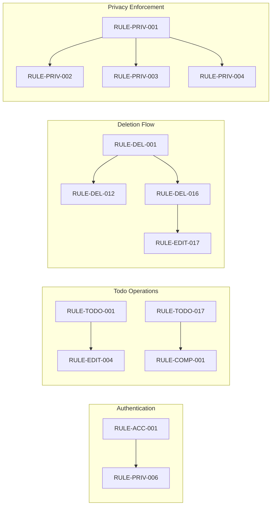

# Business Rules and Validation Requirements

## Overview

This document consolidates all business rules, validation requirements, and constraints that govern the Todo application behavior. These rules serve as the authoritative reference for implementing validation logic, business constraints, and system behavior.

Each rule is identified by a unique rule ID following the pattern `RULE-{CATEGORY}-{NUMBER}` where category abbreviations are: ACC (Account), PRO (Profile), TODO (Todo), EDIT (Editing), COMP (Completion), DEL (Deletion), DATE (Date), PRIV (Privacy), PAGE (Pagination), FILT (Filtering), SORT (Sorting), ERR (Error).

---

## 1. User Account Rules

### 1.1 Registration Rules

#### Email Validation

**RULE-ACC-001**: WHEN a user submits registration, THE system SHALL validate that the email address is in a valid email format.

**RULE-ACC-002**: WHEN a user submits registration, THE system SHALL validate that the email address is not already registered in the system.

**RULE-ACC-003**: WHEN a user submits registration with a duplicate email, THEN THE system SHALL reject the registration and display an error message indicating the email is already in use.

**RULE-ACC-004**: THE system SHALL normalize email addresses to lowercase before storage and comparison.

**RULE-ACC-005**: WHEN a user submits registration, THE system SHALL validate that the email address does not exceed 254 characters.

#### Password Validation

**RULE-ACC-006**: WHEN a user submits registration, THE system SHALL validate that the password contains a minimum of 8 characters.

**RULE-ACC-007**: WHEN a user submits registration, THE system SHALL validate that the password contains at least one uppercase letter.

**RULE-ACC-008**: WHEN a user submits registration, THE system SHALL validate that the password contains at least one lowercase letter.

**RULE-ACC-009**: WHEN a user submits registration, THE system SHALL validate that the password contains at least one numeric digit.

**RULE-ACC-010**: WHEN a user submits registration, THE system SHALL validate that the password contains at least one special character from the set: !@#$%^&*()_+-=[]{}|;:,.<>?

**RULE-ACC-011**: WHEN a user submits registration, THE system SHALL validate that the password does not exceed 128 characters.

**RULE-ACC-012**: WHEN a user submits registration, THE system SHALL hash the password using a secure hashing algorithm (bcrypt with cost factor 12 or higher) before storage.

**RULE-ACC-013**: THE system SHALL never store passwords in plain text under any circumstances.

#### Account Creation

**RULE-ACC-014**: WHEN registration validation passes, THE system SHALL create a new user account with a unique user identifier.

**RULE-ACC-015**: WHEN a new account is created, THE system SHALL create an empty todo list for the user.

**RULE-ACC-016**: WHEN a new account is created, THE system SHALL create an empty trash list for the user.

**RULE-ACC-017**: WHEN a new account is created, THE system SHALL create an empty profile with a default display name.

### 1.2 Authentication Rules

#### Login Validation

**RULE-ACC-018**: WHEN a user attempts to log in, THE system SHALL validate that the email address exists in the system.

**RULE-ACC-019**: WHEN a user attempts to log in with a non-existent email, THEN THE system SHALL reject the login and display a generic error message.

**RULE-ACC-020**: WHEN a user attempts to log in, THE system SHALL validate that the password matches the stored hash for the account.

**RULE-ACC-021**: WHEN a user attempts to log in with an incorrect password, THEN THE system SHALL reject the login and display a generic error message.

**RULE-ACC-022**: WHEN authentication fails, THE system SHALL NOT reveal whether the email or password was incorrect (generic error message: "Invalid email or password").

#### Session Management

**RULE-ACC-023**: WHEN a user successfully authenticates, THE system SHALL create a session with a JSON Web Token (JWT).

**RULE-ACC-024**: THE system SHALL include the user ID in the JWT payload.

**RULE-ACC-025**: THE system SHALL set the JWT access token expiration to 30 minutes.

**RULE-ACC-026**: THE system SHALL issue a refresh token with a 7-day expiration period.

**RULE-ACC-027**: WHEN a refresh token expires, THE system SHALL require the user to re-authenticate.

### 1.3 Password Management Rules

#### Password Change

**RULE-ACC-028**: WHEN a user requests a password change, THE system SHALL require authentication of the current session.

**RULE-ACC-029**: WHEN a user changes password, THE system SHALL require the current password for verification.

**RULE-ACC-030**: WHEN a user submits a password change, THE system SHALL validate the new password meets all password complexity requirements (RULE-ACC-006 through RULE-ACC-011).

**RULE-ACC-031**: WHEN a user changes password, THE system SHALL invalidate all existing sessions except the current one.

**RULE-ACC-032**: WHEN password change is successful, THE system SHALL hash and store the new password.

### 1.4 Account Deletion Rules

#### Deletion Authorization

**RULE-ACC-033**: WHEN a user requests account deletion, THE system SHALL require authentication of the current session.

**RULE-ACC-034**: WHEN a user requests account deletion, THE system SHALL require password confirmation.

#### Cascade Deletion

**RULE-ACC-035**: WHEN an account is deleted, THE system SHALL permanently delete all todos owned by the user.

**RULE-ACC-036**: WHEN an account is deleted, THE system SHALL permanently delete all todos in the user's trash.

**RULE-ACC-037**: WHEN an account is deleted, THE system SHALL permanently delete all edit history entries for the user's todos.

**RULE-ACC-038**: WHEN an account is deleted, THE system SHALL delete the user's profile.

**RULE-ACC-039**: WHEN an account is deleted, THE system SHALL invalidate all active sessions for the user.

**RULE-ACC-040**: WHEN an account is deleted, THE system SHALL remove the user's authentication credentials.

**RULE-ACC-041**: WHEN an account is deleted, THE system SHALL NOT retain any user data for recovery purposes.

---

## 2. Profile Rules

### 2.1 Profile Structure Rules

**RULE-PRO-001**: THE system SHALL maintain exactly one profile per user account.

**RULE-PRO-002**: THE system SHALL store a display name for each user profile.

**RULE-PRO-003**: WHEN a new account is created, THE system SHALL initialize the display name to a default value.

### 2.2 Display Name Validation Rules

**RULE-PRO-004**: WHEN a user updates their display name, THE system SHALL validate that the display name is not empty.

**RULE-PRO-005**: WHEN a user updates their display name, THE system SHALL validate that the display name does not exceed 100 characters.

**RULE-PRO-006**: WHEN a user updates their display name, THE system SHALL validate that the display name contains only printable characters.

**RULE-PRO-007**: WHEN a user updates their display name, THE system SHALL trim leading and trailing whitespace.

**RULE-PRO-008**: WHEN a user updates their display name, THE system SHALL allow special characters and Unicode characters.

### 2.3 Profile Privacy Rules

**RULE-PRO-009**: THE system SHALL restrict profile viewing to the profile owner only.

**RULE-PRO-010**: WHEN a user attempts to view another user's profile, THE system SHALL deny access and return an error.

**RULE-PRO-011**: THE system SHALL NOT provide any API endpoint for viewing other users' profiles.

**RULE-PRO-012**: THE system SHALL NOT expose profile information in any public or shared context.

---

## 3. Todo Creation Rules

### 3.1 Title Validation Rules

**RULE-TODO-001**: WHEN a user creates a todo, THE system SHALL require a title value.

**RULE-TODO-002**: WHEN a user creates a todo without a title, THEN THE system SHALL reject the creation and return a validation error.

**RULE-TODO-003**: WHEN a user creates a todo, THE system SHALL validate that the title is not empty after trimming whitespace.

**RULE-TODO-004**: WHEN a user creates a todo, THE system SHALL validate that the title does not exceed 200 characters.

**RULE-TODO-005**: WHEN a user creates a todo, THE system SHALL trim leading and trailing whitespace from the title.

**RULE-TODO-006**: WHEN a user creates a todo, THE system SHALL store the title exactly as provided (after trimming).

### 3.2 Description Validation Rules

**RULE-TODO-007**: WHEN a user creates a todo, THE system SHALL allow an empty or null description.

**RULE-TODO-008**: WHEN a user creates a todo with a description, THE system SHALL validate that the description does not exceed 5,000 characters.

**RULE-TODO-009**: WHEN a user creates a todo with a description, THE system SHALL preserve the description exactly as provided (including whitespace and formatting).

### 3.3 Start Date Validation Rules

**RULE-TODO-010**: WHEN a user creates a todo, THE system SHALL allow an empty or null start date.

**RULE-TODO-011**: WHEN a user creates a todo with a start date, THE system SHALL validate that the start date is a valid date value.

**RULE-TODO-012**: WHEN a user creates a todo with a start date, THE system SHALL store the start date without time component (date only).

**RULE-TODO-013**: WHEN a user creates a todo with both a start date and due date, THE system SHALL allow the start date to be after the due date (no validation constraint).

### 3.4 Due Date Validation Rules

**RULE-TODO-014**: WHEN a user creates a todo, THE system SHALL allow an empty or null due date.

**RULE-TODO-015**: WHEN a user creates a todo with a due date, THE system SHALL validate that the due date is a valid date value.

**RULE-TODO-016**: WHEN a user creates a todo with a due date, THE system SHALL store the due date without time component (date only).

### 3.5 Default Values Rules

**RULE-TODO-017**: WHEN a user creates a todo, THE system SHALL set the completion status to incomplete (false) by default.

**RULE-TODO-018**: WHEN a user creates a todo, THE system SHALL record the current timestamp as the creation date.

**RULE-TODO-019**: WHEN a user creates a todo, THE system SHALL set the deleted status to false (not in trash).

### 3.6 Ownership Rules

**RULE-TODO-020**: WHEN a user creates a todo, THE system SHALL associate the todo with the authenticated user's account.

**RULE-TODO-021**: THE system SHALL ensure each todo has exactly one owner.

---

## 4. Todo Editing Rules

### 4.1 Authorization Rules

**RULE-EDIT-001**: WHEN a user attempts to edit a todo, THE system SHALL verify that the todo belongs to the authenticated user.

**RULE-EDIT-002**: WHEN a user attempts to edit a todo belonging to another user, THEN THE system SHALL deny access and return an error.

**RULE-EDIT-003**: WHEN a user attempts to edit a todo in the trash, THE system SHALL deny the edit and return an error.

### 4.2 Field Modification Rules

**RULE-EDIT-004**: WHEN a user edits a todo title, THE system SHALL apply all title validation rules (RULE-TODO-001 through RULE-TODO-006).

**RULE-EDIT-005**: WHEN a user edits a todo description, THE system SHALL apply all description validation rules (RULE-TODO-007 through RULE-TODO-009).

**RULE-EDIT-006**: WHEN a user edits a todo start date, THE system SHALL apply all start date validation rules (RULE-TODO-010 through RULE-TODO-013).

**RULE-EDIT-007**: WHEN a user edits a todo due date, THE system SHALL apply all due date validation rules (RULE-TODO-014 through RULE-TODO-016).

### 4.3 Edit History Rules

**RULE-EDIT-008**: WHEN a user edits any todo field, THE system SHALL create a history entry.

**RULE-EDIT-009**: WHEN a user edits multiple fields in a single request, THE system SHALL create exactly one history entry for all changes.

**RULE-EDIT-010**: WHEN a history entry is created, THE system SHALL record the current timestamp.

**RULE-EDIT-011**: WHEN a history entry is created, THE system SHALL record the new title value if the title was changed.

**RULE-EDIT-012**: WHEN a history entry is created, THE system SHALL record the new description value if the description was changed.

**RULE-EDIT-013**: WHEN a history entry is created, THE system SHALL record the new start date value if the start date was changed.

**RULE-EDIT-014**: WHEN a history entry is created, THE system SHALL record the new due date value if the due date was changed.

**RULE-EDIT-015**: WHEN a history entry is created for an unchanged field, THE system SHALL store null for that field.

**RULE-EDIT-016**: WHEN a user views edit history, THE system SHALL sort entries from most recent to oldest.

**RULE-EDIT-017**: WHEN a todo is permanently deleted, THE system SHALL delete all associated history entries.

**RULE-EDIT-018**: WHEN a todo is restored from trash, THE system SHALL preserve all edit history.

### 4.4 Partial Update Rules

**RULE-EDIT-019**: WHEN a user edits a todo, THE system SHALL allow updating any subset of editable fields.

**RULE-EDIT-020**: WHEN a user edits a todo without providing a field, THE system SHALL preserve the existing value for that field.

---

## 5. Completion Status Rules

### 5.1 Status Toggle Rules

**RULE-COMP-001**: WHEN a user marks a todo as complete, THE system SHALL set the completion status to true.

**RULE-COMP-002**: WHEN a user marks a todo as incomplete, THE system SHALL set the completion status to false.

**RULE-COMP-003**: WHEN a user toggles completion status, THE system SHALL allow both true-to-false and false-to-true transitions.

**RULE-COMP-004**: WHEN a user toggles completion status to the same value, THE system SHALL accept the request without error.

### 5.2 Authorization Rules

**RULE-COMP-005**: WHEN a user attempts to toggle completion status, THE system SHALL verify that the todo belongs to the authenticated user.

**RULE-COMP-006**: WHEN a user attempts to toggle completion status of a todo in trash, THE system SHALL deny the operation and return an error.

### 5.3 History Rules

**RULE-COMP-007**: WHEN a user toggles completion status, THE system SHALL NOT create an edit history entry.

**RULE-COMP-008**: THE system SHALL treat completion status changes as distinct from content edits.

---

## 6. Deletion Rules

### 6.1 Soft Delete Rules

**RULE-DEL-001**: WHEN a user deletes a todo, THE system SHALL set the deleted status to true.

**RULE-DEL-002**: WHEN a user deletes a todo, THE system SHALL NOT remove the todo from storage.

**RULE-DEL-003**: WHEN a user deletes a todo, THE system SHALL NOT delete the todo's edit history.

**RULE-DEL-004**: WHEN a user deletes a todo, THE system SHALL NOT modify any todo fields.

**RULE-DEL-005**: WHEN a user deletes a todo, THE system SHALL exclude the todo from the normal todo list.

### 6.2 Authorization Rules

**RULE-DEL-006**: WHEN a user attempts to delete a todo, THE system SHALL verify that the todo belongs to the authenticated user.

**RULE-DEL-007**: WHEN a user attempts to delete another user's todo, THEN THE system SHALL deny access and return an error.

### 6.3 Trash List Rules

**RULE-DEL-008**: WHEN a user views the trash list, THE system SHALL display only todos with deleted status true.

**RULE-DEL-009**: WHEN a user views the trash list, THE system SHALL display only todos belonging to the authenticated user.

**RULE-DEL-010**: WHEN a user views the trash list, THE system SHALL support pagination.

**RULE-DEL-011**: WHEN the trash list is empty, THE system SHALL return an empty list with appropriate metadata.

### 6.4 Restore Rules

**RULE-DEL-012**: WHEN a user restores a todo from trash, THE system SHALL set the deleted status to false.

**RULE-DEL-013**: WHEN a user restores a todo from trash, THE system SHALL make the todo visible in the normal todo list.

**RULE-DEL-014**: WHEN a user restores a todo from trash, THE system SHALL preserve all todo fields and edit history.

**RULE-DEL-015**: WHEN a user attempts to restore a todo not in trash, THE system SHALL return an error.

### 6.5 Permanent Deletion Rules

**RULE-DEL-016**: WHEN a user permanently deletes a todo, THE system SHALL remove the todo from storage entirely.

**RULE-DEL-017**: WHEN a user permanently deletes a todo, THE system SHALL delete all associated edit history entries.

**RULE-DEL-018**: WHEN a user permanently deletes a todo, THE system SHALL NOT allow recovery.

**RULE-DEL-019**: WHEN a user attempts to permanently delete a todo not in trash, THE system SHALL return an error.

**RULE-DEL-020**: WHEN a user permanently deletes a todo, THE system SHALL verify the todo belongs to the authenticated user.

---

## 7. Date Handling Rules

### 7.1 Date Storage Rules

**RULE-DATE-001**: THE system SHALL store dates in ISO 8601 format (YYYY-MM-DD).

**RULE-DATE-002**: THE system SHALL store dates without time components.

**RULE-DATE-003**: THE system SHALL store dates in UTC for consistency.

### 7.2 Date Validation Rules

**RULE-DATE-004**: WHEN a user provides a date, THE system SHALL validate that the date is parseable.

**RULE-DATE-005**: WHEN a user provides an invalid date format, THEN THE system SHALL reject the request with a validation error.

**RULE-DATE-006**: THE system SHALL allow dates in the past.

**RULE-DATE-007**: THE system SHALL allow dates in the future.

**RULE-DATE-008**: THE system SHALL NOT validate the relationship between start date and due date.

### 7.3 Date Sorting Rules

**RULE-DATE-009**: WHEN sorting by start date ascending, THE system SHALL display todos with start dates from earliest to latest.

**RULE-DATE-010**: WHEN sorting by start date descending, THE system SHALL display todos with start dates from latest to earliest.

**RULE-DATE-011**: WHEN sorting by start date, THE system SHALL place todos without a start date at the end of the list.

**RULE-DATE-012**: WHEN sorting by due date ascending, THE system SHALL display todos with due dates from earliest to latest.

**RULE-DATE-013**: WHEN sorting by due date descending, THE system SHALL display todos with due dates from latest to earliest.

**RULE-DATE-014**: WHEN sorting by due date, THE system SHALL place todos without a due date at the end of the list.

**RULE-DATE-015**: WHEN multiple todos have the same date, THE system SHALL sort them by creation date as a secondary criterion.

### 7.4 Empty Date Handling Rules

**RULE-DATE-016**: THE system SHALL represent empty dates as null values.

**RULE-DATE-017**: WHEN a user clears a date field, THE system SHALL store null for that field.

**RULE-DATE-018**: WHEN a user edits a todo to remove a date, THE system SHALL create a history entry recording the change to null.

---

## 8. Privacy Rules

### 8.1 Data Isolation Rules

**RULE-PRIV-001**: THE system SHALL ensure complete data isolation between users.

**RULE-PRIV-002**: WHEN a user queries todos, THE system SHALL return only todos belonging to the authenticated user.

**RULE-PRIV-003**: WHEN a user queries a single todo, THE system SHALL verify ownership before returning data.

**RULE-PRIV-004**: WHEN a user attempts to access a todo belonging to another user, THEN THE system SHALL return an access denied error.

**RULE-PRIV-005**: THE system SHALL NOT provide any mechanism to view other users' data.

### 8.2 API Authorization Rules

**RULE-PRIV-006**: WHEN a user accesses any todo-related endpoint, THE system SHALL require authentication.

**RULE-PRIV-007**: WHEN authentication is missing or invalid, THE system SHALL return a 401 Unauthorized response.

**RULE-PRIV-008**: WHEN a user lacks permission for a resource, THE system SHALL return a 403 Forbidden response.

**RULE-PRIV-009**: THE system SHALL NOT expose user identifiers in API responses that could enable cross-user access.

### 8.3 No Sharing Rules

**RULE-PRIV-010**: THE system SHALL NOT provide any todo sharing functionality.

**RULE-PRIV-011**: THE system SHALL NOT provide any todo collaboration functionality.

**RULE-PRIV-012**: THE system SHALL NOT provide any public todo viewing functionality.

**RULE-PRIV-013**: THE system SHALL NOT provide any todo export that includes other users' data.

### 8.4 Query Scope Rules

**RULE-PRIV-014**: WHEN the system executes any query, THE system SHALL include the user ID as a mandatory filter.

**RULE-PRIV-015**: THE system SHALL prevent queries that could access other users' data through injection or manipulation.

**RULE-PRIV-016**: THE system SHALL validate that all resource identifiers in requests belong to the authenticated user.

### 8.5 Error Message Privacy Rules

**RULE-PRIV-017**: WHEN access is denied, THE system SHALL return a generic error message.

**RULE-PRIV-018**: THE system SHALL NOT reveal the existence of resources belonging to other users in error messages.

**RULE-PRIV-019**: WHEN a user attempts to access a non-existent resource or another user's resource, THE system SHALL return the same error response.

---

## 9. Pagination Rules

### 9.1 List Pagination Rules

**RULE-PAGE-001**: WHEN a user requests a todo list, THE system SHALL support pagination.

**RULE-PAGE-002**: WHEN a user requests a todo list, THE system SHALL default to page 1 if not specified.

**RULE-PAGE-003**: WHEN a user requests a todo list, THE system SHALL default to 20 items per page if not specified.

**RULE-PAGE-004**: WHEN a user requests a todo list, THE system SHALL allow page size between 1 and 100 items.

**RULE-PAGE-005**: WHEN a user requests a page size outside the allowed range, THEN THE system SHALL return a validation error.

**RULE-PAGE-006**: WHEN a user requests a page beyond the available data, THE system SHALL return an empty list.

**RULE-PAGE-007**: WHEN returning a paginated list, THE system SHALL include total count and pagination metadata.

---

## 10. Filtering Rules

### 10.1 Completion Status Filter Rules

**RULE-FILT-001**: WHEN a user filters by completion status, THE system SHALL support three options: all, complete, and incomplete.

**RULE-FILT-002**: WHEN a user filters by "all", THE system SHALL return todos regardless of completion status.

**RULE-FILT-003**: WHEN a user filters by "complete", THE system SHALL return only todos with completion status true.

**RULE-FILT-004**: WHEN a user filters by "incomplete", THE system SHALL return only todos with completion status false.

**RULE-FILT-005**: WHEN no filter is specified, THE system SHALL default to showing all todos.

**RULE-FILT-006**: WHEN filtering, THE system SHALL combine with other filters and sorting options.

---

## 11. Sorting Rules

### 11.1 Sort Criteria Rules

**RULE-SORT-001**: WHEN a user sorts the todo list, THE system SHALL support sorting by creation date.

**RULE-SORT-002**: WHEN a user sorts the todo list, THE system SHALL support sorting by start date.

**RULE-SORT-003**: WHEN a user sorts the todo list, THE system SHALL support sorting by due date.

### 11.2 Sort Direction Rules

**RULE-SORT-004**: WHEN a user sorts by creation date, THE system SHALL support ascending (oldest first) and descending (newest first) directions.

**RULE-SORT-005**: WHEN a user sorts by start date, THE system SHALL support ascending (earliest first) and descending (latest first) directions.

**RULE-SORT-006**: WHEN a user sorts by due date, THE system SHALL support ascending (earliest first) and descending (latest first) directions.

### 11.3 Default Sorting Rules

**RULE-SORT-007**: WHEN no sort criteria is specified, THE system SHALL sort by creation date descending (newest first).

### 11.4 Combined Operations Rules

**RULE-SORT-008**: WHEN sorting is combined with filtering, THE system SHALL apply both operations.

**RULE-SORT-009**: WHEN sorting is combined with pagination, THE system SHALL apply sorting before pagination.

---

## 12. Error Handling Rules

### 12.1 Validation Error Rules

**RULE-ERR-001**: WHEN validation fails, THE system SHALL return a 400 Bad Request response.

**RULE-ERR-002**: WHEN validation fails, THE system SHALL include specific field-level error messages.

**RULE-ERR-003**: WHEN multiple validation errors occur, THE system SHALL return all errors in a single response.

### 12.2 Authentication Error Rules

**RULE-ERR-004**: WHEN authentication is missing, THE system SHALL return a 401 Unauthorized response.

**RULE-ERR-005**: WHEN authentication token is invalid, THE system SHALL return a 401 Unauthorized response.

**RULE-ERR-006**: WHEN authentication token is expired, THE system SHALL return a 401 Unauthorized response.

### 12.3 Authorization Error Rules

**RULE-ERR-007**: WHEN a user lacks permission for a resource, THE system SHALL return a 403 Forbidden response.

**RULE-ERR-008**: WHEN a user attempts to access another user's resource, THE system SHALL return a 403 Forbidden response.

**RULE-ERR-009**: WHEN a user attempts to access a non-existent resource, THE system SHALL return a 404 Not Found response.

### 12.4 Server Error Rules

**RULE-ERR-010**: WHEN an unexpected error occurs, THE system SHALL return a 500 Internal Server Error response.

**RULE-ERR-011**: WHEN a server error occurs, THE system SHALL NOT expose internal system details in the error message.

**RULE-ERR-012**: WHEN a server error occurs, THE system SHALL log the error details securely.

---

## 13. Business Rule Summary Table

| Rule ID | Category | Description |
|---------|----------|-------------|
| RULE-ACC-001 to RULE-ACC-041 | User Account | Registration, authentication, password, deletion rules |
| RULE-PRO-001 to RULE-PRO-012 | Profile | Structure, validation, privacy rules |
| RULE-TODO-001 to RULE-TODO-021 | Todo Creation | Title, description, date, defaults, ownership rules |
| RULE-EDIT-001 to RULE-EDIT-020 | Todo Editing | Authorization, modification, history rules |
| RULE-COMP-001 to RULE-COMP-008 | Completion | Status toggle, authorization, history rules |
| RULE-DEL-001 to RULE-DEL-020 | Deletion | Soft delete, trash, restore, permanent deletion rules |
| RULE-DATE-001 to RULE-DATE-018 | Date Handling | Storage, validation, sorting rules |
| RULE-PRIV-001 to RULE-PRIV-019 | Privacy | Data isolation, authorization, error privacy rules |
| RULE-PAGE-001 to RULE-PAGE-007 | Pagination | List pagination rules |
| RULE-FILT-001 to RULE-FILT-006 | Filtering | Completion status filter rules |
| RULE-SORT-001 to RULE-SORT-009 | Sorting | Sort criteria and direction rules |
| RULE-ERR-001 to RULE-ERR-012 | Error Handling | Validation, authentication, authorization error rules |

---

## 14. Rule Dependencies

### Critical Dependencies

The following rule dependencies must be respected during implementation:

### Implementation Order

1. **Foundation**: Implement authentication rules (RULE-ACC-*) first
2. **Core**: Implement todo creation rules (RULE-TODO-*) as core functionality
3. **Operations**: Implement editing and completion rules (RULE-EDIT-*, RULE-COMP-*)
4. **Lifecycle**: Implement deletion and restore rules (RULE-DEL-*)
5. **Enhancement**: Implement filtering and sorting rules (RULE-FILT-*, RULE-SORT-*)
6. **Security**: Ensure all privacy rules (RULE-PRIV-*) are enforced throughout

---

> *Developer Note: This document defines business requirements only. All technical implementations (architecture, APIs, database design, etc.) are at the discretion of the development team.*